# 一、Linux网络配置

## 1.1 CentOS 7 网络配置

### 1.CentOS 7 NAT模式

#### 1.1 确保虚拟机设置中，网络适配器使用NAT 模式

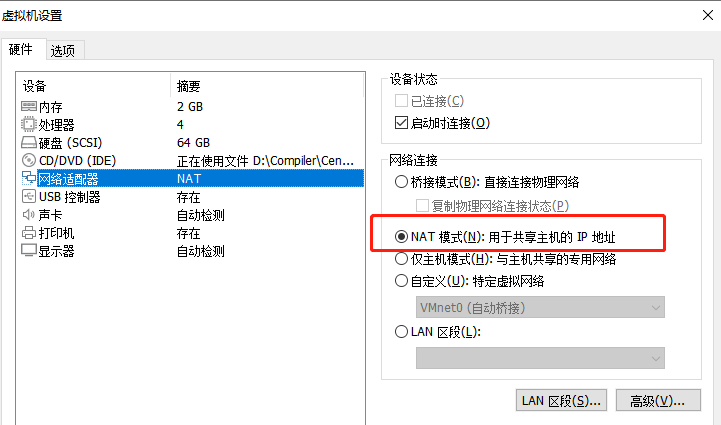

#### 1.2 设置虚拟机的虚拟网络编辑器

- 打开网络编辑器

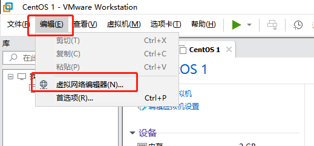

- 点击更改设置

  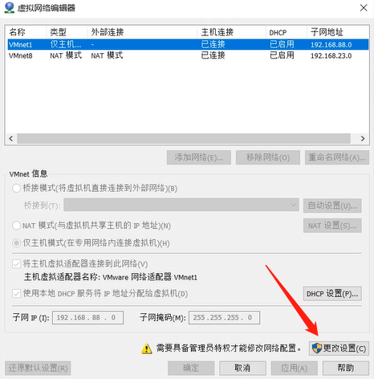

- 切换到VMnet8，配置子网ip和网关ip

  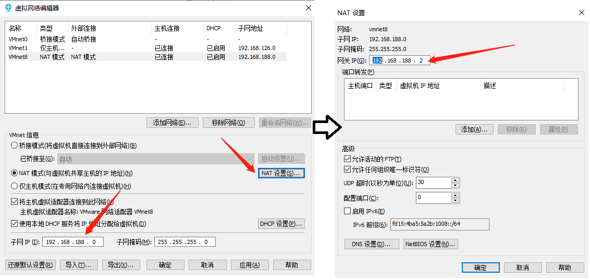

  

#### 1.3 打开CentOS，输入root和密码

- 找到  ifcfg-en*** 文件（文件名不一定，但都是以  ifcfg-en  开头的，具体的可以通过  ll  查看）

  - `vi /etc/sysconfig/network-scripts/ifcfg-eno16777736`

    

  - 配置ens33文件内容

    - BOOTPROTO=dhcp改为BOOTPROTO=static
    - ONBOOT=no改为ONBOOT=yes
    - 添加：IPADDR=192.168.188.100
    - 添加：NETMASK=255.255.255.0
    - 添加：GATEWAY=192.168.188.2
    - 添加：DNS1=114.114.114.114

  - ifcfg-en文件初始状态

    

  - 修改后的状态

    

#### 1.4 重新启动网络设置

- 输入 `systemctl restart network.service` 重新启动网络设置
- 输入 `ping www.baidu.com` 检查网络是否配置成功
- 输入 `ip addr` 检查当前网络配置数据

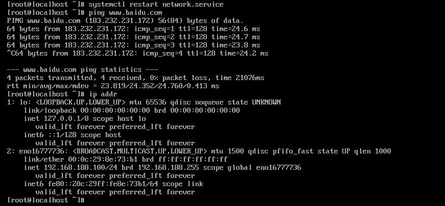

#### 1.5 关闭防火墙

- 本次开机状态下，关闭防火墙（下次开机防火墙又会开启）

  `systemctl stop firewalld`

- 重启后，一直关闭防火墙（本次开机状态不关闭，重启后一直关闭）

  `systemctl disable firewalld`

#### 1.6 连接 xshell和xftp

破解版下载地址1：http://xshell.cephp.cn/

破解版下载地址2：http://pan.cephp.cn/index.php/s/bHGGDG59nkEA3Zm

- 打开虚拟机

  

###### xshell

- 打开xshell，用户身份验证

  - 输入 ssh 192.168.188.100

    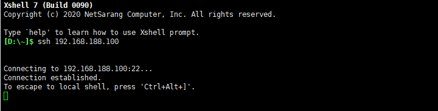

    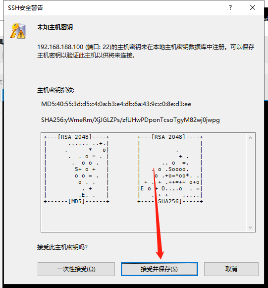

    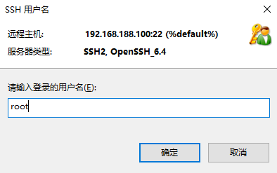

    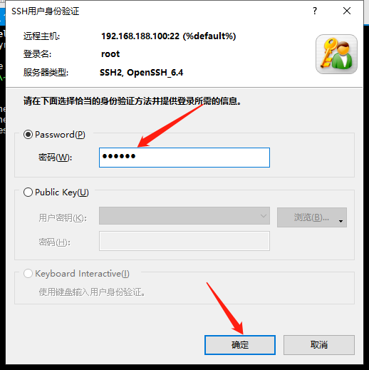

    

    

  - 成功连接xshell

    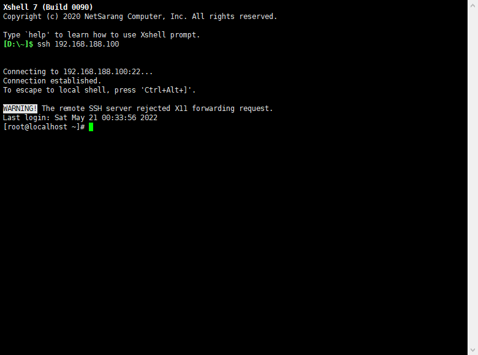

###### xftp

- 打开xshell，点击“新建文件传输”

  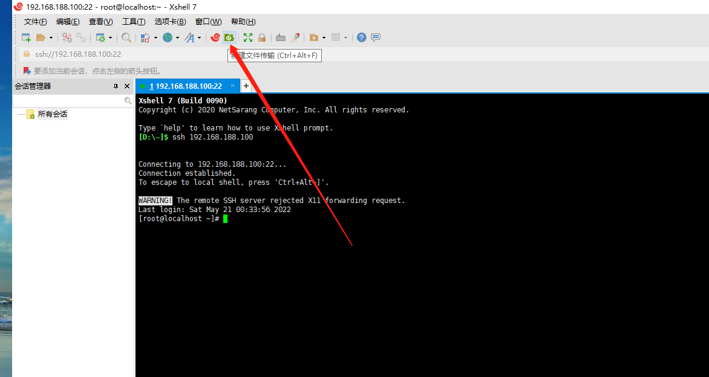

- 就完成了xftp的连接

  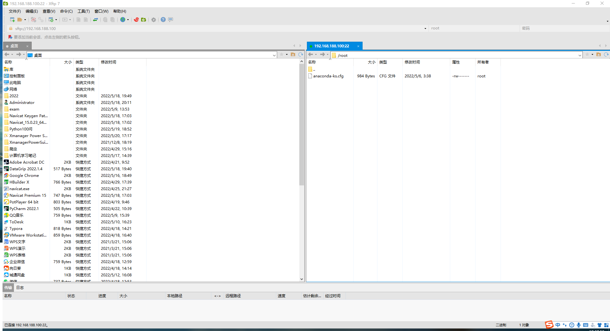


### 2. CentOS 7 桥接模式


## 1.2 Ubuntu 网络配置

### 1. Ubuntu22.04 NAT模式

#### 1.1 配置Ubuntu的yaml

`sudo vi /etc/netplan/01-network-manager-all.yaml`

```bash
sudo vi /etc/netplan/01-network-manager-all.yaml

# Let NetworkManager manage all devices on this system
network:
  version: 2
  renderer: NetworkManager
  

```

- 添加相关信息

```bash
# Let NetworkManager manage all devices on this system
network:
  version: 2
  renderer: NetworkManager
  ethernets:
		ens33:
			dhcp4: no
			dhcp6: no
			addresses:
				- 192.168.0.10/24
			routes:
				- to: default
				  via: 192.168.0.1
			nameservers:
				addresses:
					- 114.114.114.114
					- 8.8.8.8
	version: 2
	renderer: networkd
https://blog.csdn.net/qq_36393978/article/details/124868232?spm=1001.2101.3001.6650.1&utm_medium=distribute.pc_relevant.none-task-blog-2%7Edefault%7ECTRLIST%7Edefault-1-124868232-blog-124736956.pc_relevant_downloadblacklistv1&depth_1-utm_source=distribute.pc_relevant.none-task-blog-2%7Edefault%7ECTRLIST%7Edefault-1-124868232-blog-124736956.pc_relevant_downloadblacklistv1&utm_relevant_index=2
```


# 二、Linux软件安装与配置

## 2.1 CentOS 7

### 1. 配置Yum源

#### 1.1 配置CentOS7的yum源

- 查看系统默认Yum源

  ```bash
  yum repolist
  ```

- 查看Yum配置文件

  ```bash
  cd /etc/yum.repos.d/
  ls
  vi CentOS-Base.repo
  ```

- 备份原文件

  ```bash
  mv /etc/yum.repos.d/CentOS-Base.repo /etc/yum.repos.d/CentOS-Base.repo.backup
  ```

- 配置阿里云的Yum源文件

  ```bash
  curl -o /etc/yum.repos.d/CentOS-Base.repo https://mirrors.aliyun.com/repo/Centos-7.repo
  ```

- 生成缓存

  ```bash
  yum makecache
  ```

#### 1.2 添加epel Yum源

- 安装wget

  ```bash
  yum install wget
  ```

- 添加epel Yum源

  ```bash
  wget -O /etc/yum.repos.d/epel.repo http://mirrors.aliyun.com/repo/epel-7.repo
  ```

- 生成缓存

  ```bash
  yum makecache
  ```


### 2. 安装python3.8

#### 2.1 在yum源中查询

- 按python关键字查询

  ```bash
  yum search python
  ```

  找到python解释器

  `python3.x86_64 : Interpreter of the Python programming language`

- 查看python安装包的详细信息

  ```bash
  yum info python3.x86_64
  ```

  > Name        : python3
  > Arch        : x86_64
  > Version     : 3.6.8
  > Release     : 18.el7
  > Size        : 70 k
  > Repo        : updates/7/x86_64
  > Summary     : Interpreter of the Python programming language
  > URL         : https://www.python.org/
  > License     : Python
  > Description : Python is an accessible, high-level, dynamically typed, interpreted programming
  >          : language, designed with an emphasis on code readability.
  >          : It includes an extensive standard library, and has a vast ecosystem of
  >          : third-party libraries.
  >          : 
  >          : The python3 package provides the "python3" executable: the reference
  >          : interpreter for the Python language, version 3.
  >          : The majority of its standard library is provided in the python3-libs package,
  >          : which should be installed automatically along with python3.
  >          : The remaining parts of the Python standard library are broken out into the
  >          : python3-tkinter and python3-test packages, which may need to be installed
  >          : separately.
  >          : 
  >          : Documentation for Python is provided in the python3-docs package.
  >          : 
  >          : Packages containing additional libraries for Python are generally named with
  >          : the "python3-" prefix.

#### 2.2 去官网获取

- 去python官网寻找3.8.6版本的python

  下载 [Gzipped source tarball](https://www.python.org/ftp/python/3.8.7/Python-3.8.7.tgz)

  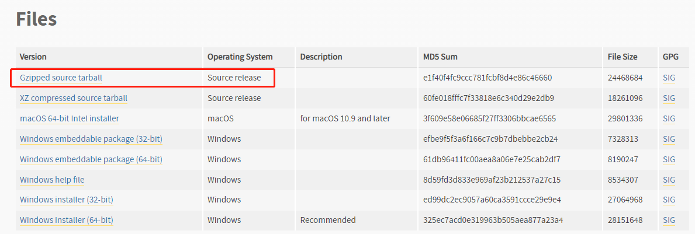

#### 2.3 在Linux里安装

- 使用xftp将压缩文件迁移至CentOS里

- 解压缩Python-3.8.7.tgz

  ```bash
  tar -zxvf Python-3.8.7.tgz
  ```

  

- 安装Python依赖环境

  ```bash
  yum install gcc zlib-devel bzip2-devel openssl-devel ncurses-devel sqlite-devel readline-devel tk-devel gcc make libffi-devel -y
  ```

  

- 解压安装

  安装到目录：/usr/local/python-3.8

  ```bash
  # 进入Python-3.8.7
  cd Python-3.8.7
  
  # 配置安装位置
  ./configure prefix=/usr/local/python-3.8
  
  # 安装
  make && make install
  ```

  

- 查看

  ```bash
  # 如果最后没提示出错，就代表正确安装了，在/usr/local/目录下就会有python-3.8目录
  ls /usr/local/python-3.8
  
  # 在根目录下删除python安装包
  rm -rf Python-3.8.7
  ```

#### 2.4 配置环境变量

- (方法一)  添加软连接

  ```bash
  # 添加python3的软链接 
  ln -s /usr/local/python-3.8/bin/python3.8 /usr/bin/python3 
  
  # 添加 pip3 的软链接 
  ln -s /usr/local/python-3.8/bin/pip3.8 /usr/bin/pip3
  ```

  

- （方法二）添加环境变量

  ```bash
  cd /bin
  vi /etc/profile
  
  # 在profile文件的最后一行添加
  export PATH=$PATH:/usr/local/python-3.8/bin
  
  # 保存退出，重新加载环境变量
  source /etc/profile
  ```

  

- 查看

  ```bash
  [root@localhost bin]# python3
  Python 3.8.7 (default, May 31 2022, 07:40:22) 
  [GCC 4.8.5 20150623 (Red Hat 4.8.5-44)] on linux
  Type "help", "copyright", "credits" or "license" for more information.
  >>>
  ```

  

### 3. 安装MySQL

#### 3.1 在yum源中查询

```bash
yum search mysql-community-server
# 发现没有匹配的安装包，需要去官网找
```

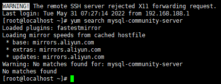

#### 3.2 去官网获取

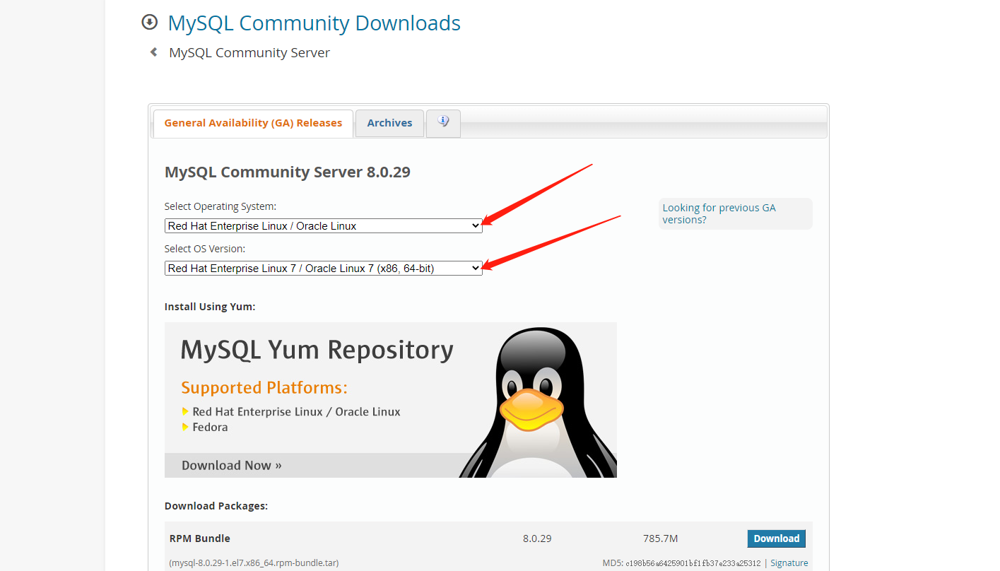

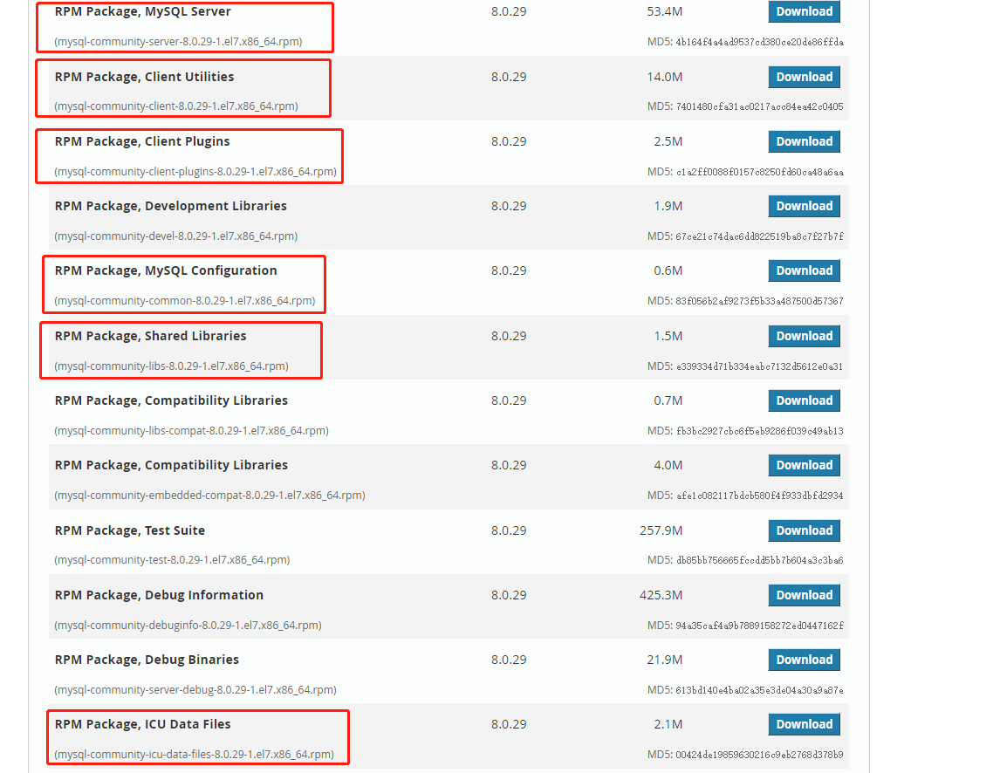

- 一共6个安装包

  - server

  - client

  - client-plugins

  - common

  - libs

  - icu-data

    

#### 3.3 在Linux里面安装

- 使用xftp将压缩文件迁移至CentOS里

- 卸载并安装

  ```bash
  # 卸载 mariadb-libs
  rpm -e mariadb-libs --nodeps
  
  # 依次安装
  rpm -ivh mysql-community-common-8.0.29-1.el7.x86_64.rpm
  rpm -ivh mysql-community-client-plugins-8.0.29-1.el7.x86_64.rpm
  rpm -ivh mysql-community-libs-8.0.29-1.el7.x86_64.rpm
  rpm -ivh mysql-community-client-8.0.29-1.el7.x86_64.rpm
  yum install net-tools
  yum install perl
  rpm -ivh mysql-community-icu-data-files-8.0.29-1.el7.x86_64.rpm
  rpm -ivh mysql-community-server-8.0.29-1.el7.x86_64.rpm
  
  ```


#### 3.4 配置MySQL

- ```bash
  # 初始化MySQL
  mysqld --initialize
  
  # 修改MySQL的拥有者
  cd /var/lib
  chown mysql:mysql mysql -R
  
  # 启动MySQL服务
  systemctl start mysqld.service
  # 查看启动状态
  systemctl status mysqld.service
  # Active: active (running)代表MySQL服务已经启动
  ● mysqld.service - MySQL Server
     Loaded: loaded (/usr/lib/systemd/system/mysqld.service; enabled; vendor preset: disabled)
     Active: active (running) since Tue 2022-05-31 10:30:19 CHOT; 3min 54s ago
       Docs: man:mysqld(8)
             http://dev.mysql.com/doc/refman/en/using-systemd.html
    Process: 29607 ExecStartPre=/usr/bin/mysqld_pre_systemd (code=exited, status=0/SUCCESS)
   Main PID: 29631 (mysqld)
     Status: "Server is operational"
     CGroup: /system.slice/mysqld.service
             └─29631 /usr/sbin/mysqld
  
  
  # 查看临时密码
  cd /mysql
  cat /var/log/mysqld.log
  >>>>
  # 找到临时密码
  2022-05-31T02:22:43.142742Z 6 [Note] [MY-010454] [Server] A temporary password is generated for root@localhost: rXi?UmAgt2gl
  
  # 登录MySQL,在任意位置都可以
  mysql -uroot -p
  rXi?UmAgt2gl
  
  # 修改临时密码,在MySQL里面输入
  ALTER USER 'root'@'localhost' IDENTIFIED BY '123456';
  
  # 让MySQL服务设置为随着开机一起启动
  systemctl enable mysqld.service
  # 让MySQL服务设置为不随着开机一起启动
  systemctl disable mysqld.service
  ```

  

