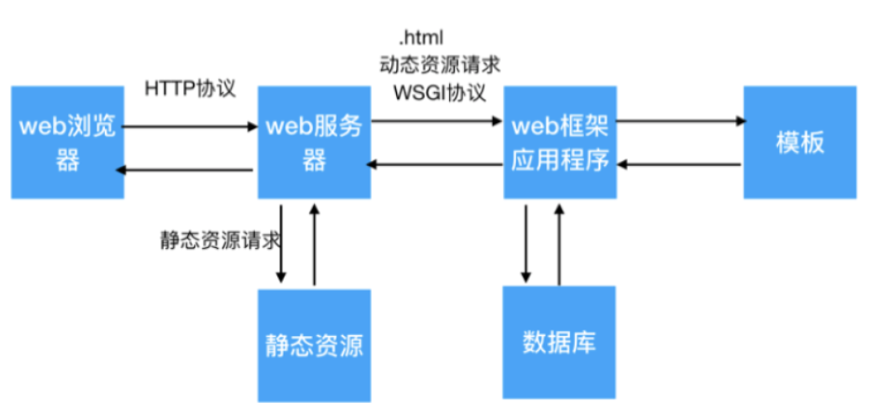

# 第一章：自制Web框架

## 1. Web框架

**web服务器：**Web服务器一般指网站服务器，是指驻留于因特网上某种类型计算机的程序，可以处理浏览器等Web客户端的请求并返回相应响应，也可以放置网站文件，让全世界浏览；可以放置数据文件，让全世界下载。目前最主流的三个Web服务器是Apache、 Nginx 、IIS。

**web框架：**是一种开发框架，用来支持动态网站、网络应用程序及网络服务的开发。

**WSGI：**Web服务器网关接口（Python Web Server Gateway Interface，缩写为WSGI）是为Python语言定义的Web服务器和Web应用程序或框架之间的一种简单而通用的接口。

**静态资源：**不需要经常变化的资源，这种资源web服务器可以提前准备好，比如: png/jpg/css/js等文件。
**动态资源：**和静态资源相反, 这种资源会经常变化，比如: 我们在京东浏览商品时经常会根据条件进行筛选，选择不同条件, 浏览的商品就不同，这种资源web服务器无法提前准备好，需要web框架来帮web服务器进行准备，在这里web服务器可以把.html的资源请求认为是动态资源请求交由web框架进行处理。



## 2. 开发自己的Web框架

接收web服务器的动态资源请求，给web服务器提供处理动态资源请求的服务。根据请求资源路径的后缀名进行判断

- 如果请求资源路径的后缀名是.html则是动态资源请求, 让web框架程序进行处理。
- 否则是静态资源请求，让web服务器程序进行处理。

### 2.1 开发Web服务器主体程序

1. 接受客户端HTTP请求（底层是TCP）
2. 判断请求是否是静态资源还是动态资源
3. 如果静态资源怎么处理？
4. 如果动态资源又怎么处理
5. 关闭Web服务器

```python
'''
我们自己开发的Web服务器
'''
import socket
import threading
import time
import MyFramework

class MyHttpWebServer(object):
    def __init__(self, port):
        # 创建HTTP服务器的套接字
        server_socket = socket.socket(socket.AF_INET, socket.SOCK_STREAM)
        # 设置端口号复用，程序退出之后，不需要等待几分钟，直接释放端口
        server_socket.setsockopt(socket.SOL_SOCKET, socket.SO_REUSEADDR, True)
        server_socket.bind(('', port))
        server_socket.listen(128)
        self.server_socket = server_socket

    # 处理浏览器请求的函数
    @staticmethod
    def handle_browser_request(new_socket):
        # 接收客户端发过来的数据
        recv_data = new_socket.recv(4096)
        # 如果没有收到数据，那么请求无效，关闭套接字，直接退出
        if len(recv_data) == 0:
            new_socket.close()
            return

        # 对接收到的字节数据，转换成字符
        request_data = recv_data.decode('utf-8')
        print('浏览器请求的数据: ', request_data)
        request_array = request_data.split(' ', maxsplit=2)
        # 得到请求路径
        request_path = request_array[1]
        print('请求路径是: ', request_path)
        # 如果请求路径是根目录，自动设置为/index.html
        if request_path == '/':
            request_path = '/index.html'

        # 根据请求路径来判断是动态资源还是静态资源
        if request_path.endswith('.html'):
            '''动态资源的请求'''
            # 动态资源的处理交给Web框架来处理，需要把请求参数传给Web框架，可能会有多个参数，所以采用字典结构
            params = {
                'request_path': request_path,
            }
            # Web框架处理动态资源请求之后，返回一个响应
            response = MyFramework.handle_request(params)
            new_socket.send(response)
            new_socket.close()

        else:
            '''静态资源的请求'''
            response_body = None          # 响应主题
            response_header = None        # 响应头
            response_first_line = None    # 响应头的第一行
            # 其实就是: 根据请求路径读取/static目录中静态的文件数据，响应给客户端
            try:
                # 读取static目录中对应的文件数据(字节)
                path = 'static' + request_path
                print('path = ', path)
                with open(path, 'rb') as f:
                    response_body = f.read()
                response_first_line = 'HTTP/1.1 200 ok\r\n'
                response_header = 'Server: My Server\r\n'

            except Exception as e:  # 浏览器想读取的文件可能不存在
                with open('static/404.html', 'rb') as f:
                    response_body = f.read()  # 响应的主体页面内容
                # 响应头(字符数据)
                response_first_line = 'HTTP/1.1 404 Not Found\r\n'
                response_header = 'Server: My Server\r\n'

            finally:
                # 组成响应数据，发送给客户端(浏览器)
                response = (response_first_line + response_header + '\r\n').encode('utf-8') + response_body
                new_socket.send(response)
                new_socket.close()  # 关闭套接字

    # 启动服务器，并且接收客户端的请求
    def start(self):
        # 循环并且多线程来接收客户端的请求
        while True:
            new_socket, ip_port = self.server_socket.accept()
            print("客户端的ip和端口", ip_port)
            # 一个客户端的请求交给一个线程来处理
            sub_thread = threading.Thread(target=self.handle_browser_request, args=(new_socket,))
            # 设置当前线程为守护线程
            sub_thread.setDaemon(True)
            sub_thread.start()


# web服务器程序的入口
def main():
    web_server = MyHttpWebServer(8080)
    web_server.start()


if __name__ == '__main__':
    main()
```


### 2.2 开发Web框架主体程序

1. 根据请求路径，动态的响应对应的数据
2. 如果请求路径，没有对应的响应数据也需要返回404页面

```python
'''
我们自动应以的Web框架
'''
import time


# 处理动态资源请求的函数
def handle_request(params):
    request_path = params['request_path']

    if request_path == '/index.html':  # 当前的请求路径有与之对应的动态响应
        return index()
    elif request_path == '/user_info.html':  # 个人中心的功能, user_info.html
        return user_info()
    else:
        # 没有动态资源的数据，返回404页面
        return page_not_found()

# 当前user_info函数，专门处理user_info.html的请求
def user_info():
    # 需求: 在页面中动态显示当前系统时间
    date = time.strftime('%Y-%m-%d %H:%M:%S', time.localtime())
    # response_body = data

    with open('template/user_info.html', 'r', encoding='utf-8') as f:
        response_body = f.read()
    response_body = response_body.replace('', date)
    response_first_line = 'HTTP/1.1 200 OK\r\n'
    response_header = 'Server: My Server\r\n'
    response = (response_first_line + response_header + '\r\n' + response_body).encode('utf-8')
    return response


# 当前index函数，专门处理index.html的请求
def index():
    # 需求: 在页面中动态显示当前系统时间
    date = time.strftime('%Y-%m-%d %H:%M:%S', time.localtime())
    # response_body = data

    with open('template/index.html', 'r', encoding='utf-8') as f:
        response_body = f.read()
    response_body = response_body.replace('', date)
    response_first_line = 'HTTP/1.1 200 OK\r\n'
    response_header = 'Server: My Server\r\n'
    response = (response_first_line + response_header + '\r\n' + response_body).encode('utf-8')
    return response

# 处理没有找到对应的动态资源
def page_not_found():
    with open('static/404.html', 'rb') as f:
        response_body = f.read()  # 响应的主体页面内容
    # 响应头(字符数据)
    response_first_line = 'HTTP/1.1 404 Not Found\r\n'
    response_header = 'Server: My Server\r\n'
    response = (response_first_line + response_header + '\r\n').encode('utf-8') + response_body
    return response
```


### 2.3 使用模板来展示响应内容

1. 自己设计一个模板 （index.html） ，中有一些地方采用动态的数据来替代
2. 怎么替代，替代什么数据

### 2.4 开发框架的路由列表功能

1. 以后开发新的动作资源的功能，只需要，a、增加一个条件判断分支 b、增加一个专门处理的函数

2. 路由： 就是请求的URL路径和处理函数直接的映射。

3. 路由表

   注意：用户的动态资源请求，通过遍历路由表找到对应的处理函数来完成的。

| 请求路径        | 处理函数      |
| --------------- | ------------- |
| /index.html     | index函数     |
| /user_info.html | user_info函数 |

```python
'''
我们自动应以的Web框架
'''
import time

# 处理动态资源请求的函数
def handle_request(params):
    request_path = params['request_path']

    for path, func in route_list:
        if request_path == path:
            return func()
    else:
        # 没有动态资源的数据，返回404页面
         return page_not_found()

    # if request_path == '/index.html':  # 当前的请求路径有与之对应的动态响应
    #     return index()
    # elif request_path == '/user_info.html':  # 个人中心的功能, user_info.html
    #     return user_info()
    # else:
    #     # 没有动态资源的数据，返回404页面
    #     return page_not_found()

# 当前user_info函数，专门处理user_info.html的请求
def user_info():
    # 需求: 在页面中动态显示当前系统时间
    date = time.strftime('%Y-%m-%d %H:%M:%S', time.localtime())
    # response_body = data

    with open('template/user_info.html', 'r', encoding='utf-8') as f:
        response_body = f.read()
    response_body = response_body.replace('', date)
    response_first_line = 'HTTP/1.1 200 OK\r\n'
    response_header = 'Server: My Server\r\n'
    response = (response_first_line + response_header + '\r\n' + response_body).encode('utf-8')
    return response


# 当前index函数，专门处理index.html的请求
def index():
    # 需求: 在页面中动态显示当前系统时间
    date = time.strftime('%Y-%m-%d %H:%M:%S', time.localtime())
    # response_body = data

    with open('template/index.html', 'r', encoding='utf-8') as f:
        response_body = f.read()
    response_body = response_body.replace('', date)
    response_first_line = 'HTTP/1.1 200 OK\r\n'
    response_header = 'Server: My Server\r\n'
    response = (response_first_line + response_header + '\r\n' + response_body).encode('utf-8')
    return response

# 处理没有找到对应的动态资源
def page_not_found():
    with open('static/404.html', 'rb') as f:
        response_body = f.read()  # 响应的主体页面内容
    # 响应头(字符数据)
    response_first_line = 'HTTP/1.1 404 Not Found\r\n'
    response_header = 'Server: My Server\r\n'
    response = (response_first_line + response_header + '\r\n').encode('utf-8') + response_body
    return response

# 定义路由表
route_list = {
    ('/index.html', index),
    ('/user_info.html', user_info)
}
```


### 2.5 采用装饰器的方式添加路由

1. 采用带参数的装饰器

2. 在任何一个处理函数的基础上增加一个添加路由的功能

   小结：使用带参数的装饰器，可以把我们的路由自动的，添加到路由表中。

```python
'''
我们自动应以的Web框架
'''
import time
from functools import wraps

# 定义路由表
route_list = []

# 定义一个带参数的装饰器
def route(request_path):  # 参数就是URL请求
    def add_route(func):
        # 添加路由到路由表
        route_list.append((request_path, func))
        @wraps(func)
        def invoke(*arg, **kwargs):
            # 调用我们制定的处理函数，并返回结果
            return func()
        return invoke
    return add_route


# 处理动态资源请求的函数
def handle_request(params):
    request_path = params['request_path']

    for path, func in route_list:
        if request_path == path:
            return func()
    else:
        # 没有动态资源的数据，返回404页面
         return page_not_found()

    # if request_path == '/index.html':  # 当前的请求路径有与之对应的动态响应
    #     return index()
    # elif request_path == '/user_info.html':  # 个人中心的功能, user_info.html
    #     return user_info()
    # else:
    #     # 没有动态资源的数据，返回404页面
    #     return page_not_found()

# 当前user_info函数，专门处理user_info.html的请求
@route('/user_info.html')
def user_info():
    # 需求: 在页面中动态显示当前系统时间
    date = time.strftime('%Y-%m-%d %H:%M:%S', time.localtime())
    # response_body = data

    with open('template/user_info.html', 'r', encoding='utf-8') as f:
        response_body = f.read()
    response_body = response_body.replace('', date)
    response_first_line = 'HTTP/1.1 200 OK\r\n'
    response_header = 'Server: My Server\r\n'
    response = (response_first_line + response_header + '\r\n' + response_body).encode('utf-8')
    return response


# 当前index函数，专门处理index.html的请求
@route('/index.html')
def index():
    # 需求: 在页面中动态显示当前系统时间
    date = time.strftime('%Y-%m-%d %H:%M:%S', time.localtime())
    # response_body = data

    with open('template/index.html', 'r', encoding='utf-8') as f:
        response_body = f.read()
    response_body = response_body.replace('', date)
    response_first_line = 'HTTP/1.1 200 OK\r\n'
    response_header = 'Server: My Server\r\n'
    response = (response_first_line + response_header + '\r\n' + response_body).encode('utf-8')
    return response

# 处理没有找到对应的动态资源
def page_not_found():
    with open('static/404.html', 'rb') as f:
        response_body = f.read()  # 响应的主体页面内容
    # 响应头(字符数据)
    response_first_line = 'HTTP/1.1 404 Not Found\r\n'
    response_header = 'Server: My Server\r\n'
    response = (response_first_line + response_header + '\r\n').encode('utf-8') + response_body
    return response


```

