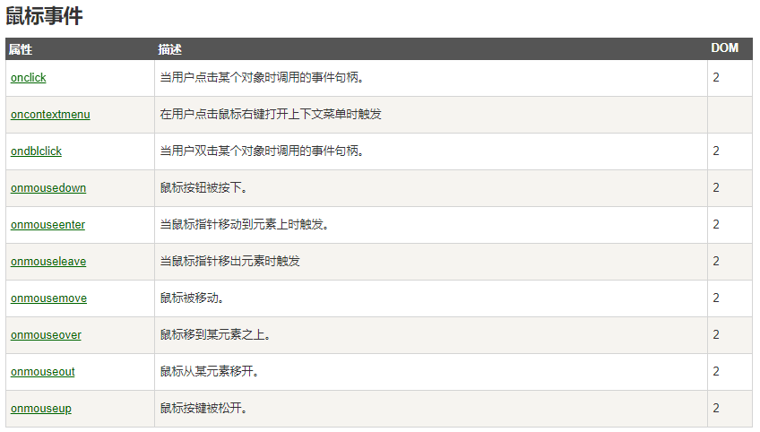
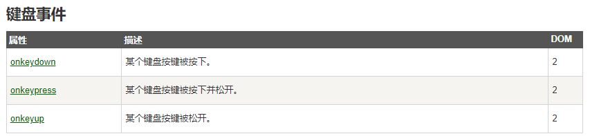
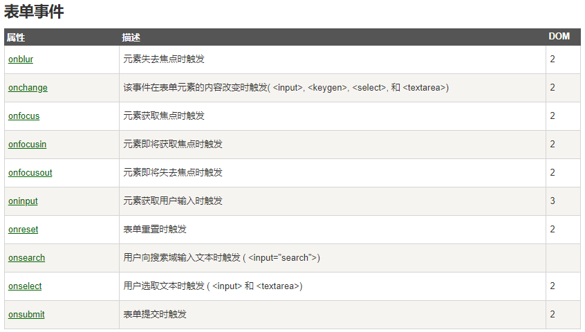
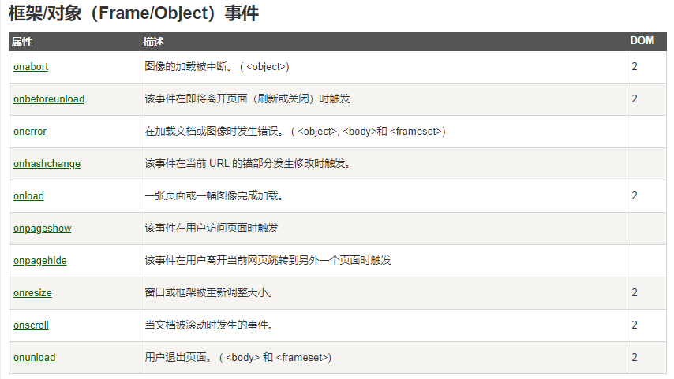

# 一、JS的引入方式

## 1.1 嵌入式引入

```javascript
<!DOCTYPE html>
<html lang="en">
  <head>
    <meta charset="UTF-8" />
	<title></title>
	<!-- 内嵌式引入方式
	     1. 在head标签中，用一对script标签，嵌入JS代码
		 2. type属性可以省略不写
	 -->
	<script type="text/javascript">
		/* 定义一个函数(方法) */
		function fun1(){
			/* 弹窗提示信息 */
			alert("你好")
		}
	</script>
  <head>
  <body>
	  <input  type="button" value="点我呀" onclick="fun1()"/>
  </body>
</html>
```

## 1.2 链接式引入外部 JS 文件

script标签一旦用于引入外部 JS 文件，就不能再该标签下定义内嵌式代码了，得另起一个script标签

- **index.html**

  ```javascript
  <!DOCTYPE html>
  <html>
  	<head>
  		<meta charset="utf-8">
  		<title></title>
  		<script type="text/javascript" src="js/myjs1.js"></script>
  		<script type="text/javascript" src="js/myjs2.js"></script>
  		<script type="text/javascript">
  			function fun3(){
  				alert("总能见到你")
  			}
  		</script>
  	</head>
  	<body>
  		<input type="button" value="来点我呀" onclick="fun1()"/>
  		<input type="button" value="再点我呀" onclick="fun2()"/>
  		<input type="button" value="还点我呀" onclick="fun3()"/>
  	</body>
  </html>
  ```

- **myjs1.js**

  ```javascript
  function fun1(){
  	alert("你好")
  }
  ```

- **myjs2.js**

  ```javascript
  function fun2(){
  	alert("你好,又见面啦！")
  }
  ```

  

# 二、JS中的数据类型

- 所有的变量对象的数据类型的声明，统统都是var
- 变量声明时没有数据类型，变量赋值时确定具体的数据类型

- JS中的变量可以反复声明var，后声明的会覆盖之前声明的同名变量

- JS中的代码可以不以分号 **;** 作为结尾，每一行都是一个独立的语句**（建议加上分号）**
- 变量起名尽量避免 $ ,会和 jQuery 冲突
- JS中的数据类型有
  - 数值型（number）：整数和浮点数统称为数值
  - 字符串型（string）：由单引号或双引号括起来表示
  - 布尔型（boolean）：用true或false来表示
  - 空值（null）：注意，空值不等同于空字符串""或0
  - 未定义值（undefined）：是一个保留字，变量声明了，但没有赋值
  - 复合数据类型（object）：包括对象和数组两种
    - 数组在JS中是用方括号 [1, 2, 3] 存储

# 三、JS中的运算符

| 类型       | 运算符                          |
| ---------- | ------------------------------- |
| 算术运算符 | +   -   *   /   %   ++   --     |
| 赋值运算符 | =                               |
| 比较运算符 | >   <   >=   <=   ==   ===   != |
| 逻辑运算符 | &&   \|\|    !                  |

- **/** 的特征
  1. 能除尽，则结果默认为整数，不能除尽，则结果默认为浮点数
  2. 除零不会出现异常，会alert 一个 Infinity

- **%** 的特征
  - 和 0 取余数，会alert 一个 NaN

- **+** 的特征
  1. 如果+的一端是字符串，就会变成字符串的拼接
  2. 数字和boolean类型相加，true会转变为1，false会转变为0，再做数学运算

- **==** 的特征
  - 如果类型一致，则比较值是否相同
  - 如果类型不一致，则将数据尝试转换成number，再比较内容

- **===** 的特征
  - 如果类型不一致，直接返回false
  - 如果类型一致，值不一致，也返回false
  - 只有类型和值都相等，才返回true


# 四、流程控制

## 4.1 顺序结构（略）

## 4.2 分支结构 if  switch

```javascript
<!DOCTYPE html>
<html>
	<head>
		<meta charset="utf-8">
		<title></title>
		<script>
			/* 
			 * 定义变量表示月份
			 * 根据月份输出该月的季节和应季活动
			 */
			var i=10;
			if(i == 12 || i == 1 || i == 2){
				alert("大约在冬季:冬天吃火锅");
			}else if(i>= 3 && i<=5){
				alert("春天来了:出去春游");
			}else if(i >= 6 && i <= 8){
				alert("夏天到了:撸串儿喝酒")
			}else if(i >= 9 && i <= 11){
				alert("秋天到了:贴秋膘");
			}else{
				alert("月份有误");
			}
			
			switch(i){
				case 3:
				case 4:
				case 5:
					alert("春眠不觉晓");
					break;
				case 6:
				case 7:
				case 8:
					alert("夏天蚊子咬");
					break;	
				case 9:
				case 10:
				case 11:
					alert("秋天一身包");
					break;
				case 1:
				case 2:
				case 12:
					alert("冬天蚊子死翘翘");
					break;	
				default:
					alert("月份有误")
			}
		</script>
	</head>
	<body>
	</body>
</html>
```


## 4.3 循环结构 while    do_while    for

```javascript
<!DOCTYPE html>
<html>
	<head>
		<meta charset="utf-8">
		<title></title>
		<script>
			/*  输出 1 到 10 */
			var i = 1;
			while(i <= 10){
				alert(i);
				i++;
			}
			
			/*  求 1-10 的整数和 */			
			var j = 1;
			var sum = 0
			do{
				sum += j;
				j++;
			}while(j<=10)
			alert(j)
			
			var sum2 = 0
			/*  求 1-10 的整数和 */
			for(var z=1; z<=10; z++){
				sum2 += z;
			}
			alert(sum2)
		</script>
	</head>
	<body>
	</body>
</html>
```


## 4.4 流程控制小练习

- 打印九九乘法表

```javascript
<!DOCTYPE html>
<html>
	<head>
		<meta charset="utf-8">
		<title></title>
		<script>
			for(var i=1; i<=9; i++){
				for(var j=1; j<=i; j++){
					document.write(j+"*"+i+"="+i*j+"&nbsp&nbsp&nbsp")
				}
				document.write("<br/>")
			}
		</script>
	</head>
	<body>
	</body>
</html>
```


# 五、函数

## 5.1 函数的声明

```javascript
<!DOCTYPE html>
<html>
	<head>
		<meta charset="utf-8">
		<title></title>
		<script>
			/* 第一种定义函数的语法格式 */
			function fun1(){
				alert("你好");
			}
			
			/* 第二种定义函数的语法格式 */
			var fun2=function(){
				alert("你很好");
			}
			
			/* 第三种定义函数的语法格式 */
			var fun3=new Function("alert('你非常好')")
			
			/* 调用函数 */
			fun1();
			fun2();
			fun3();
		</script>
	</head>
	<body>
	</body>
</html>
```


## 5.2 函数的参数

```javascript
<!DOCTYPE html>
<html>
	<head>
		<meta charset="utf-8">
		<title></title>
		<script>
			function fun1(a, b, c){
				alert("a:" + a)
				alert("b:" + b)
				alert("c:" + c)
			}
			
			/* 正常传递参数 */
			fun1(10, 'hello JS', false);
			/* 少传一个参数，少传的参数会以 undefined 的形式参与函数运算 */
			fun1(10, 'hello JS');
			/* 多传一个参数，多传的参数相当于没传 */
			fun1(10, 'hello JS', false, "第四个参数")
		</script>
		
	</head>
	<body>
	</body>
</html>
```


## 5.3 函数的返回值

```javascript
<!DOCTYPE html>
<html>
	<head>
		<meta charset="utf-8">
		<title></title>
		<script>
			function fun1(a, b){
				var c = a * b
				return c
			}
			
			var x = fun1(10,20)
			alert(x)
		
		</script>
	</head>
	<body>
	</body>
</html>
```

# 六、数据类型的应用

## 6.1数组

### 6.1.1 数组的创建

```javascript
<!DOCTYPE html>
<html>
	<head>
		<meta charset="utf-8">
		<title></title>
		<script>
			/* 第一种
			 * 创建了一个空数组,长度动态申请
			 */
			var arr=new Array();
			arr[0]=1;
			console.log(arr);
			
			/* 
			 * 第二种
			 * 创建定长数组 new Array(5)
			 */
			var arr2=new Array(5);
			arr2[0]='x';
			arr2[4]=true;
			arr2[6]=1;
			console.log(arr2);
			
			/* 
			 * 第三种
			 * 创建时，直接指定元素值
			 */
			var arr3=new Array("asdf",10,20.3,true);
			arr3[4]='hello'
			console.log(arr3)
			
			/* 
			 * 第四种
			 * 相当于第三种的简写
			 */
			var arr4=["qwer",20,10.3,false];
			arr4[4]='world'
			console.log(arr4)
		</script>
	</head>
	<body>

	</body>
</html>
```


### 6.1.2 数组的元素和长度

```javascript
<!DOCTYPE html>
<html>
	<head>
		<meta charset="utf-8">
		<title></title>
		<script type="text/javascript">
			var arr=[11,22,33];
			console.log(arr);
			// 获取数组元素
			console.log(arr[0]);
			// 获取数组长度
			console.log((arr.length));
			
			/* 
			 * js中的数组可以通过修改length属性来改变数组长度 
			 */
			arr.length=5;
			console.log(arr);
			/* 
			 * js中的数组可以通过索隐改变数组长度
			 */
			arr[9]=99;
			console.log(arr)
		</script>
	</head>
	<body>

	</body>
</html>
```


### 6.1.3 数组的遍历

```javascript
<!DOCTYPE html>
<html>
	<head>
		<meta charset="utf-8">
		<title></title>
		<script type="text/javascript">
			var arr=[5,7,3,1,6,2,4,9,8];
			/* 
			 * 普通for循环遍历数组
			 */
			for(var i=0;i<arr.length;i++){
				console.log(arr[i])
			}
			
			/* 
			 * foreach循环遍历数组
			 * foreach的写法为 for(var i in 数组)
			 * i 不是元素，是索引，和python不同
			 */
			for(var i in arr){
				console.log(arr[i])
			}
		</script>
	</head>
	<body>

	</body>
</html>
```


### 6.1.4 数组常用方法

https://www.runoob.com/jsref/jsref-obj-array.html

- 查询元素在数组中的索引： `var index=arr.indexOf('hello')`
- 合并两个数组：`var arr3=arr1.concat(arr2)`
- 合并多个数组：`var arr4=arr1.concat(arr2, arr3)`
- 合并数组中的字符串：`var s=arr.join()`
- 删除最后一个元素：`var s=arr.pop()`
- 在末尾添加一个元素：`arr.push('world')`
- 反转数组：`arr.reverse()`
- 删除第一个元素：`var s=arr.shift()`
- 向第一位增加一个元素：`arr.unshift('say')`
- 按索引切片：`arr2 = arr.slice(1,3)`
- 删除某区域数据：`arr.splice(2,3)`  从第2个索引位置开始，往后删3个参数
- 在指定索引位置插入数据：`arr.splice(2,0,100)` 第二个参数为0的时候，就变成了增加，往索引为2的位置插入100
- 数组升序：`arr.sort()`
- 数组降序：`arr.sort(function(a,b){return b-a})`


## 6.2 字符串

https://www.runoob.com/jsref/jsref-obj-string.html


## 6.3 Number对象

https://www.runoob.com/jsref/jsref-obj-number.html


## 6.4 Math对象

https://www.runoob.com/jsref/jsref-obj-math.html


## 6.5 Date对象

https://www.runoob.com/jsref/jsref-obj-date.html


# 七、自定义对象的三种方式

## 7.1 调用系统的构造函数创建对象(Object)

```javascript
<!DOCTYPE html>
<html>
	<head>
		<meta charset="utf-8">
		<title></title>
		<script type="text/javascript">
			// 实例化对象
			var obj=new Object();
			// 给对象添加属性
			obj.name='张三';
			obj.age=35;
			obj.gender='男';
			// 给对象添加方法
			obj.eat=function(food){
				console.log(this.name+'正在吃'+food)
			}
			// 查看对象属性
			console.log(obj.name);
			console.log(obj.age);
			console.log(obj.gender);
			// 调用对象方法
			obj.eat('蛋糕');
		</script>
	</head>
	<body>

	</body>
</html>
```


## 7.2 自定义构造函数创建对象(function)

```javascript
<!DOCTYPE html>
<html>
	<head>
		<meta charset="utf-8">
		<title></title>
		<script type="text/javascript">
			// 准备一个构造方法
			function Person(pname,page){
				this.pname=pname;
				this.page=page;
				this.eat=function(food){
					console.log(this.page+"岁的"+this.pname+"正在吃"+food);
				}
			}
			// 实例化对象
			var p1=new Person('张三','10')
			// 查看对象属性，调用对象方法
			console.log(p1.pname);
			console.log(p1.page);
			p1.eat('油条')
		</script>
	</head>
	<body>

	</body>
</html>
```


## 7.3 字面量的方式创建对象(JSON)

```javascript
<!DOCTYPE html>
<html>
	<head>
		<meta charset="utf-8">
		<title></title>
		<script type="text/javascript">
			/* 
			 * JSON
			 * var 对象名={属性名:属性值,属性名:属性值,... ...,方法名:方法声明,方法名:方法声明}
			 */
			
			var person={
				name:'小明',
				gender:'男',
				age:10,
				eat:function(food){
					console.log(this.age+'岁的'+this.gender+'孩儿'+this.name+'正在吃'+food)
				}
			};
			// 查看对象属性
			console.log(person.name);
			console.log(person.gender);
			console.log(person.age);
			// 调用对象方法
			person.eat('馒头');
		</script>
	</head>
	<body>

	</body>
</html>
```


# 八、事件的绑定

https://www.runoob.com/jsref/dom-obj-event.html


## 8.1 事件的绑定和触发

```javascript
<!DOCTYPE html>
<html>
	<head>
		<meta charset="utf-8" />
		<title></title>
		<script>
			function fun1(){
				console.log("fun1执行了")
			}
			
			
			function fun2(){
				console.log("fun2执行了")
			}
			function fun3(){
				console.log("fun3执行了")
			}
		</script>
	</head>
	<body>
		<!--
			JS 事件驱动型
			当我们单击按钮时,触发某些JS代码的执行
			单击按钮时,触发一段JS代码的运行
			1一个事件可以同时绑定多个JS函数
			2一个页面元素可以同时绑定多个事件
		-->
		<input type="button" value="按钮" onclick="fun1(),fun2()" onmouseover="fun3()" />
	</body>
</html>
```


## 8.2 鼠标事件



```javascript

<!DOCTYPE html>
<html>
	<head>
		<meta charset="UTF-8">
		<title></title>
		<style>
			.d1{
				width: 100px;
				height: 100px;
				background-color: greenyellow;
			}

		</style>
		<script>
			function fun1(){
				console.log("双击666")
			}
			function fun2(){
				console.log("鼠标按下")
			}
			function fun3(){
				console.log("鼠标抬起")
			}
			function fun4(){
				console.log("鼠标进入")
			}
			function fun5(){
				console.log("鼠标离开")
			}
			function fun6(){
				console.log("鼠标移动")
			}
		</script>
	</head>
	<body>
		<div class="d1" 
			ondblclick="fun1()" 
			onmousedown="fun2()" 
			onmouseup="fun3()" 
			onmouseenter="fun4()" 
			onmouseleave="fun5()" 
			onmousemove="fun6()">
			
		</div>
	</body>
</html>
```


## 8.3 键盘事件



```javascript

<!DOCTYPE html>
<html>
	<head>
		<meta charset="UTF-8">
		<title></title>
		<script>
			function fun1(){
				console.info("按钮按下")
			}
			function fun2(){
				console.info("按钮抬起")
			}
			function fun3(){
				console.info("按钮按下并抬起")
			}
		</script>
	</head>
	<body>
		<input type="text" onkeydown="fun1()" onkeyup="fun2()" onkeypress="fun3()" />
	</body>
</html>
```


## 8.4 表单事件



```javascript
<!DOCTYPE html>
<html>
	<head>
		<meta charset="UTF-8">
		<title></title>
		<script>
			function fun1(){console.log("获得焦点");}
			function fun2(){console.log("失去焦点");}
			function fun3(){console.log("正在输入");}// 只要输入了,就会触发
			function fun4(){console.log("内容改变");}// 内部信息发生变化的同时,要失去焦点
			function fun5(sel){console.log("内容发生改变了"+sel.value)}
			function fun6(){
				alert("发生了提交事件");
				// 做了一些运算之后 动态决定表单能否提交
				
				return false ;
			}
			function fun7(){ 
				console.log("发生了重置事件");
				return true;
			}
		</script>
	</head>
	<body>
		<form method="get"  action="https://www.baidu.com" onsubmit="return fun6()" onreset="return fun7()">
			<input name=""  value=""  type="text" onfocus="fun1()" onblur="fun2()" oninput="fun3()" onchange="fun4()"/><br />
			<select name="city" onchange="fun5(this)">
				<option selected>-请选择城市-</option>
				<option value="1">北京</option>
				<option value="2">天津</option>
				<option value="3">上海</option>
				<option value="4">重庆</option>
			</select>
			<br />
			<input type="submit" value="提交数据" />
			<input type="reset"  value="重置数据" />
		</form>
	</body>
</html>
```


## 8.5 页面加载事件



```javascript

<!DOCTYPE html>
<html>
	<head>
		<meta charset="UTF-8">
		<title></title>
		<script>
			
			function testFun(){
				var in1=document.getElementById("i1");
				var v1=in1.value;
				console.log(v1)
			}
			
		</script>
	</head>
	<body onload="testFun()">
		<input type="text" value="测试文字" id="i1" />
	</body>
</html>
```


# 九、BOM和DOM

- BOM：browser object model 浏览器对象模型
  - 将浏览器抽象成一个window对象，同时封装了一些属性和方法
  - 通过window对象属性的控制和方法的调用可以实现对浏览器特征进行控制
  - 有BOM之后，就可以控制浏览器的行为了
- DOM：document object model 文档对象模型
  - 将浏览器当前打开的文件抽象成document对象
  - 将文档解析成一个document对象，树形结构的对象
  - 通过操作该对象，可以达到修改页面文档内容的效果

```javascript
class window{
    location;    将地址栏抽象成属性
    history;     浏览器打开页面的历史属性
    navigartor;  浏览器软件本身
    screen;      浏览器所在显示器
    document;    浏览器打开的文档
}
```


## 9.1 window对象的三种弹窗方式

```javascript
<!DOCTYPE html>
<html>
	<head>
		<meta charset="UTF-8">
		<title></title>
		<script>
			function fun1(){
				/*
				 * 如果是使用window对象调用的方法和访问的属性 那么window对象都可以省略不写
				 * 
				 * */
				window.alert("你好呀");//普通信息提示框
				
				var con =window.confirm("确定要删除***女友吗?");// 确认框
				console.log(con);
				
				var message =window.prompt("请输入3号女友的名字","例如:小刚");// 信息输入框
				console.log(message)
			}
			
		</script>
	</head>
	<body>
		<input type="button" value="测试按钮"  onclick="fun1()"/>
	</body>
</html>
```


## 9.2 window对象的定时器使用

```javascript
<!DOCTYPE html>
<html>
	<head>
		<meta charset="UTF-8">
		<title></title>
		<script>
			
			var intervalIDS =new Array(); // [1,2,3 ]
			// 循环执行的定时器任务
			function startInterval(){
				// 2
				var intervalID = window.setInterval(
					function(){
						var today =new Date();
						var hours=today.getHours();
						var minutes=today.getMinutes();
						var seconds =today.getSeconds();
						var str = hours+"点"+minutes+"分"+seconds+"秒";
						
						var ta =document.getElementById("timeArea");
						ta.value =str;
					
					},
					1000
				);
				intervalIDS.push(intervalID);
			}
			function stopInterval(){
				while(intervalIDS.length >0){
					window.clearInterval(intervalIDS.shift());
				}
				
				
			}
			
			var timeoutIDS =new Array();
			// 执行一次的定时器任务
			function startTimeout(){
				
				var timeoutID =window.setTimeout(
					function(){
						var today =new Date();
						var hours=today.getHours();
						var minutes=today.getMinutes();
						var seconds =today.getSeconds();
						var str = hours+"点"+minutes+"分"+seconds+"秒";
						console.log(str)
					
					},
					5000
				);
				
				timeoutIDS.push(timeoutID);
			}
			
			function stopTimeout(){
				while(timeoutIDS.length >0){
					window.clearTimeout(timeoutIDS.shift());
				}
			}
			
		</script>
	</head>
	<body>
		<input type="text" id="timeArea" /> <br />
		<input type="button" value="开始Interval" onclick="startInterval()" />
		<input type="button" value="结束Interval" onclick="stopInterval()" />
		<input type="button" value="开始timeout" onclick="startTimeout()" />
		<input type="button" value="结束timeout" onclick="stopTimeout()" />
	</body>
</html>
```


## 9.3 window对象的open和close方法

```javascript
<!DOCTYPE html>
<html>
	<head>
		<meta charset="UTF-8">
		<title></title>
		<script>
			function fun1(){
				window.open("https://www.baidu.com")
			}
			function fun2(){
				window.close();
			}
		</script>
	</head>
	<body>
		<input type="button" value="打开百度" onclick="fun1()" />
		<input type="button" value="关闭页面" onclick="fun2()" />
	</body>
</html>
```


## 9.4 location对象

```javascript
<!DOCTYPE html>
<html>
	<head>
		<meta charset="UTF-8">
		<title></title>
		<script>
			function fun1(){
				console.log(location.host);// 服务器的IP+端口号
				console.log(location.hostname);// IP 
				console.log(location.port);// 端口号
				console.log(location.href);// 地址栏中具体的文字
			
				location.href="https://www.baidu.com"
			}
			
		</script>
	</head>
	<body>
		<input type="button" value="测试location" onclick="fun1()" />
		<a href="10history.html" target="_self">测试标签</a>
	</body>
</html>
```


## 9.5 history对象

```javascript
<!DOCTYPE html>
<html>
	<head>
		<meta charset="UTF-8">
		<title></title>
		<script>
		
			function fun1(){
				window.history.forward();
				
			}
			function fun2(){
				history.back();
			}
			function fun3(){
				history.go(2); // 正整数 向前跳转 * 页  负整数 向后跳转*页
			}
	
			
		</script>
	</head>
	<body>
		<a href="a.html" target="_self">pageA</a>
		<input type="button" value="向前" onclick="fun1()"/>
		<input type="button" value="向后" onclick="fun2()"/>
		<input type="button" value="go" onclick="fun3()"/>
	</body>
</html>
```


## 9.6 document对象

- **DOM节点分类node：**

  节点对象：Node，document对象中的每一个分支点都是一个node对象，它有三个子类

  - 元素节点：Element	如: \<a href='链接地址'\> 我的链接 \</a\>
  - 属性节点：Attribute   如: href='链接地址'
  - 文本节点：Text           如: 我的链接

- **DOM操作的内容：**
  - 查询元素（获取元素，进而操作元素，或者元素的属性，文本）
  - 操作文本
  - 操作属性
  - 操作CSS样式（一个特殊的属性style）

### 9.6.1 直接获取元素

```javascript
<!DOCTYPE html>
<html>
	<head>
		<meta charset="UTF-8">
		<title></title>
		<script>
			function fun1(){
				// 获得document对象
				var element1 =document.getElementById("d1");
				console.log(element1);
				
				element1.innerText="这是我的div";
			}
			function fun2(className){
				var elements =document.getElementsByClassName(className);
				console.log(elements)
				for(var i =0;i<elements.length;i++){
					console.log(elements[i])
				}
			}
			function fun3(){
				var elements =document.getElementsByTagName("input");
				console.log(elements);
				for(var i =0;i<elements.length;i++){
					console.log(elements[i])
				}
			}
			function fun4(){
				var elements=document.getElementsByName("hobby");
				console.log(elements);
				for(var i =0;i<elements.length;i++){
					console.log(elements[i])
				}
			}
		</script>
	</head>
	<body>
		<div id='d1' class="a">这是第一个div</div>
		<div id='d2' class="a">这是第二个div</div>
		<div id='d3' class="a">这是第三个div</div>
		<input id='i1' class="a" name='name1'/>
		<div id='d4' class="b" name='name1'>这是第四个div</div>
		<div id='d5' class="b">这是第五个div</div>
		爱好:
		<input type="checkbox" name="hobby"  value="1" />篮球
		<input type="checkbox" name="hobby"  value="2" />足球
		<input type="checkbox" name="hobby"  value="3" />羽毛球
	
		<hr />
		<input type="button" value="id值获取" onclick='fun1()' />
		<input type="button" value="class属性值获取" onclick='fun2("b")' />
		<input type="button" value="标签名获取" onclick='fun3()' />
		<input type="button" value="name属性值获取" onclick='fun4()' />
	</body>
</html>
```


### 9.6.2 操作属性和样式

- 操作节点属性

```javascript
<!DOCTYPE html>
<html>
	<head>
		<meta charset="UTF-8">
		<title></title>
		<script>
			function fun1(){
				var element =document.getElementById("in1");
				
				// 语法1  获取:节点.属性名  修改:节点.属性名=属性值
				console.log(element.type);
				console.log(element.value);
				element.type="button";
				element.value="你好我也好";
				
				// 语法2  getAttribute  setAttribute
				console.log(element.getAttribute("type"));
				console.log(element.getAttribute("value"));
				element.setAttribute("type","button")
				element.setAttribute("value","大家好")
			}
		</script>
	</head>
	<body>
		<input type="text" value="你好呀" id="in1" /> 
		<hr />
		<input type="button" value="变" onclick="fun1()"  />
		
	</body>
</html>
```

- 操作节点样式

```javascript
<!DOCTYPE html>
<html>
	<head>
		<meta charset="UTF-8">
		<title></title>
		<style>
			#div1{
				width: 100px;
				height: 100px;
				border: 1px solid red;
				
			}
			.a{
				background-color: lightblue;
				color: blue;
				font-size: 40px;
			}
		</style>
		<script>
			function fun1(){
				// 节点.style.样式名=样式值
				var element =document.getElementById("div1");
				element.style.width="200px";
				element.style.height="200px";
				element.style.border="10px solid green";
				// css样式在更多的时候是以class选择器的形式作用到元素上
				// 可以通过修改class属性,影响div的样式
				element.setAttribute("class","a")
			}
		</script>
	</head>
	<body>
		<div id="div1" >
			你好呀
		</div>
		<hr/>
		<input type="button" value="测试" onclick="fun1()" />
	</body>
</html>
```


### 9.6.3 操作标签文本

```javascript
<!DOCTYPE html>
<html>
	<head>
		<meta charset="UTF-8">
		<title></title>
		<style>
			div{
				border: 1px solid red;
				width: 200px;
				height: 200px;
			}
		</style>
		<script>
			function fun1(){
				var element1=document.getElementById("d1");
				
				/*
				 * innerText  不包含HTML结构
				 * innerHTML  包含HTML结构
				 * */
				
				console.log("innerText>>>"+element1.innerText);
				console.log("innerHTML>>>"+element1.innerHTML);
				
				
				var element2=document.getElementById("i1");
				console.log(element2.value)
			}
			function fun2(){
				var element1=document.getElementById("d1");
				//element1.innerText="<h1>一刻也不能分割</h1>"
				element1.innerHTML="<h1>一刻也不能分割</h1>"
				
				var element2=document.getElementById("i1");
				element2.value="无论我走到哪里";
				
			}
		</script>

	</head>
	<body>
		<div id='d1'>
			a
			<span>文字</span>
			b
		</div>
		
		<input type="text" value="我和我的祖国" id='i1' />
		
		<input type="button" value="获取内容"  onclick="fun1()"/>
		<input type="button" value="修改内容"  onclick="fun2()"/>
	</body>
</html>
```


### 9.6.4 增加删除节点

```javascript
<!DOCTYPE html>
<html>
	<head>
		<meta charset="utf-8">
		<title></title>
		<style>
			#d1{
				border: 1px solid red;
				width: 80%;
				height: 200px;
			}
		</style>
		<script>
			function fun1(){
				var div1=document.getElementById("d1");
				// 通过JS创建标签
				var in1=document.createElement("input");
				in1.setAttribute("type","text");
				in1.setAttribute("value","请输入内容");
				
				var in2=document.createElement("input");
				in2.setAttribute("type","password");
				in2.setAttribute("value","123456789");
				
				var in3=document.createElement("input");
				in3.setAttribute("type","button");
				in3.setAttribute("value","删除");
				
				var br=document.createElement("br");
				
				in3.onclick=function (){
					div1.removeChild(in1)
					div1.removeChild(in2)
					div1.removeChild(in3)
					div1.removeChild(br)
				}
				div1.appendChild(in1);
				div1.appendChild(in2);
				div1.appendChild(in3);
				div1.appendChild(br);
			}
		</script>
	</head>
	<body>
		<div id="d1">
			
		</div>
		<input type="button" value="增加" onclick="fun1()" />
	</body>
</html>
```


### 9.6.5 案例开发

```javascript
<!DOCTYPE html>
<html>
        <head>
                <meta charset="utf-8" />
                <title></title>
         		<script>
         			function fun1(){
         				var outerDiv =document.getElementById("outerDiv"); 
         				// 1000
         				var left =Math.floor(Math.random()*1000)
         				// 500
         				var top =Math.floor(Math.random()*500)
         				
         				
         				outerDiv.style.marginTop=top+"px";
         				outerDiv.style.marginLeft=left+"px";
         			}
         			
         			function  fun2(){
         				alert("love you too")
         			}
         			
         		</script>
                <style>
                        #outerDiv{
                                width: 200px;
                                height: 200px;
                                border: 1px solid gold;
                                background-color: gray;
                                text-align: center;
                                margin-top: 200px;
                                margin-left: 200px;
                        }
                        #outerDiv input{
                                width: 50px;
                                height: 50px;
                                margin: 20px;
                        }
                </style>
        </head>
        <body >
                <div id="outerDiv">
                        <h3>do you love me?</h3>
                        <input type="button" value="是" onclick="fun2()"/>
                        <input type="button" value="否" onmouseover="fun1()"/>
                </div>
        </body>
</html>
```

# 十、echarts

链接地址：https://echarts.apache.org/zh/index.html

