# 一、基础篇
## 1. MySQL启动与连接

### 1.1 MySQL启动
| 操作                                      | 说明            |
| ----------------------------------------- | --------------- |
| net start mysql80                         | 启动MySQL服务   |
| mysql [-h127.0.0.1] [-p3306] -uroot-proot | 登录MySQL服务器 |
| mysql -u root -p                          | 登录MySQL服务器 |
| net stop mysql80                          | 关闭MySQL服务   |

### 1.2 MySQL客户端连接Navicate

- 修改密码编码方式(Windows)

  - 执行命令

    ```mysql
    use mysql
    select user,host from user;
    ```

  - 找到用户名和host

    ```mysql
    alter user 'root'@'localhost' identified by 'root' password expire never;
    
    alter user 'root'@'localhost' identified with mysql_native_password by 'root';
    
    # root是user localhost是host
    ```


## 2. SQL
### 2.1 SQL基础语法介绍
>1.SQL语句可以单行或多行书写，以分号结尾。
>2.SQL语句可以使用空格/缩进来增强语句的可读性
>3.MySQL数据库的SQL语句不区分大小写，关键字建议使用大写
>4.注释：
>
>- 单行注释：- - 注释内容 或 # 注释内容(MySQL特有)
>- 多行注释：/* 注释内容 */
- **SQL分类**

| 分类 | 全称                       | 说明                                                   |
| ---- | -------------------------- | ------------------------------------------------------ |
| DDL  | Data Definition Language   | 数据定义语言，用来定义数据库对象(数据库，表，字段)     |
| DML  | Data Manipulation Language | 数据操作语言，用来对数据库表中的数据进行增删改         |
| DQL  | Data Query Language        | 数据查询语言，同来查询数据库中表的记录                 |
| DCL  | Data Control Language      | 数据控制语言，用来创建数据库用户、控制数据库的访问权限 |
- **数值类型**

| 类型         | 大小    | 有符号(SIGNED)范围                                    | 无符号(UNSIGNED)范围                                    |
| ------------ | ------- | ----------------------------------------------------- | ------------------------------------------------------- |
| tinyint      | 1 byte  | (-128, 127)                                           | （0, 255）                                              |
| smallint     | 2 bytes | (-32768, 32767)                                       | (0, 65535)                                              |
| mediumint    | 3 bytes | (-8388608, 8388607)                                   | (0, 16777215)                                           |
| int或integer | 4 bytes | (-2147483648, 2147483647)                             | (0, 4294967295)                                         |
| bigint       | 8 bytes | $$ (-2^{63}, 2^{63}-1) $$                             | $$ (0, 2^{64}-1) $$                                     |
| float        | 4 bytes | (-3.402823466 E+38, 3.402823466351 E+38)              | 0和(1.175494351 E-38, 3.402823466 E+38)                 |
| double       | 8 bytes | (-1.7976931348623157 E+308, 1.7976931348623157 E+308) | 0和(2.2250738585072014 E-308, 1.7976931348623157 E+308) |
| decimal      |         | 依赖于M(精度)和D(标度)的值                            | 依赖于M(精度)和D(标度)的值                              |

- **字符串类型**

| 类型       | 大小               | 描述                         |
| ---------- | ------------------ | ---------------------------- |
| char       | 0-255 bytes        | 定长字符串                   |
| varchar    | 0-65535 bytes      | 变长字符串                   |
| tinyblob   | 0-255 bytes        | 不超过255个字符的二进制数据  |
| tinytext   | 0-255 bytes        | 短文本字符串                 |
| blob       | 0-65535 bytes      | 二进制形式的长文本数据       |
| text       | 0-65535 bytes      | 长文本数据                   |
| mediumblob | 0-16777215 bytes   | 二进制形式的中等长度文本数据 |
| mediumtext | 0-16777215 bytes   | 中等长度文本数据             |
| longblob   | 0-4294967295 bytes | 二进制形式的极大文本数据     |
| longtext   | 0-4294967295 bytes | 极大文本数据                 |

- **日期时间类型**

| 类型      | 大小 | 范围                                       | 格式                | 描述                     |
| --------- | ---- | ------------------------------------------ | ------------------- | ------------------------ |
| date      | 3    | 1000-01-01 至 9999-12-31                   | YYYY-MM-DD          | 日期值                   |
| time      | 3    | -838:59:59 至 838:59:59                    | HH:MM:SS            | 时间值或持续时间         |
| year      | 1    | 1901 至 2155                               | YYYY                | 年份值                   |
| datetime  | 8    | 1000-01-01 00:00:00 至 9999-12-31 23:59:59 | YYYY-MM-DD HH:MM:SS | 混合日期和时间值         |
| timestamp | 4    | 1970-01-01 00:00:00 至 2038-01-19 03:14:07 | YYYY-MM-DD HH:MM:SS | 混合日期和时间值，时间戳 |


### 2.2 DDL：数据定义语言

#### 2.2.1 数据库操作

##### 1. 查询

- **查询所有数据库：**`show databases;`
- **查看当前所在数据库：**`select database();`

##### 2. 创建

- **创建数据库：**`create database [if not exists] 数据库名 [default charset 字符集] [collate 排序规则];`
- **创建数据库案例：**`creat database test default charset utf8mb4;`

##### 3. 删除

- **删除指定数据库：**`drop database [if exists] 数据库名;`

##### 4. 使用

- **选择指定数据库：**`use 数据库名`

  

#### 2.2.2 表操作

##### 1. 查询

- **查询当前数据库中所有的表：**`show tables;`
- **查询表的结构：**`desc 表名;`
- **查询指定表的建表语句：**`show create table 表名;`

##### 2. 创建

- 语法

```mysql
create table 表名(
    字段1  字段1类型[comment 字段1注释],
    字段2  字段2类型[comment 字段2注释],
    字段3  字段3类型[comment 字段3注释],
    ······
    字段n  字段n类型[comment 字段n注释]
)[comment 表注释];
```

- 举例

```mysql
create table emp(
	id int comment '编号',
    workno varchar(10) comment '工号',
    name varchar(10) comment '姓名',
    gender char(1) comment '性别',
    age tinyint unsigned comment '年龄',
    idcard char(18) comment '身份证号',
    entrydate date comment '入职时间'
) comment '员工信息表';
```

##### 3. 修改

```
+-----------+------------------+------+-----+---------+-------+
| Field     | Type             | Null | Key | Default | Extra |
+-----------+------------------+------+-----+---------+-------+
| id        | int              | YES  |     | NULL    |       |
| workno    | varchar(10)      | YES  |     | NULL    |       |
| name      | varchar(10)      | YES  |     | NULL    |       |
| gender    | char(1)          | YES  |     | NULL    |       |
| age       | tinyint unsigned | YES  |     | NULL    |       |
| idcard    | char(18)         | YES  |     | NULL    |       |
| entrydate | date             | YES  |     | NULL    |       |
+-----------+------------------+------+-----+---------+-------+
```

- **添加字段：**`alter table 表名 add 字段名 类型(长度) [comment 注释] [约束];`
  - 案例：` alter table emp add nickname varchar(20);`
- **修改数据类型：**`alter table 表名 modify 字段名 新数据类型(长度)`
  - 案例：`alter table emp modify name varchar(20);`
- **修改字段名和字段类型：**`alter table 表名 change 旧字段名 新字段名 类型(长度) [comment 注释] [约束]`
  - 案例：`alter table emp change nickname username varchar(30) comment '用户名';`
- **删除字段：**`alter table 表名 drop 字段名;`
  - 案例：`alter table emp drop entrydate;`
- **修改表名：**`alter table 旧表名 rename to 新表名;`
  - 案例：`alter table emp rename to employee;`

```
+----------+------------------+------+-----+---------+-------+
| Field    | Type             | Null | Key | Default | Extra |
+----------+------------------+------+-----+---------+-------+
| id       | int              | YES  |     | NULL    |       |
| workno   | varchar(10)      | YES  |     | NULL    |       |
| name     | varchar(20)      | YES  |     | NULL    |       |
| gender   | char(1)          | YES  |     | NULL    |       |
| age      | tinyint unsigned | YES  |     | NULL    |       |
| idcard   | char(18)         | YES  |     | NULL    |       |
| username | varchar(30)      | YES  |     | NULL    |       |
+----------+------------------+------+-----+---------+-------+
```

##### 4. 删除

- **删除表：**`drop table [if exists] 表名;`
  - 案例：`drop table if exists emp;`
- **删除指定表，并重新创建该表：**`truncate table 表名;`
  - 案例：`truncate table employee;`


### 2.3 DML：数据操作语言

#### 1. 添加

- **给指定字段添加数据：**

  - **插入一条数据：**`insert into 表名(字段名1, 字段名2, ...) values(值1, 值2, ...);`

    - 案例：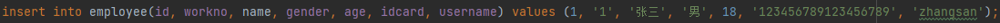

    

- **给全部字段添加数据：**

  - **插入一条数据：**`insert into 表名 values(值1, 值2, ...);`

    - 案例：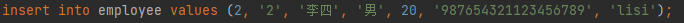

      

- **批量添加数据：**

  - `insert into 表名(字段名1, 字段名2, ...) values(值1, 值2, ...),(值1, 值2, ...),(值1, 值2, ...);`
    - 案例：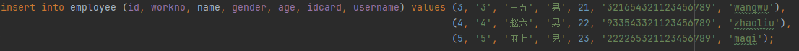

  - `insert 表名 values(值1, 值2, ...),(值1, 值2, ...),(值1, 值2, ...);`
    - 案例：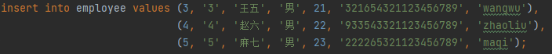

  

- **注意：**

  - 插入数据时，指定的字段顺序需要与值的顺序是一一对应的
  - 字符串和日期型数据赢包含在引号中
  - 插入的数据大小，应该在字段的规定范围内

#### 2. 更新

- **修改数据：**`update 表名 set 字段名1=值1, 字段名2=值2, [WHERE 条件];`
  - 案例1：`update employee set name='张三三' where id=1;`
  - 案例2：`update employee set name='小昭', gender='女' where id=2;`
  - 案例3：`update employee set workno='1';`
- **注意：**修改语句的条件可以有，也可以没有，如果没有条件，则会修改整张表的所有数据

#### 3. 删除

- **删除数据：**`delete from 表名 [where 条件];`

  - 案例1：`delete from employee where gender='女';`
  - 案例2：`delete from employee;`

  

- **注意：**
  
  - delete语句的条件可以有，也可以没有，如果没有条件，则会删除整张表的所有数据
  - delete语句不能删除某一个字段的值(可以使用update)

### 2.4 DQL：数据查询语言

```mysql
SELECT
	字段列表
FROM
	表名列表
WHERE
	条件列表
GROUP BY
	分组字段列表
HAVING
	分组后条件列表
ORDER BY
	排序字段列表
LIMIT
	分页参数
```

#### 2.4.1 基础查询

##### 1. 查询多个字段

- `select 字段1,字段2,字段3,... from 表名;`
  - `selcet id,name,workaddress,age,gender from emp;`
- `select * from 表名;`

##### 2. 设置别名

- `select 字段1 as 别名1, 字段2 as 别名2, ... from 表名;`
  - `select workaddress as '工作地址' from emp;`
  - `select workaddress '工作地址' from emp;`

##### 3. 查询字段(不要重复)

- `select distinct 字段列表 from 表名;`
  - `select distinct workaddress '工作地址' from emp;`

#### 2.4.2 条件查询

##### 1. 语法

- `select 字段列表 from 表名 条件列表;`

##### 2. 条件

| 比较运算符          | 功能                             |
| ------------------- | -------------------------------- |
| >                   | 大于                             |
| >=                  | 大于等于                         |
| <                   | 小于                             |
| <=                  | 小于等于                         |
| =                   | 等于                             |
| <> 或 !=            | 不等于                           |
| between ... and ... | 在某个范围之内(含最小、最大值)   |
| in(...)             | 在in之后的列表中的值，多选一     |
| like 占位符         | 模糊匹配(_单个字符，%任意个字符) |
| is NULL             | 是NULL                           |

| 逻辑运算符  | 功能 |
| ----------- | ---- |
| and 或 &&   | 并且 |
| or 或  \|\| | 或者 |
| not 或  !   | 非   |

##### 3. 示例

```mysql
-- 查询年龄等于88的员工信息
select * from emp where age=88;

-- 查询年龄小于20的员工信息
select * from emp where age<20;

-- 查询年龄小于等于20的员工信息
select * from emp where age<=20;

-- 查询身份证号缺失的员工信息
select * from emp where idcard is null;

-- 查询身份证号存在的员工信息
select * from emp where idcard is not null;

-- 查询年龄不等于88的员工信息
select * from emp where age != 88;
select * from emp where age <> 88;

-- 查询年龄在15岁(包含)到20岁(包含)之间的员工信息
select * from emp where age>=15 and age<=20;
select * from emp where age>=15 && age<=20;
select * from emp where age between 15 and 20;

-- 查询 性别为女 且 年龄小于25 的员工信息
selcet * from emp where gender='女' and age<25;

-- 查询 年龄等于18 或20 或40 的员工信息
select * from emp where age=18 or age=20 or age=40;
select * from emp where age in(18,20,40);

-- 查询姓名为两个字的员工信息
select * from emp where name like '__';

-- 查询身份证号最后一位是X的员工信息
select * from emp where name like '%X';
```

#### 2.4.3 聚合函数

- 将一列数据作为一个整体，进行纵向计算

##### 1.常见的聚合函数

| 函数  | 功能     |
| ----- | -------- |
| count | 统计数量 |
| max   | 最大值   |
| min   | 最小值   |
| avg   | 平均值   |
| sum   | 求和     |

##### 2.示例

```mysql
-- 所有的null值，不参与聚合函数的运算

-- 统计企业员工的总数量
select count(*) from emp;
select count(idcard) from emp; 

-- 统计企业员工的平均年龄
select avg(age) from emp;

-- 统计企业员工的最大年龄
select max(age) from emp;

-- 统计企业员工的最小年龄
select min(age) from emp;

-- 统计西安地区员工的年龄之和
select sum(age) from emp where workaddress='西安';
```

#### 2.4.4 分组查询

##### 1. 语法

`select 字段列表 from 表名 [where 条件] group by 分组字段名 [having 分组后过滤条件];`

- where与having的区别
  - 执行时机不同：where是分组之前进行过滤，不满足where条件，不参与分组；having是分组之后对结果进行过滤
  - 判断条件不同：where不能对聚合函数进行判断，而having可以

##### 2. 示例

```mysql
-- 根据性别分组，统计 男性员工 和 女性员工 的数量
select gender,count(*) from emp group by gender;

-- 根据性别分组，统计 男性员工 和 女性员工 的平均年龄
select gender,avg(age) from emp group by gender;

-- 查询年龄小于45的员工，并根据工作地址分组，获取员工数量大于等于3的工作地址
select workaddress,count(*) from emp where age<45 group by workaddress having count(*)>=3;
select workaddress,count(*) address_count from emp where age<45 group by workaddress having address_count>=3;
```

##### 5. 注意

- 执行顺序：where > 聚合函数 > having
- 分组之后，查询的字段一般为聚合函数和分组字段，查询其他字段无任何意义

#### 2.4.5 排序查询

##### 1. 语法

`select 字段列表 from 表名 order by 字段1 排序方式1, 字段2 排序方式2;`

- 排序方式
  - ASC：升序(默认值)
  - DESC：降序

- 注意：如果是多字段排序，当第一个字段值相同时，才会根据第二个字段进行排序

##### 2. 示例

```mysql
-- 根据年龄，对员工进行升序排序
select * from emp order by age;
select * from emp order by age asc;

-- 根据入职时间，对员工进行降序排序
select * from emp order by entrydate desc;

-- 根据年龄，对公司的员工进行生序排序，年龄相同，再按照入职时间进行降序排序
select * from emp order by age asc, entrydate desc;
```

#### 2.4.6 分页查询

##### 1. 语法

`select 字段列表 from 表名 limit 起始索引,查询记录数;`

- 注意：
  - 起始索引从0开始，起始索引= (查询页码-1) * 每页显示记录数
  - 分页查询是数据库的方言，不同的数据库有不同的实现，MySQL中是limit
  - 如果查询的是第一页数据，起始索引可以省略，直接简写为limit 10

##### 2. 示例

```mysql
-- 查询第1页员工数据，每页展示10条记录
select * from emp limit 10;
select * from emp limit 0,10;

-- 查询第2页员工数据，每页展示10条记录
select * from emp limit 10,10;
```

#### 2.4.7 案例练习

**需求：**

1. 查询年龄为20,21,22,23岁的女性员工信息
2. 查询性别为男，并且年龄在20-40岁(含)以内的姓名为三个字的员工
3. 统计员工表中，年龄小于60岁的，男性员工和女性员工的人数
4. 查询所有年龄小于等于35岁员工的姓名和年龄，并对查询结果按年龄升序排序，如果年龄相同按入职时间降序排序
5. 查询性别为男，且年龄在20-40岁(含)以内的前五个员工信息，对查询的结果按年龄升序排序，年龄相同按入职时间升序排序

**代码**

```mysql
-- 查询年龄为20,21,22,23岁的女性员工信息
select * from emp where gender='女' and age in(20,21,22,23);

-- 查询性别为男，并且年龄在20-40岁(含)以内的姓名为三个字的员工
select * from emp where gender='男' and age between 20 and 40 and name like '___';
select * from emp where gender='男' and (age between 20 and 40) and name like '___';

-- 统计员工表中，年龄小于60岁的，男性员工和女性员工的人数
select gender,count(*) from emp where age<60 group by gender;

-- 查询所有年龄小于等于35岁员工的姓名和年龄，并对查询结果按年龄升序排序，如果年龄相同按入职时间降序排序
select name,age from emp where age<=35 order by age asc, entrydate desc;

-- 查询性别为男，且年龄在20-40岁(含)以内的前五个员工信息，对查询的结果按年龄升序排序，年龄相同按入职时间升序排序
select * from emp where gender='男' and (age between 20 and 40) order by age asc, entrydate asc limit 5;
```

#### 2.4.8 执行顺序

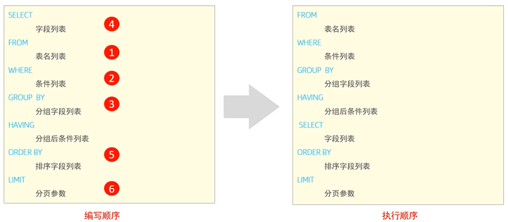


### 2.5 DCL：数据控制语言    

#### 2.5.1 管理用户

##### 1. 查询用户

```mysql
use mysql;
select * from user;
```

##### 2. 创建用户

```mysql
create user '用户名'@'主机名' identified by '密码';
```

##### 3. 修改用户密码

```mysql
alter user '用户名'@'主机名' identified with mysql_native_password by '新密码';
```

##### 4. 删除用户

```mysql
drop user '用户名'@'主机名';
```

##### 5. 示例

```mysql
-- 创建用户ssl0，只能够在当前主机localhost访问，密码123456
create user 'ssl0'@'localhost' identified by '123456';

-- 创建用户ssl，在任意主机上都能访问该数据库，密码123456
create user 'ssl'@'%' identified by '123456';

-- 修改用户ssl的访问密码为1234
alter user 'ssl'@'%' identified with mysql_native_password by '1234'

-- 删除用户ssl0@localhost用户
drop user 'ssl0'@'localhost';
```

#### 2.5.2 权限控制

**常用权限**

| 权限                | 说明               |
| ------------------- | ------------------ |
| all, all privileges | 所有权限           |
| select              | 查询数据           |
| insert              | 插入数据           |
| update              | 修改数据           |
| delete              | 删除数据           |
| alter               | 修改表             |
| drop                | 删除数据库/表/视图 |
| create              | 创建数据库/表      |

##### 1. 查询权限

```mysql
show grants for '用户名'@'主机名';
```

##### 2. 授予权限

```mysql
grant 权限列表 on 数据库名.表名 to '用户名'@'主机名';
```

##### 3. 撤销权限

```mysql
revoke 权限列表 on 数据库名.表名 from '用户名'@'主机名';
```

##### 4. 示例

```mysql
-- 查询 ssl@% 的权限
show grants for 'ssl'@'%';

-- 授予 ssl@% 在mytest库中所有的权限
grant all on mytest.* to 'ssl'@'%';

-- 撤销 ssl@% 在mytest库中所有的权限
revoke all on mytest.* from 'ssl'@'%';

-- 授予 ssl@% 所有权限
grant all on *.* to 'ssl'@'%';
```

- 注意：
  - 多个权限之间，使用逗号分隔
  
  - 授权时，数据库名和表名可以使用 * 进行通配，代表所有
  
    

## 3.函数

### 3.1 字符串函数

####  3.1.1 常见函数

| 函数                       | 功能                                                      |
| -------------------------- | --------------------------------------------------------- |
| concat(S1, S2, ..., Sn)    | 字符串拼接，将S1, S2, ..., Sn拼接成一个字符串             |
| lower(str)                 | 将字符串str全部转为小写                                   |
| upper(str)                 | 将字符串str全部转为大写                                   |
| lpad(str, n, pad)          | 左填充，用字符串pad对str的左边进行填充，达到n个字符串长度 |
| rpad(str, n, pad)          | 右填充，用字符串pad对str的右边进行填充，达到n个字符串长度 |
| trim(str)                  | 去掉字符串头部和尾部的空格                                |
| substring(str, start, len) | 返回字符串str从start位置起的len个长度的字符串             |


#### 3.1.2 示例

```mysql
-- 字符串拼接 concat
select concat('Hello', 'MySQL');

-- 转小写 lower
select lower('Hello');

-- 转大写 upper
select upper('Hello');

-- 左填充 lpad
select lpad('01', 5, '-');

-- 右填充 rpad
select rpad('01', 5, '-');

-- 去两端的空格 trim
select trim(' Hello MySQL ');

-- 字符串截取 substring
select substring('Hello MySQL', 1, 5);


-- 案例：由于业务需求变更，企业员工的工号统一为5位数，目前不足5位数的全部在前面补0，比如：1号员工应该为00001
update emp set worno = lpad(workno, 5, 0);
```


### 3.2 数值函数

#### 3.2.1 常见函数

| 函数       | 功能                               |
| ---------- | ---------------------------------- |
| ceil(x)    | 向上取整                           |
| floor(x)   | 向下取整                           |
| mod(x,y)   | 返回 x/y 的模                      |
| rand( )    | 返回0~1内的随机数                  |
| round(x,y) | 求参数x的四舍五入的值，保留y位小数 |

#### 3.2.2 示例

```mysql
-- 向上取整 ceil
select ceil(1.1);

-- 向下取整 floor
select floor(1.9);

-- 取模 mod
select mod(7,4);

-- 求0~1之间的随机数 rand
select rand();

-- 四舍五入 round
select round(2.345, 2);

-- 案例：通过数据库的函数，生成一个六位数的随机验证码
select lpad(round(rand()*1000000, 0), 6, '0');
```


### 3.3 日期函数

#### 3.3.1 常见函数

| 函数                               | 功能                                               |
| ---------------------------------- | -------------------------------------------------- |
| curdate( )                         | 返回当前日期                                       |
| curtime( )                         | 返回当前时间                                       |
| now( )                             | 返回当前日期和时间                                 |
| year(date)                         | 获取指定date的年份                                 |
| month(date)                        | 获取指定date的月份                                 |
| day(date)                          | 获取指定date的日期                                 |
| date_add(date, INTERVAL expr type) | 返回一个日期/时间值加上一个时间间隔exper后的时间值 |
| datediff(date1,date2)              | 返回起始时间date1和结束时间date2之间的天数         |

#### 3.3.2 示例

```mysql
-- 返回当前日期 curdate
select curdate();

-- 返回当前时间 curtime
select curtime();

-- 返回当前日期和时间
select now();

-- 获取指定date的年份 year
select year(now());

-- 获取指定date的月份 month
select month(now());

-- 获取指定date的日期 day
select day(now());

-- 加上一个时间间隔exper date_add
select date_add(now(), INTERVAL 70 DAY);
select date_add(now(), INTERVAL 70 MONTH);
select date_add(now(), INTERVAL 70 YEAR);

-- 间隔天数 datediff(第一个时间减去第二个时间)
select datediff('2021-12-01, 2022-6-30');


-- 案例：查询所有员工的入职天数，并根据入职天数倒序排序
select name, datediff(curdate(), entrydate) as 'entrydays' from emp order by entrydays desc;
```

### 3.4 流程函数

#### 3.4.1 常见函数

| 函数                                                       | 功能                                                      |
| ---------------------------------------------------------- | --------------------------------------------------------- |
| if(value, t, f)                                            | 如果value为true，则返回t，否则返回f                       |
| ifnull(value1, vaule2)                                     | 如果value1不为空，返回value1，否则返回value2              |
| case when [val1] then [res1] ... else [default] end        | 如果val1为true，返回res1，... 否则返回default默认值       |
| case [expr] when [val1] then [res1] ... else [default] end | 如果expr的值等于val1，返回res1，... 否则返回default默认值 |

#### 3.4.2 示例

```mysql
-- 流程控制函数
-- if
select if(false, 'Ok', 'Error');

-- ifnull
select ifnull('Ok', 'Default');
select ifnull('', 'Default');
select ifnull(null, 'Default');

-- case when then else end
-- 需求：查询emp表的员工、姓名和工作地址(上海/北京 ---> 一线城市， 其他 ---> 二线城市)
select
	name,
	( case workaddress when '北京' then '一线城市' when '上海' then '一线城市' else '二线城市' end ) as '工作地址'
from emp;

-- 案例：统计班级各个学员的成绩，展示的规则如下：
-- >=85：优秀
-- >=60：及格
-- 否则：不及格
select
	id,
	name,
	(case when math>=85 then '优秀' when math>=60 then '及格' else '不及格' end) '数学',
	(case when english>=85 then '优秀' when math>=60 then '及格' else '不及格' end) '英语',
	(case when chinese>=85 then '优秀' when math>=60 then '及格' else '不及格' end) '语文'
from score;
```


## 4.约束

### 4.1 约束的概述

**概念：**约束是作用于表中字段上的规则，用于限制存储在表中的数据

**目的：**保证数据库中数据的正确、有效性和完整性

**分类：**

| 约束     | 描述                                                     | 关键字      |
| -------- | -------------------------------------------------------- | ----------- |
| 非空约束 | 限制该字段的数据不能为null                               | NOT NULL    |
| 唯一约束 | 保证该字段的所有数据都是唯一的、不重复的                 | UNIQUE      |
| 主键约束 | 主键是一行数据的唯一标识，要求非空且唯一                 | PRIMARY KEY |
| 默认约束 | 保存数据时，如果未指定该字段的值，则采用默认值           | DEFAULT     |
| 检查约束 | 保证字段值满足一个条件                                   | CHECK       |
| 外键约束 | 用来让两张表的数据之间建立连接，保证数据的一致性和完整性 | FOREIGN KEY |

### 4.2 约束的演示

- **需求**

| 字段名 | 字段含义   | 字段类型    | 约束条件                  | 约束关键字                  |
| ------ | ---------- | ----------- | ------------------------- | --------------------------- |
| id     | ID唯一标识 | int         | 主键，并且自动增长        | PRIMARY KEY, AUTO_INCREMENT |
| name   | 姓名       | varchar(10) | 不为空，并且唯一          | NOT NULL , UNIQUE           |
| age    | 年龄       | int         | 大于0，并且小于等于120    | CHECK                       |
| status | 状态       | char(1)     | 如果没有指定该值，默认为1 | DEFAULT                     |
| gender | 性别       | char(1)     | 无                        | 无                          |

- **表结构**

```mysql
create table user(
	id int primary key auto_increment comment '主键',
    name varchar(10) not null unique comment '姓名',
    age int check (age>0 and age<=120) comment '年龄',
    status char(1) default '1' comment '状态',
    gender char(1) comment '性别'
) comment '用户表';
```

### 4.3 外键约束

**概念：**外键用来让两张表的数据之间建立连接，从而保证数据的一致性和完整性

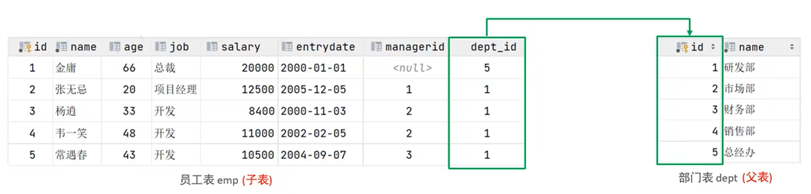

```mysql
-- 准备数据
create table dept(
	id int auto_increment comment 'ID' primary key,
    name varchar(50) not null comment '部门名称'
) comment '部门表';
insert into dept (id, name) values (1, '研发部'), (2, '市场部'), (3, '财务部'), (4, '销售部'), (5, '总经办');

create table emp(
	id int auto_increment comment 'ID' primary key,
    name varchar(50) not null comment '姓名',
    age int comment '年龄',
    job varchar(20) comment '职位',
    salary int comment '薪资',
    entrydate date comment '入职时间',
    managerid int comment '直属领导ID',
    dept_id int comment '部门ID'
) comment '员工表';
insert into emp(id, name, age, job, salary, entrydate, managerid, dept_id) values (1, '金庸', 66, '总裁', 20000, '2000-01-01', null, 5), (2, '张无忌', 20, '项目经理', 12500, '2005-12-05', 1,1)

```


## 5.多表查询
## 6.事物
# 二、进阶篇
## 1.存储引擎
## 2.索引
## 3.SQL优化
## 4.视图/存储过程/触发器
## 5.锁
## 6.InnoDB核心
## 7.MySQL管理
# 三、运维篇
## 1.日志
## 2.主从复制
## 3.分库分表
## 4.读写分离


# 四、Python与MySQL交互

## 4.1 Python操作MySQL步骤

**在pymysql中提供了Connection和Cursor对象来管理操作MySQL**

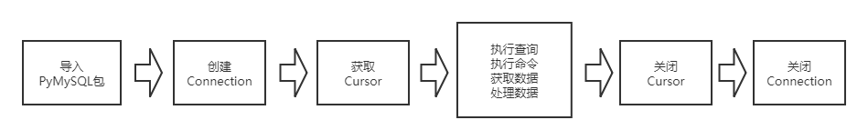

### **1. 引入pymysql模块**

```python
from pymysql import *
```


### **2. 构造Connection对象**

代表一个与MySQL Server的socket连接，使用connect方法来创建一个连接实例。

创建对象，调用connect()方法:

```python
conn = connect(参数列表)
```

- 参数host：连接的mysql主机，如果本机是'localhost'
- 参数port：连接的mysql主机的端口，默认是3306
- 参数database(db)：数据库的名称
- 参数user：连接的用户名
- 参数password(passwd)：连接的密码
- 参数charset：通信采用的编码方式，推荐使用utf8

**Connection对象常用的API:**

| lAPI            | 说明                         |
| --------------- | ---------------------------- |
| connect()       | 创建一个数据库连接实例       |
| close()         | 发送一个退出消息，并关闭连接 |
| commit()        | 提交修改至数据库             |
| cursor()        | 创建一个cursor(游标)实例     |
| ping()          | 检测服务器是否在运行         |
| rollback()      | 回滚当前事务                 |
| select_db(db)   | 设置当前db                   |
| show_warnings() | 显示警告信息                 |

### 3. 构造Cursor对象

代表一个与MySQL数据库交互对象，使用Connection.Cursor()在当前socket连接上的交互对象。

游标（Cursor）是处理数据的一种方法，为了查看或者处理结果集中的数据，游标提供了在结果集中一次一行或者多行前进或向后浏览数据的能力。可以把游标当作一个指针，它可以指定结果中的任何位置，然后允许用户对指定位置的数据进行处理
通俗来说就是，操作数据和获取数据库结果都要通过游标来操作。


**Cursor对象常用API：**

| API           | 说明                       |
| ------------- | -------------------------- |
| close()       | 关闭当前cursor             |
| execute()     | 执行一个sql语句            |
| executemany() | 执行批量sql语句            |
| fetchall()    | 取所有数据                 |
| fetchmany()   | 取多条数据，指定取数据条数 |
| fetchone()    | 取一条数据                 |

### 4. Python操作MySQL步骤代码

```python
#1 导入pymysql库
from pymysql import *

#2 创建数据库连接
conn = Connect(host='localhost',port=3306,user='root',password='root',db='mytestdb',charset='utf8')

print(conn)

#3 创建游标
cur = conn.cursor()

#4 执行sql语句和数据处理
pass

#5 关闭游标
cur.close()

#6 关闭连接
conn.close()
```

- 执行结果

  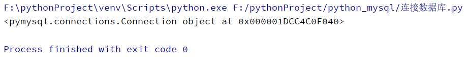

  看到以上运行结果，说明Connection对象创建成功，数据库已经连接成功！

## 4.2 sql语句注入

**什么是sql注入**

用户提交带有恶意的数据与SQL语句进行字符串方式的拼接，从而影响了SQL语句的语义，最终产生数据泄露或数据的篡改的现象。


**如何防止sql注入-sql语句参数化**

参数化查询是指在设计与数据库链接并访问数据时，在需要填入数值或数据的地方，使用参数 (Parameter) 来给值，这个方法目前已被视为最有效可预防SQL注入攻击的防御方式。


```python
#1 导入pymysql包
from pymysql import *

#2 创建数据连接
conn = connect(host='localhost',port=3306,user='root',password='root',db='mytestdb',charset='utf8')

#3 打开游标
cur = conn.cursor()

#4 执行sql语句和数据处理
sname = input('请输入用户名：')
passwd = input('请输入密码：')
#有sql注入漏洞的sql语句
#sql = "select * from t_student where sname='%s' and passwd='%s'"%(sname,passwd)
#print(sql)
#select * from t_student where sname='test' or 1=1 #' and passwd='dsafdsa'
#为防止sql注入，我们对sql语句进行参数化
sql = "select * from t_student where sname=%s and passwd=%s"
params = (sname,passwd)

rowcount = cur.execute(sql,params)

if rowcount != 0:
    print("登录成功！")
else:
    print("登录失败！")

#5 关闭游标
cur.close()

#6 关闭连接
conn.close()
```


## 4.3 增加数据

### 4.3.1 增加单条数据

```python
#1  导入pymsql包
from pymysql import *

#2 创建数据库连接
conn = connect(host='localhost',port=3306,user='root',password='root',db='mytestdb',charset='utf8')

#3 打开游标
cur = conn.cursor()

#4 执行 sql语句
#编写sql语句
try:
    sql = "insert into t_student values (%s,%s,%s,%s,%s,%s,%s,%s)"
    params = (7,"肖小军","123456",'男',21,"2020-07-15","大数据班","123456@126.com")
    #执行sql语句
    cur.execute(sql,params)
    conn.commit()
except:
    conn.rollback()

print("数据增加成功!")
#5 关闭游标
cur.close()

#6 关闭连接
conn.close()
```

运行结果

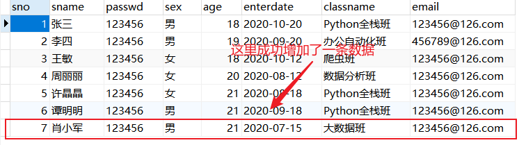


### 4.3.2 增加多条数据

```python
#1  导入pymsql包
from pymysql import *

#2 创建数据库连接
conn = connect(host='localhost',port=3306,user='root',password='root',db='mytestdb',charset='utf8')

#3 打开游标
cur = conn.cursor()

#4 执行 sql语句
#编写sql语句
try:
    sql = "insert into t_student values (%s,%s,%s,%s,%s,%s,%s,%s)"
    params = [(7,"王辉1","123456",'男',24,"2020-09-15","Python全栈班","123456@126.com"),
              (7, "王辉2", "123456", '男', 24, "2020-09-15", "Python全栈班", "123456@126.com"),
              (7, "王辉3", "123456", '男', 24, "2020-09-15", "Python全栈班", "123456@126.com")
              ]
    #执行sql语句
    cur.executemany(sql,params)
    conn.commit()
except:
    conn.rollback()

print("数据增加成功!")
#5 关闭游标
cur.close()

#6 关闭连接
conn.close()
```

运行结果

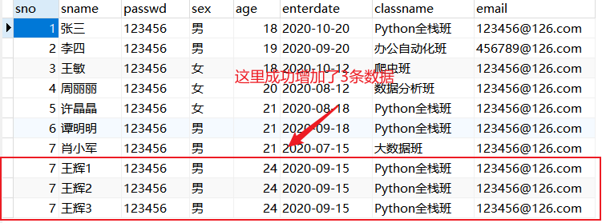


## 4.4 删除数据

```python
#1  导入pymsql包
from pymysql import *

#2 创建数据库连接
conn = connect(host='localhost',port=3306,user='root',password='root',db='mytestdb',charset='utf8')
print(conn)
#3 打开游标
cur = conn.cursor()

#4 执行 sql语句
#编写sql语句
try:
    sql = "delete from t_student where sno=%s"
    params = (7)
    #执行sql语句
    rowcount = cur.execute(sql,params)
    conn.commit()
except:
    conn.rollback()

print("已删除"+str(rowcount)+"条数据!")
#5 关闭游标
cur.close()

#6 关闭连接
conn.close()
```

运行结果

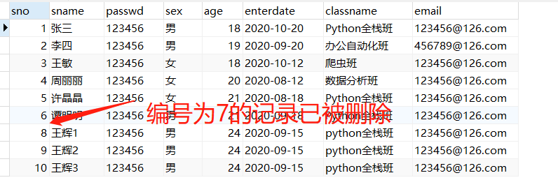


## 4.5 修改数据

```python
#1  导入pymsql包
from pymysql import *

#2 创建数据库连接
conn = connect(host='localhost',port=3306,user='root',password='root',db='mytestdb',charset='utf8')
print(conn)
#3 打开游标
cur = conn.cursor()

#4 执行 sql语句
#编写sql语句
try:
    # 删除和修改操作一定要限定条件，不然将影响其他数据，甚至误删或修改整个数据库
    sql = "update t_student set sname=%s where sno=%s"
    params = ('李敏',8)
    #执行sql语句
    rowcount = cur.execute(sql,params)
    conn.commit()
except:
    conn.rollback()

print("已修改"+str(rowcount)+"条数据!")
#5 关闭游标
cur.close()

#6 关闭连接
conn.close()
```

运行结果

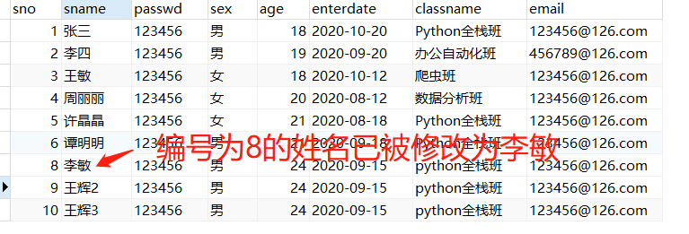


## 4.6 查询数据

```python
#1  导入pymsql包
from pymysql import *

#2 创建数据库连接
conn = connect(host='localhost',port=3306,user='root',password='root',db='mytestdb',charset='utf8')

#3 打开游标
cur = conn.cursor()

#4 执行 sql语句
#编写sql语句
# 查询数据时，为了节约内存，不要用*,而应该指定具体要取的字段，另外要指定查询条件
sql = "select sno,sname,sex,age,classname from t_student where age>%s"
params = (20)
#执行sql语句
cur.execute(sql,params)

# result=cur.fetchone()  #取一条数据
# print(result)

#result=cur.fetchmany(3)  #取指定多条数据
result=cur.fetchall()  #取所有数据
#打印输出执行结果
for row in result:
    print(row)

#5 关闭游标
cur.close()

#6 关闭连接
conn.close()
```


## 4.7 数据库封装操作

观察前面的文件发现，除了sql语句及参数不同，其它语句都是一样的

这样造成了很多重复代码，我们可以把数据库常用操作封装为一个类，以便代码可以重复使用

- **创建MysqlHelper.py文件，定义类**

  ```python
  from pymysql import *
  
  class MysqlHelper(object):
      #数据库连接参数，可以定义多个，比如conn_params1，conn_params2，用于连接多个数据库，在类实例化时指定
      conn_params1 = {'host': 'localhost', 'port': 3306, 'user': 'root', 'passwd': 'root', 'db': 'mytestdb',
                      'charset': 'utf8'}
  
      #类的构造函数，主要用于类的初始化
      def __init__(self, conn_params):
          self.__host = conn_params['host']
          self.__port = conn_params['port']
          self.__db = conn_params['db']
          self.__user = conn_params['user']
          self.__passwd = conn_params['passwd']
          self.__charset = conn_params['charset']
  
      #建立数据库连接和打开游标
      def __connect(self):
          self.__conn = connect(host=self.__host, port=self.__port, db=self.__db, user=self.__user, passwd=self.__passwd,
                              charset=self.__charset)
          self.__cursor = self.__conn.cursor()
  
      #关闭游标和关闭连接
      def __close(self):
          self.__cursor.close()
          self.__conn.close()
  
      #取一条数据
      def get_one(self, sql, params):
          result = None
          try:
              self.__connect()
              self.__cursor.execute(sql, params)
              result = self.__cursor.fetchone()
              self.__close()
          except Exception as e:
              print(e)
          return result
  
      #取所有数据
      def get_all(self, sql, params):
          lst = ()
          try:
              self.__connect()
              self.__cursor.execute(sql, params)
              lst = self.__cursor.fetchall()
              self.__close()
          except Exception as e:
              print(e)
          return lst
  
      #增加数据
      def insert(self, sql, params):
          return self.__edit(sql, params)
  
      #修改数据
      def update(self, sql, params):
          return self.__edit(sql, params)
  
      #删除数据
      def delete(self, sql, params):
          return self.__edit(sql, params)
  
      #写数据操作具体实现，增删改操作都是调用这个方法来实现，这是个私有方法，不允许类外部调用
      def __edit(self, sql, params):
          count = 0
          try:
              self.__connect()
              count = self.__cursor.execute(sql, params)
              self.__conn.commit()
              self.__close()
          except Exception as e:
              print(e)
          return count
  ```

  

- **MysqlHelper类的调用**

  ```python
  from MysqlHelper import *
  
  # 数据库查询
  '''
  mysqlhelper = MysqlHelper(MysqlHelper.conn_params1)
  sql = "select sno,sname,sex,age,classname from t_student where age>%s"
  params = (20)
  result = mysqlhelper.get_all(sql, params)
  
  # 打印输出执行结果
  for row in result:
      print(row)'''
  
  
  #增加数据
  '''
  mysqlhelper = MysqlHelper(MysqlHelper.conn_params1)
  sql = "insert into t_student values (%s,%s,%s,%s,%s,%s,%s,%s)"
  params = (11,"王五","123456",'男',24,"2020-09-15","python全栈班","123456@126.com")
  rowcount = mysqlhelper.insert(sql, params)
  print("已增加"+str(rowcount)+"条数据")'''
  
  
  #删除数据
  '''
  mysqlhelper = MysqlHelper(MysqlHelper.conn_params1)
  sql = "delete from t_student where sno=%s"
  params = (11)
  rowcount = mysqlhelper.delete(sql, params)
  print("已删除"+str(rowcount)+"条数据")'''
  
  #修改数据
  '''
  mysqlhelper = MysqlHelper(MysqlHelper.conn_params1)
  sql = "update t_student set classname=%s where sno=%s"
  params = ('大数据班',9)
  rowcount = mysqlhelper.update(sql, params)
  print("已修改"+str(rowcount)+"条数据")'''
  ```

  
