# 一、网络概述

## 1.1OSI模型

### （1）物理层

定义了通信设备的传输规范，规定了激活、维持和关闭通信节点之间的机械特性、电气特性和功能特性等。此层为上层协议提供了一个传输数据的物理媒介。简单的描述是将数据转换为可通过物理介质传送的电子信号，相当于快递公司中的搬运工人。

### （2）数据链路层

定了数据封装以及传送的方式。这个层次的数据单位称为帧。数据链路层包括两个重要的子层：逻辑链路控制层（Logic Link Control，LLC）和介质访问控制层（Media Access Control，MAC）。LLC用来对节点间的通信链路进行初始化，并防止链路中断，确保系统的可靠通信。而MAC则用来检测包含在数据帧中的地址信息。这里的地址是链路地址或物理地址，在设备制造的时候设置的。网络上的两种设备不能够包含相同的物理地址，否则会造成网络信息传送失败。简单的描述是决定访问网络介质的方式。在此层将数据分帧，并处理流控制。本层指定拓扑结构并提供硬件寻址，相当于快递公司中的装拆箱工人。

### （3）网络层

定义了数据的寻址和路由方式。这一层负责选择子网间的数据路由，并实现网络互连等功能。简单的描述是使用权数据路由经过大型网络，相当于快递公司中的排序工人按指定的省市地区分类。

### （4）传输层

为数据提供端到端传输。这是比网络层更高的层次，是主机到主机的层次。传输层将对上层的数据进行分段并进行端到端传输。另外，还提供差错控制和流量控制问题。简单的描述是提供终端到终端的可靠连接，相当于公司中跑快递点邮寄东西的人员。

### （5）会话层

用来为通信的双方制定通信方式，包括建立和拆除会话。另外，此层将会在数据中插入校验点来实现数据同步。简单的描述允许用户使用简单易记的名称建立连接 相当于公司中收寄快递、包裹与拆包裹的前台服务人员。

### （6）表示层

为不同的用户提供数据和信息的转换。同时还提供解压缩和加解密服务。这一层保证了两个主机的信息可以互相理解。简单的描述是协商数据交换格式 相当公司中替领导拿或寄快递的助理。

### （7）应用层

控制着用户绝大多数对于网络应用程序的访问，提供了访问网络服务的接口。简单的描述是用户的应用程序和网络之间的接口。

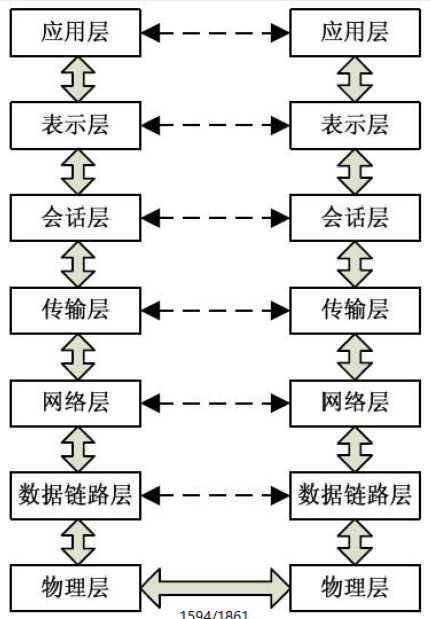

## 1.2 TCP/IP模型

在OSI模型出现之前，就已经有了TCP/IP的研究和实现。时间最早可以追溯到20世纪70年代，为互联网的最早的通信协议。TCP为传输层的协议，而IP则为网络层的协议。两个层次中有代表性的协议组合代表了一系列的协议族，还包括有ARP、ICMP和UDP协议等。由于TCP/IP协议出现的比OSI早，所以并不符合OSI模型，对应关系如下

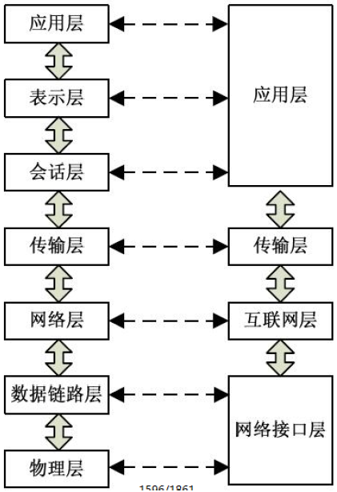

## 1.3 协议

​	协议也叫网络协议，网络协议是通信计算机双方必须共同遵从的一组约定。如怎么样建立连接、怎么样互相识别等。只有遵守这个约定，计算机之间才能相互通信交流。它的三要素是：语法、语义、时序。为了使数据在网络上从源到达目的，网络通信的参与方必须遵循相同的规则，这套规则称为协议（protocol），它最终体现为在网络上传输的数据包的格式。协议往往分成几个层次进行定义，分层定义是为了使某一层协议的改变不影响其他层次的协议。
​	遵循我们的OSI模型作为参考，常用到的协议有：**网络层协议IP**、**传输层协议TCP**和**UDP**、**应用层协议HTTP**等常用协议。下面简述一下协议的基本的概念和理解

### （1）IP协议

IP地址是用来识别网络上的设备，因此，IP地址是由网络地址与主机地址两部分所组成

​	**网络地址**可用来识别设备所在的网络，网络地址位于IP地址的前段。当组织或企业申请IP地址时，所获得的并非IP地址 而是取得一个唯一的、能够识别的网络地址。同一网络上的所有设备，都有相同的网络地址。IP路由的功是根据IP地址 中的网络地址，决定要将IP信息包送至所指明的那个网络
​	**主机地址**位于IP地址的后段，可用来识别网络上设备。同一网络上的设备都会有相同的网络地址，而各设备之间则是以 主机地址来区别

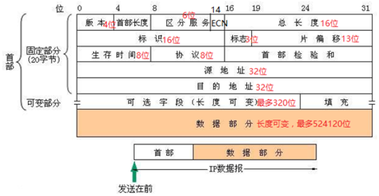

#### **A类IP地址**
一个A类IP地址由1字节的网络地址和3字节主机地址组成，网络地址的最高位必须是“0”，
地址范围1.0.0.1-126.255.255.254
二进制表示为：00000001 00000000 00000000 00000001 - 01111110 11111111 11111111 11111110
可用的A类网络有126个，每个网络能容纳1677214个主机


#### **B类IP地址**

一个B类IP地址由2个字节的网络地址和2个字节的主机地址组成，网络地址的最高位必须是“10”，
地址范围128.1.0.1-191.255.255.254
二进制表示为：10000000 00000001 00000000 00000001 - 10111111 11111111 11111111 11111110
可用的B类网络有16384个，每个网络能容纳65534主机


#### **C类IP地址**

一个C类IP地址由3字节的网络地址和1字节的主机地址组成，网络地址的最高位必须是“110”
范围192.0.1.1-223.255.255.254
二进制表示为: 11000000 00000000 00000001 00000001 - 11011111 11111111 11111110 11111110
C类网络可达2097152个，每个网络能容纳254个主机


#### D类地址用于多点广播

D类IP地址第一个字节以“1110”开始，它是一个专门保留的地址。
它并不指向特定的网络，目前这一类地址被用在多点广播（Multicast）中
多点广播地址用来一次寻址一组计算机
地址范围224.0.0.1-239.255.255.254


#### **E类IP地址**

以“1111”开始，为将来使用保留
E类地址保留，仅作实验和开发用


#### **私有ip**

在这么多网络IP中，国际规定有一部分IP地址是用于我们的局域网使用，也就
是属于私网IP，不在公网中使用的，它们的范围是：

```
10.0.0.0～10.255.255.255
172.16.0.0～172.31.255.255
192.168.0.0～192.168.255.255
```

IP地址127．0．0．1~127．255．255．255用于回路测试，
如：127.0.0.1可以代表本机IP地址，用http://127.0.0.1 就可以测试本机中配置的Web服务器。


#### 子网掩码

如果不指定，就不知道哪些位是网络号、哪些是主机号，这就需要通过子网掩码来实现。
子网掩码不能单独存在，它必须结合IP地址一起使用。
子网掩码只有一个作用，就是将某个IP地址划分成网络地址和主机地址两部分子网掩码的设定必须遵循一定的规则。

与IP地址相同，子网掩码的长度也是32位，

- 左边是网络位，用二进制数字“1”表示；
- 右边是主机位，用二进制数字“0”表示。


### （2）TCP与UDP协议

​	**传输控制协议（TCP）：**TCP（传输控制协议）定义了两台计算机之间进行可靠的传输而交换的数据和确认信息的格式 以及计算机为了确保数据的正确到达而采取的措施。协议规定了TCP软件怎样识别给定计算机上的多个目的进程如何对分组、重复这类差错进行恢复。协议还规定了两台计算机如何初始化一个TCP数据流传输以及如何结束这一传输。TCP最大的特点就是提供的是**面向连接、可靠的字节流服务**。

​	**用户数据报协议（UDP）：**UDP（用户数据报协议）是一个简单的面向数据报的传输层协议。提供的是非面向连接的、 不可靠的数据流传输。UDP不提供可靠性，也不提供报文到达确认、排序以及流量控制等功能。它只是把应用程序传给IP层的数据发送出去，但是并不能保证它们能到达目的地。因此报文可能会丢失、重复以及乱序等。但由于UDP在传输数据报文前不用在客户和服务器之间建立一个连接，且没有超时重发等机制，故而传输速度很快。

​	**TCP和UDP最大的区别就是：**TCP是面向连接的，UDP是无连接的。TCP协议和UDP协议各有所长、各有所短，适用于不同要求的通信环境


#### 面向连接的TCP协议

​	TCP协议是一种可靠的、一对一的、面向有连接的通信协议

​	TCP协议能为应用程序提供可靠的通 信连接，使一台计算机发出的字节流无差错地发往网络上的其他计算机，对可靠 性要求高的数据通信系统往往使用TCP协议传输数据。

​	**面向连接：**就是在正式通信前必须要与对方建立起连接，是按照电话系统建模的。比如你给别人打电话，必须等线路接 通了、对方拿起话筒才能相互通话。客户端与服务端在使用TCP传输协议时要先建立一个“通道”，在传输完毕之后又要关闭这“通道”，前者可以被形象地成为“三次握手”，而后者则可以被称为“四次挥手”。


**三次握手：**

(1) 在建立通道时，客户端首先要向服务端发送一个SYN同步信号

(2) 服务端在接收到这个信号之后会向客户端发出SYN同步信号和ACK确认信号

(3) 当服务端的ACK和SYN到达客户端后，客户端与服务端之间的这个“通道”就会被建立起来

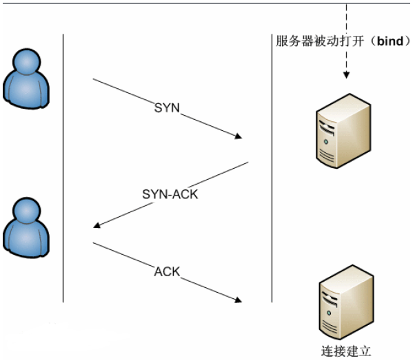

**四次挥手：**

(1) 在数据传输完毕之后，客户端会向服务端发出一个FIN终止信号

(2) 服务端在收到这个信号之后会向客户端发出一个ACK确认信号

(3) 如果服务端此后也没有数据发给客户端时服务端会向客户端发送一个FIN终止信号

(4) 客户端收到这个信号之后会回复一个确认信号，在服务端接收到这个信号后，服务端与客户端的通道也就关闭了

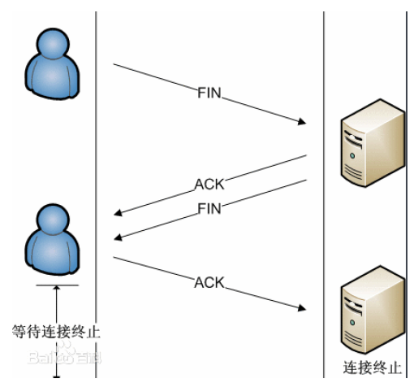


#### 无连接的UDP协议

​	UDP协议是一种不可靠的、面向无连接、可以实现多对一、一对多和一对一连接的通信协议

​	**无连接：**就是在正式通信前不必与对方先建立连接，不管对方状态就直接发送。与手机短信非常相似：你在发短信的时候，只需要输入对方手机号就OK了。UDP在传输数据前既不需要建立通道，在数据传输完毕后也不需要将通道关闭。只要 客户端给服务端发送一个请求，服务端就会一次性地把所有数据发送完毕。UDP在传输数据时不会对数据的完整性进行验 证，在数据丢失或数据出错时也不会要求重新传输，因此也节省了很多用于验证数据包的时间，所以以UDP建立的连接的 延迟会比以TCP建立的连接的延迟更低。UDP不会根据当前的网络情况来控制数据的发送速度，因此无论网络情况是好是坏，服务端都会以恒定的速率发送数据。虽然这样有时会造成数据的丢失与损坏，但是这一点对于一些实时应用来说是十分重要的。基于以上三点，UDP在数据传输方面速度更快，延迟更低，实时性更好，因此被广泛地用于通信领域和视频网站当中

​	**UDP适用于一次只传送少量数据、对可靠性要求不高的应用环境。**比如，我们经常使用“ping”命令来测试两台主机之间 TCP/IP通信是否正常，其实“ping”命令的原理就是向对方主机发送ICMP数据包，然后对方主机确认收到数据包，如果数据 包到达的消息及时反馈回来，那么网络就是通的。例如，在默认状态下，一次“ping”操作发送4个数据包。大家可以看到，发送的数据包数量是4包，收到的也是4包（因为对方主机收到后会发回一个确认收到的数据包）。这充分说明了UDP 协议是面向非连接的协议，没有建立连接的过程。正因为UDP协议没有连接的过程，所以它的通信效率高；但也正因为如 此，它的可靠性不如TCP协议高。QQ就使用UDP发消息，因此有时会出现收不到消息的情况。


#### HTTP协议

​	HTTP是一个简单的请求-响应协议，它通常运行在TCP之上。它指定了客户端可能发送给服务器什么样的消息以及得到 什么样的响应。请求和响应消息的头以ASCII码形式给出；而消息内容则具有一个类似MIME的格式。这个简单模型是早期Web成功的有功之臣，因为它使得开发和部署是那么的直截了当。

HTTP是基于**客户/服务器模式，且面向连接的。**典型的HTTP事务处理有如下的过程
（1）客户与服务器建立连接；
（2）客户向服务器提出请求；
（3）服务器接受请求，并根据请求返回相应的文件作为应答；
（4）客户与服务器关闭连接。

​	客户与服务器之间的HTTP连接是一种一次性连接，它限制每次连接只处理一个请求，当服务器返回本次请求的应答后便 立即关闭连接，下次请求再重新建立连接。这种一次性连接主要考虑到WWW服务器面向的是Internet中成干上万个用户， 且只能提供有限个连接，故服务器不会让一个连接处于等待状态，及时地释放连接可以大大提高服务器的执行效率。

​	HTTP是一种无状态协议，即服务器不保留与客户交易时的任何状态。这就大大减轻了服务器记忆负担，从而保持较快的响应速度。HTTP是一种面向对象的协议。允许传送任意类型的数据对象。它通过数据类型和长度来标识所传送的数据内容 和大小，并允许对数据进行压缩传送。当用户在一个HTML文档中定义了一个超文本链后，浏览器将通过TCP/IP协议与指 定的服务器建立连接。

​	从技术上讲是客户在一个特定的TCP端口（端口号一般为80）上打开一个套接字。如果服务器一直在这个周知的端口上 倾听连接，则该连接便会建立起来。然后客户通过该连接发送一个包含请求方法的请求块。

​	HTTP规范定义了9种请求方法，每种请求方法规定了客户和服务器之间不同的信息交换方式，常用的请求方法是GET和 POST。服务器将根据客户请求完成相应操作，并以应答块形式返回给客户，最后关闭连接。


## 1.4 端口

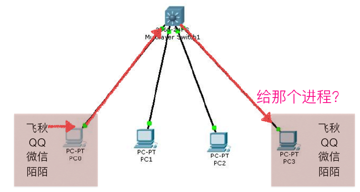

端口就是：是设备与外界通讯交流的出口

那么TCP/IP协议中的端口指的是什么呢？

端口就好一个房子的门，是出入这间房子的必经之路。如果一个进程需要收发网络数据，那么就需要有这样的端口，在linux系统中，端口可以有65536（2的16次方）个之多！既然有这么多，操作系统为了统一管理，所以进行了编号，这就是端口号

端口是通过端口号来标记的，端口号只有整数，范围是从0到65535

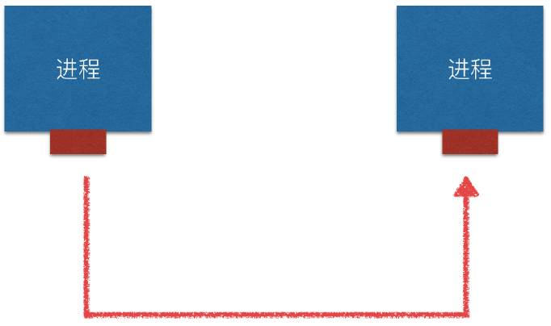

端口号不是随意使用的，而是按一定的规定进行分配

**知名端口是众所周知的端口号，范围从0到1023**

```
80端口分配给HTTP服务
21端口分配给FTP服务
22端口分配给SFTP服务\ssh协议
```


**动态端口**的范围是从1024到65535,之所以称为动态端口，是因为它一般不固定分配某种服务，而是动态分配。动态分配是指当一个系统进程或应用程序进程需要网络通信时，它向主机申请一个端口，主机从可用的端口号中分配一个供它使用。当这个进程关闭时，同时也就释放了所占用的端口号。

用 `'netstat -an'`查看端口状态


**端口的用途：**一台拥有IP地址的主机可以提供许多服务，比如HTTP（万维网服务）、FTP（文件传输）、SMTP（电子邮件）等，这些服务完全可以通过1个IP地址来实现。那么，主机是怎样区分不同的网络服务呢？显然不能只靠IP地址，因为IP地址与网络服务的关系是一对多的关系。实际上是通过“IP地址+端口号”来区分不同的服务的。 需要注意的是，端口并不是一一对应的。比如你的电脑作为客户机访问一台WWW服务器时，WWW服务器使用“80”端口与你的电脑通信，但你的电脑则可能使用“3457”这样的端口。


## 1.5 BS/CS结构

**C/S**是Client/Server的缩写。服务器通常采用高性能的PC、工作站或小型机，并采用大型数据库系统，如Oracle、Sybase、Informix或 SQL Server。客户端需要安装专用的客户端软件。


**B/S**是Browser/Server的缩写，客户机上只要安装一个浏览器（Browser），如Netscape Navigator或InternetExplorer，服务器安装Oracle、Sybase、Informix或 SQL Server等数据库。在这种结构下，用户界面完全通过WWW浏览器实现，一部分事务逻辑在前端实现，但是主要事务逻辑在服务器端实现。浏览器通过Web Server 同数据库进行数据交互。


系统开发中C/S结构（Client/Server）中Client（客户端）往往可以由 B/S结构（Browser/Server结构）的Browser（浏览器）及其载体承担，C/S结构的Web应用与B/S结构（Browser/Server结构）具有紧密联系。大系统和复杂系统中，C/S结构和B/S结构的嵌套也很普遍。 原来的Client/Server结构转变成Browser/Server结构后，客户机的压力大大减轻，负荷被均衡地分配给了服务器。由于这种结构不再需要专用的客户端软件，因此也使技术维护人员从繁重的安装、配置和升级等维护工作中解脱了出来，可以把主要精力放在服务器程序的更新工作上。同时，使用Web浏览器作为客户端软件，界面友好，新开发的系统也不需要用户每次都从头学习。

## 1.6 socket

​	我们了解了协议的基本概念，协议之间的关系，与层级之间的关联，完成了对网络的一个理解，当我们在QQ、微信给别人发送消息时，就是通过这些层级数据传输的协议去传输我们的内容，或是我们浏览网页，打开一个百度页面，都是基于协议传输的数据显示请求的页面，那我们如何去实现这些？不可能每一步都需要去写，从最底层开始写起，那就太麻烦了，由此引出一个概念Socket，需要一一解答的问题，Socket在哪里？Socket是什么？目是为了做什么？先看下图

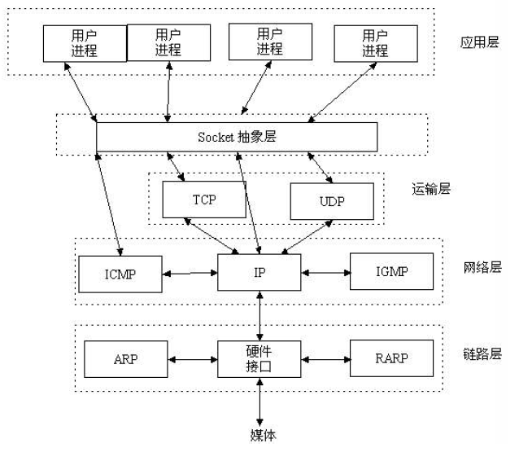

​	Socket也叫套接字（Socket）随着TCP/IP协议的使用，也越来越多地被使用在网络应用程序的构建中。实际上，Socket编程也已经成为网络中传送和接收数据的首选方法。套接字最早是由伯克利在BSD中推出的一种进程间通信方案和网络互联的基本机制。现在，已经有多种相关的套接字实现，但是大部分还是遵循着最初的设计要求。套接字相当于应用程序访问下层网络服务的接口。使用套接字，可以使得不同的主机之间进行通信，从而实现数据交换。

​	Socket是应用层与TCP/IP协议族通信的中间软件抽象层，它是一组接口。在设计模式中，Socket其实就是一个门面模式，它把复杂的TCP/IP协议族隐藏在Socket接口后面，对用户来说，一组简单的接口就是全部，让Socke去组织数据，以符合指定的协议。具体的Socket实现方法，可以通过下一节的Socket编程讲解。


# 二、socket

标识一个进程是通过：IP + 端口 + 协议 完成的

在 Python 中 使用socket 模块的函数 socket 就可以完成：

```
socket.socket(AddressFamily, Type)

- Address Family：
   · AF_INET（用于 Internet 进程间通信）,实际工作中常用AF_INET
   · AF_UNIX（用于同一台机器进程间通信）
- Type：套接字类型
   · SOCK_STREAM（流式套接字，主要用于 TCP 协议）
   · SOCK_DGRAM（数据报套接字，主要用于 UDP 协议）
```

## 2.1 创建套接字

```python
import socket

# 创建套接字(Socket)
# TCP协议
s1 = socket.socket(socket.AF_INET, socket.SOCK_STREAM)
# UDP协议
s2 = socket.socket(socket.AF_INET, socket.SOCK_DGRAM)
```

## 2.2 Socket发送数据案例

```python
from socket import *

# 创建一个UDP协议的套接字，然后发送一条数据到网络上的另一个进程
# 1.创建套接字
client_socket = socket(AF_INET, SOCK_DGRAM)

# 2.定义一个接收信息的目标, 端口写6000以上的端口
# 127.0.0.1是目标服务器地址，8080是一个目标服务器端口
server_host_port=('127.0.0.1', 8080)

# 3.准备数据，数据一定是字节数据
# encode表示按照一种编码格式把数据编程字节数组bytes
datas = input('请输入数据：').encode('utf-8')

# 4.发送数据
client_socket.sendto(datas, server_host_port)
print('发送完成')

# 5.关闭套接字，释放系统资源
client_socket.close()

```


# 三、socketserver

## 3.1 UPD

**UDP --- 用户数据报协议**，是一个无连接的简单的面向数据报的运输层协议。UDP不提供可靠性，它只是把应用程序传给IP层的数据报发送出去，但是并不能保证它们能到达目的地。由于UDP在传输数据报前不用在客户和服务器之间建立一个连接，且没有超时重发等机制，故而传输速度很快。

**UDP是一种面向无连接的协议**，每个数据报都是一个独立的信息，包括完整的源地址或目的地址，它在网络上以任何可能的路径传往目的地，因此能否到达目的地，到达目的地的时间以及内容的正确性都是不能被保证的。


**UDP特点：**

​	UDP是面向无连接的通讯协议，UDP数据包括目的端口号和源端口号信息，由于通讯不需要连接，所以可以实现广播发送。 UDP传输数据时有大小限制，每个被传输的数据报必须限定在64KB之内。 UDP是一个不可靠的协议，发送方所发送的数据报并不一定以相同的次序到达接收方。


**适用情况：**

- 语音广播
- 视频
- QQ
- TFTP(简单文件传输)
- SNMP(简单网络管理协议)
- RIP(路由信息协议，如报告股票市场，航空信息)
- DNS(域名解析)

​	UDP操作简单，而且仅需要较少的监护，因此通常用于局域网高可靠性的分散系统中client/server应用程序。例如视频会议系统，并不要求音频视频数据绝对的正确，只要保证连贯性就可以了，这种情况下显然使用UDP会更合理一些。


### 3.1.1 创建一个UDP客户端

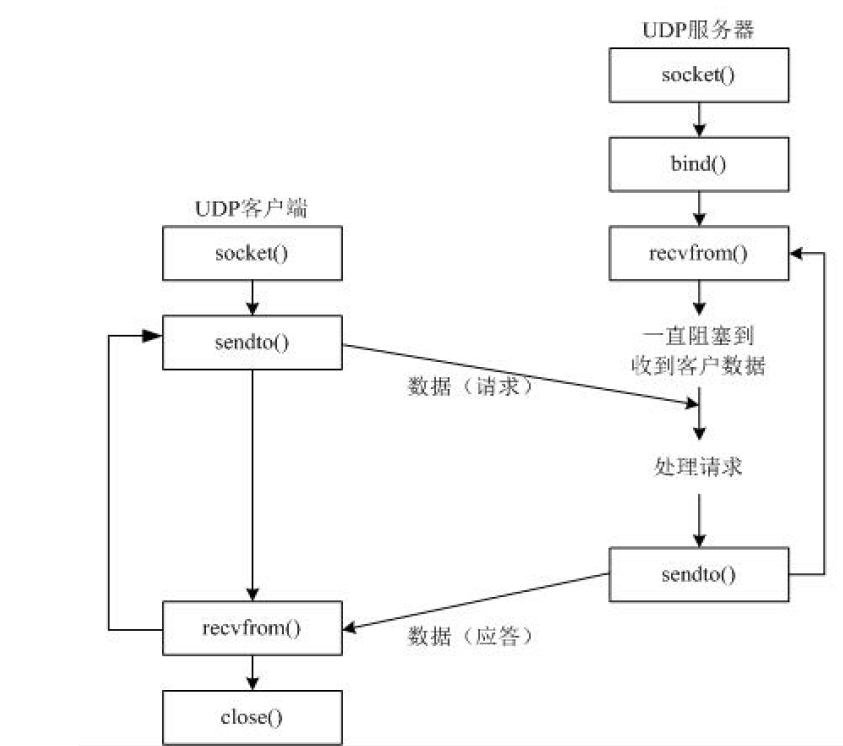

客户端的结构

```
（1）使用socket()，生成套接字描述符；
（2）通过host_post 结构设置服务器地址和监听端口；
（3）向服务器发送数据，sendto() ；
（4）关闭套接字，close() ；
```

```python
from socket import *

# 创建一个UDP协议的套接字，然后发送一条数据到网络上的另一个进程
# 1.创建套接字
client_socket = socket(AF_INET, SOCK_DGRAM)

# 2.定义一个接收信息的目标, 端口写6000以上的端口
# 127.0.0.1是目标服务器地址，8080是一个目标服务器端口
server_host_port=('192.168.1.15', 8090)

# 3.准备数据，数据一定是字节数据
# encode表示按照一种编码格式把数据编程字节数组bytes
datas = input('请输入数据：').encode('utf-8')

# 4.发送数据
client_socket.sendto(datas, server_host_port)
print('发送完成')

# 5.关闭套接字，释放系统资源
client_socket.close()

>>>>>>>>>>>>>>>>>>>>>>>>>>>>>>>>
请输入数据：我爱你
发送完成

Process finished with exit code 0
```

### 3.1.2 创建一个UDP服务端

服务器端的结构

```
（1）使用函数socket()，生成套接字描述符；
（2）通过host_post 结构设置服务器地址和监听端口；
（3）使用bind() 函数绑定监听端口，将套接字文件描述符和地址类型变量（host_post）进行绑定；
（4）接收客户端的数据，使用recvfrom() 函数接收客户端的网络数据；
（5）关闭套接字，使用close() 函数释放资源；
```

```python
from socket import *

# 1.创建一个服务端的socket
socket_server = socket(AF_INET, SOCK_DGRAM)

# 2.定义服务器端的IP地址和端口号
host_port = ('192.168.1.15', 8090)

# 3.服务器端的Socket 绑定地址和端口
# 只有绑定了地址和端口，才能称之为服务器的Socket
socket_server.bind(host_port)

# 4.接受客户端发送过来的数据,每次接受1KB的数据
data = socket_server.recvfrom(1024)
print(data)

# 5.处理二进制的数据报
# 里面是一个元组，第一个值是数据内容，第二个值是源IP地址、源端口号
data_utf8 = data[0].decode('utf-8')
print(data_utf8)

# 6.关闭套接字，释放资源
socket_server.close()

>>>>>>>>>>>>>>>>>>>>>>>>>>>>>>>>>>>>>>>>>>>>>>>>>>>>>
(b'\xe6\x88\x91\xe7\x88\xb1\xe4\xbd\xa0', ('192.168.1.15', 52236))
我爱你

Process finished with exit code 0
```


### 3.1.3 echo服务

- 客户端

  ```python
  from socket import *
  
  # 客户端可以发送多条数据
  # 客户端如果发送一个'exit'则客户端退出
  # 服务器端收到什么就返回什么
  
  # 创建一个UDP协议的套接字，然后发送一条数据到网络上的另一个进程
  # 1.创建套接字
  client_socket = socket(AF_INET, SOCK_DGRAM)
  
  
  while True:
      # 2.定义一个接收信息的目标, 端口写6000以上的端口
      # 127.0.0.1是目标服务器地址，8080是一个目标服务器端口
      server_host_port=('192.168.1.15', 8090)
  
      # 3.准备数据，数据一定是字节数据
      # encode表示按照一种编码格式把数据编程字节数组bytes
      datas = input('请输入数据：').encode('utf-8')
  
      # 4.发送数据
      client_socket.sendto(datas, server_host_port)
  
  
  
      # 5.一定可以从服务器接收到返回过来的数据，接收并打印
      print('返回的数据是:',client_socket.recvfrom(1024)[0].decode('utf-8'))
      if datas.decode('utf-8') == 'exit':
          break
  
  # 6.关闭套接字，释放系统资源
  client_socket.close()
  
  >>>>>>>>>>>>>>>>>>>>>>>>>>>>>>>>>>>>>>>>>
  请输入数据：我爱你
  返回的数据是: 我爱你
  请输入数据：你爱我
  返回的数据是: 你爱我
  请输入数据：exit
  返回的数据是: exit
  
  Process finished with exit code 0
  ```

  

- 服务器端

  ```python
  from socket import *
  
  # 客户端可以发送多条数据
  # 服务器端收到什么就返回什么
  
  
  # 1.创建一个服务端的socket
  socket_server = socket(AF_INET, SOCK_DGRAM)
  
  # 2.定义服务器端的IP地址和端口号
  # 如果服务器是真实的物理服务器，IP地址有很多，所有本机IP都绑定，就使用''
  host_port = ('', 8090)
  
  # 3.服务器端的Socket 绑定地址和端口
  # 只有绑定了地址和端口，才能称之为服务器的Socket
  socket_server.bind(host_port)
  
  while True:
  
      # 4.接受客户端发送过来的数据,每次接受1KB的数据
      data = socket_server.recvfrom(1024)
  
      # 5.服务器收到数据之后，原封不动返回，而且是收到哪个客户端的信息，就返回给哪个客户端
      # 里面是一个元组，第一个值是数据内容，第二个值是源IP地址、源端口号
      socket_server.sendto(data[0], data[1])
      print(data[0].decode('utf-8'))
  
  
  # 6.关闭套接字，释放资源
  socket_server.close()
  
  >>>>>>>>>>>>>>>>>>>>>>>>>>>>>>>>>>>>>>>>>>>>>>>>>
  我爱你
  你爱我
  exit
  ```

### 3.1.4 总结

**UDP是TCP/IP协议族中的一种协议能够完成不同机器上的程序间的数据通信**

```
- udp的服务器和客户端的区分：往往是通过`请求服务`和`提供服务`来进行区分
- 请求服务的一方称为：客户端
- 提供服务的一方称为：服务器

一般情况下，服务器端，需要绑定端口，目的是为了让其他的客户端能够正确发送到此进程客户端，一般不需要绑定，而是让操作系统随机分配，这样就不会因为需要绑定的端口被占用而导致程序无法运行的情况
```


## 3.2 TFTP

**TFTP（Trivial File Transfer Protocol,简单文件传输协议）**
是TCP/IP协议族中的一个用来在客户端与服务器之间进行简单文件传输的协议

**特点：**

- 简单
- 占用资源小
- 适合传递小文件
- 适合在局域网进行传递
- 端口号为69
- 基于UDP实现

TFTP服务器默认监听69号端口
当客户端发送“下载”请求（即读请求）时，需要向服务器的69端口发送
服务器若批准此请求,则使用一个新的、临时的 端口进行数据传输

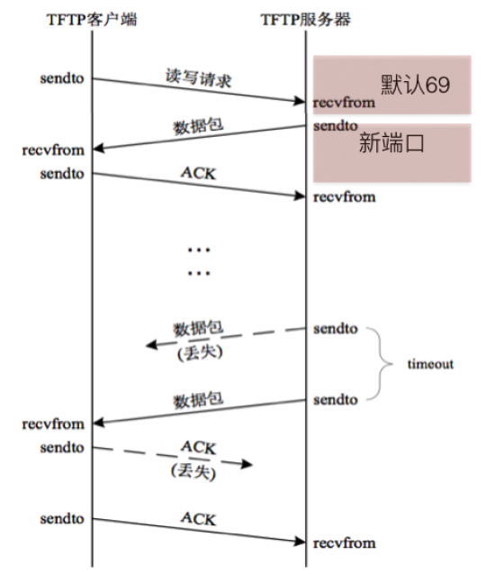

​	当服务器找到需要现在的文件后，会立刻打开文件，把文件中的数据通过TFTP协议发送给客户端如果文件的总大小较大（比如3M），那么服务器分多次发送，每次会从文件中读取512个字节的数据发送过来因为发送的次数有可能会很多，所以为了让客户端对接收到的数据进行排序，在服务器发送那512个字节数据的时候，会多发2个字节的数据，用来存放序号，并且放在512个字节数据的前面，序号是从1开始的因为需要从服务器上下载文件时，文件可能不存在，那么此时服务器就会发送一个错误的信息过来，为了区分服务发送的是文件内容还是错误的提示信息，又用了2个字节 来表示这个数据包的功能（称为操作码），并且在序号的前面

| 操作码 | 功能               |
| ------ | ------------------ |
| 1      | 读请求，即下载     |
| 2      | 写请求，即上传     |
| 3      | 表示数据包，即DATA |
| 4      | 确认码，即ACK      |
| 5      | 错误               |

​	因为udp的数据包不安全，即发送方发送是否成功不能确定，所以TFTP协议中规定，为了让服务器知道客户端已经接收到了刚刚发送的那个数据包，所以当客户端接收到一个数据包的时候需要向服务器进行发送确认信息，即发送收到了，这样的包成为ACK(应答包)
​	为了标记数据已经发送完毕，所以规定，当客户端接收到的数据小于516（2字节操作码+2个字节的序号+512字节数据）时，就意味着服务器发送完毕了,TFTP数据包的格式如下:

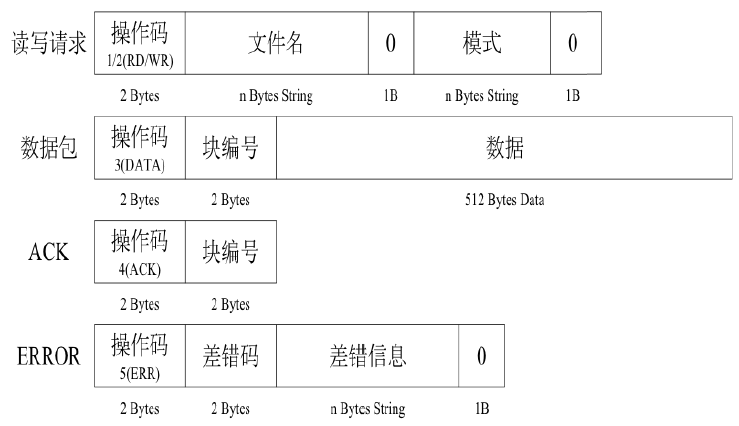

### 3.2.1 struct模块

Python中的**struct**主要是用来处理C结构数据的，在转化过程中，在转化过程中，主要用到了一个格式化字符串(format strings)，用来规定转化的方法和格式。比如代码中的:'!H'

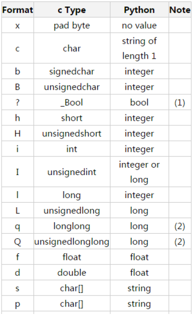

### 3.2.2 服务器端代码

```python
from socket import *
import struct

# 服务器端的socket
s = socket(AF_INET, SOCK_DGRAM)

# 绑定ip和端口号
s.bind(('', 69))


def download(filename, client_ip, client_port):
    # 创建一个新的Socket，负责发送文件内容的数据包到客户端
    new_socket = socket(AF_INET, SOCK_DGRAM)
    # 文件内容数据包的计数器\块的编号
    num = 1

    # 定义服务客户端退出的标签
    flag = True

    try:
        f = open(filename, 'rb')
    except:
        error_package = struct.pack('!HH5sb', 5, 5, 'error'.encode('utf-8'), 0)
        # 把错误数据包发送给客户端
        new_socket.sendto(error_package, (client_ip, client_port))
        # 当前线程结束，当前客户端退出服务器
        flag = False
    # 如果文件存在，那么需要把文件的内容切成一个个的数据包发送给客户端，一个数据包包含数据内容为512字节
    while flag:
        # 从文件内容中读取512字节
        read_data = f.read(512)
        # 创建一个数据包
        data_package = struct.pack('!HH', 3, num) + read_data
        # 发送数据包
        new_socket.sendto(data_package, (client_ip, client_port))
        if len(read_data) < 512:
            print("客户端:%s,文件下载完成" % client_ip)
            break
        # 服务器接收ACK的确认数据
        recv_ack = new_socket.recvfrom(1024)
        operator_code, ack_num = struct.unpack('!HH', recv_ack[0])
        print("客户端：%s 的确认信息是" % client_ip, ack_num)
        num += 1
        # 保护性代码
        if int(operator_code) != 4 or int(ack_num) < 1 : # 不正常的ack确认信息
            break

    new_socket.close()  # 客户端真正退出


def server():
    while True:
        # 服务器等着客户端发送过来数据，然后等着接收
        recv_data, (client_ip, client_port)= s.recvfrom(1024)
        print(recv_data, client_ip, client_port)
        # 判断数据包是否是：客户端请求类型数据包
        if struct.unpack('!b5sb', recv_data[-7:]) == (0, b'octet', 0):
            # 得到操作码的值
            operator_code = struct.unpack('!H', recv_data[0:2])
            # 得到文件名
            file_name = recv_data[2:-7].decode()
            if operator_code[0] == 1:
                print('客户端想下载文件: %s' % file_name)
                download(file_name, client_ip, client_port)


if __name__ == '__main__':
    server()
```


### 3.2.3 客户端代码

```python
from socket import *
import struct  # 负责Pyhton数据结构和C语言数据结构的转换


file_name = input('请输入文件名字:')
# 客户端的socket
s = socket(AF_INET, SOCK_DGRAM)

# 定义服务器的地址和端口号
host_port = ('192.168.1.15', 69)
# 把Python的数据转化成C语言的数据
# '!H%dsb5sb'代表格式: !开头, H短整型、%ds是字符串、b是int转为char、5s是长度为5的字符串
# 请求的数据包
data_package = struct.pack('!H%dsb5sb' % len(file_name), 1, file_name.encode('utf-8'), 0, 'octet'.encode('utf-8'), 0)

# 把数据包发送到服务器
s.sendto(data_package, host_port)

# 创建一个空白文件，准备接收客户端发过来的数据
f = open('client_' + file_name, 'ab')

while True:
    # 客户端接收服务器发过来的数据
    # 数据包有两种：1、下载文件的数据包  2、error信息包
    recv_data, (server_ip, server_port) = s.recvfrom(1024)
    operator_code, num = struct.unpack('!HH', recv_data[:4])  # 把前4个字节的数据接报出来
    if int(operator_code) == 5: # 判断数据包是否是error信息报
        print('服务器返回：你要下载的文件不存在！')
        break
    # 如果是文件内容数据包，需要保存文件内容
    f.write(recv_data[4:])

    # 意味着文件接收完了
    if len(recv_data) < 516:
        print('客户端下载成功')
        break

    # 客户端每收到一个数据包，还需要发送一个确认ack给服务器
    ack_package = struct.pack('!HH', 4, num)
    s.sendto(ack_package, (server_ip, server_port))

# 释放资源
f.close()
s.close()
```


## 3.3 TCP

**传输控制协议（TCP）**是一种面向连接的、可靠的、基于字节流的传输层通信协议，也是为了在不可靠的互联网络上提供可靠的端到端字节流而专门设计的一个传输协议。

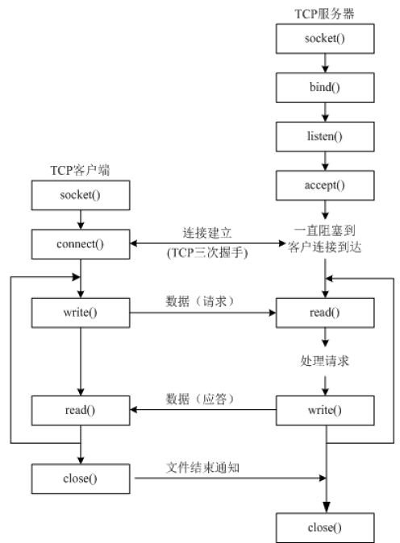

- **TCP的流程如下**

  ```
  （1）socket创建一个套接字
  
  （2）bind绑定ip和port
  
  （3）listen使套接字变为可以被动链接
  
  （4）accept等待客户端的链接
  
  （5）recv/send接收发送数据
  ```


- **TCP注意的点**
  - tcp服务器一般情况下都需要绑定，否则客户端找不到这个服务器
  - tcp客户端一般不绑定，因为是主动链接服务器，所以只要确定好服务器的ip、port等信息就好，本地客户端可以随机
  - tcp服务器中通过listen可以将socket创建出来的主动套接字变为被动的，这是做tcp服务器时必须要做的
  - 当一个tcp客户端连接服务器时，服务器端会有1个新的套接字，这个套接字用来标记这个客户端，单独为这个客户端服务
  - listen后的套接字是被动套接字，用来接收新的客户端的链接请求的，而accept返回的新套接字是标记这个新客户端的
  - 关闭listen后的套接字意味着被动套接字关闭了，会导致新的客户端不能够链接服务器，但是之前已经链接成功的客户端正常通信
  - 关闭accept返回的套接字意味着这个客户端已经服务完毕
  - 当客户端的套接字调用close后，服务器端会recv解堵塞，并且返回的长度为0，因此服务器可以通过返回数据的长度来区别客户端是否已经下线

### 3.3.1 TCP服务器端代码

```python
from socket import *

# 1.创建Server_socket
server_socket = socket(AF_INET, SOCK_STREAM)

# 2.绑定一个IP和端口
host_port = ('', 8088)
server_socket.bind(host_port)

# 3.服务器的Socket监听，listen让Socket处于被动，就可以接受客户端的连接请求
# 参数5代表最多5个客户端被挂起
server_socket.listen(5)

# 4.等待客户端的连接请求
# 当前函数是线程阻塞的函数
new_socket, client_addr = server_socket.accept()

# 5.服务器接受客户端发送过来的数据
# recv一般用于TCP协议的接受数据，recvfrom用于UDP
data = new_socket.recv(1024)  # data是字节数据
print("服务器端接受的数据是：", data.decode('utf-8'))

# 6.服务器端发送数据给客户
new_socket.send('Thank ou!'.encode('utf-8'))

new_socket.close()     # new_socket意味着当前客户端的服务已完成
server_socket.close()  # server_socket意味着整个服务器关闭
```


### 3.3.2 TCP客户端代码

```python
from socket import *

client_socket = socket(AF_INET, SOCK_STREAM)

# 目标服务器的IP和端口号
server_ip_port = ('192.168.1.15', 8088)
client_socket.connect(server_ip_port)

send_data = input('请输入：')
client_socket.send(send_data.encode('utf-8'))

# 接收服务器返回的数据
recv_data = client_socket.recv(1024)

print('客户端接收到服务器的数据为：', recv_data.decode('utf-8'))
client_socket.close()
```


### 3.3.3 TCP模拟QQ聊天

- 服务器端代码

  ```python
  from socket import *
  
  server_socket = socket(AF_INET, SOCK_STREAM)
  server_socket.bind(('', 8008))
  server_socket.listen(1)
  
  while True:
      new_socket, client_host_post = server_socket.accept()
  
      while True:
          recv_data = new_socket.recv(1024)
          if len(recv_data) > 0:
              print('客户端：', recv_data.decode('utf-8'))
          if recv_data.decode('utf-8') == 'exit':
              print('客户端已经退出！')
              break
  
          # 发送数据给客户端
          send_data = input('send:')
          if len(send_data) > 0:
              new_socket.send(send_data.encode('utf-8'))
      new_socket.close()
  
  server_socket.close()
  ```

  

- 客户端代码

  ```python
  from socket import *
  
  client_socket = socket(AF_INET, SOCK_STREAM)
  client_socket.connect(('192.168.1.15', 8008))
  
  while True:
      send_data = input('send:')
      if len(send_data) > 0:
          client_socket.send(send_data.encode('utf-8'))
      if send_data == 'exit':
          client_socket.close()
          break
  
      # 客户端接收服务器返回的数据
      recv_data = client_socket.recv(1024)
      print('服务器：', recv_data.decode('utf-8'))
  
  client_socket.close()
  ```

  

# 四、黏包问题

## 4.1 socket黏包问题

**黏包：**数据和数据之间没有明确的分界线，导致不能正确读取数据

应用程序无法直接操作硬件，应用程序想要发送数据则必须将数据交给操作系统，而操作系统需要需要同时为所有
应用程序提供数据传输服务，也就意味着，操作系统不可能立马就能将应用程序的数据发送出去，就需要为应用程
序提供一个缓冲区，用于临时存放数据，具体流程如下：

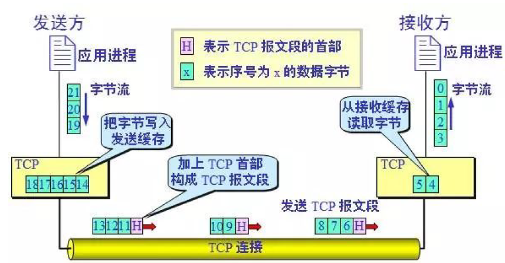


# 五、多线程与多进程

# 六、并发编程

