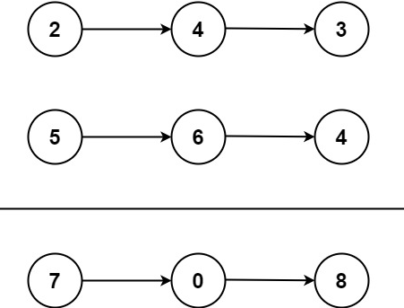
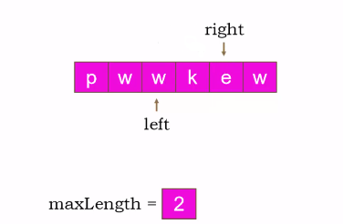
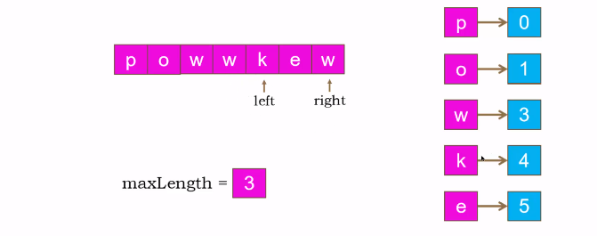
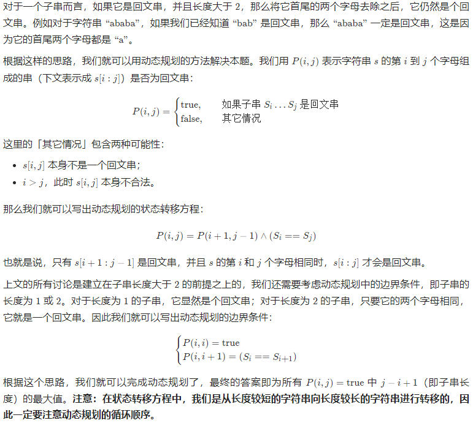

# 1. [简单] 两数之和(列表)

题目链接：https://leetcode.cn/problems/two-sum/

- 题目描述：

  给定一个整数数组 `nums` 和一个整数目标值 `target`，请你在该数组中找出 **和为目标值** `target`  的那 **两个** 整数，并返回它们的数组下标。

  你可以假设每种输入只会对应一个答案。但是，数组中同一个元素在答案里不能重复出现。

  你可以按任意顺序返回答案。

- 示例1：

  ```
  输入：nums = [2,7,11,15], target = 9
  输出：[0,1]
  解释：因为 nums[0] + nums[1] == 9 ，返回 [0, 1] 。
  ```

- 示例2:

  ```
  输入：nums = [3,2,4], target = 6
  输出：[1,2]
  ```

- 示例3：

  ```
  输入：nums = [3,3], target = 6
  输出：[0,1]
  ```


- 解题思路：
  - 创建一个空字典，hashmap = { }
  - 假设我们寻求的答案是A，那么B=target - A
  - 遍历整数数组nums，如果 B (target - nums) 不在hashmap中，则将 A 存入字典中
  - B (target - nums) 在 hashmap 中，说明我们找到了两个数(nums和target-nums)，这两个数的和为target


- 提交代码：

  ```python
  class Solution:
      def twoSum(self, nums: List[int], target: int) -> List[int]:
          hashmap={}
          for index,num in enumerate(nums):
              if hashmap.get(target - num) is not None:
                  return [index, hashmap.get(target - num)]
              hashmap[num] = index
  ```

  

# 2. [中等] 两数相加(链表)

题目链接：https://leetcode.cn/problems/add-two-numbers/

- 题目描述：

  给你两个 **非空** 的链表，表示两个非负的整数。它们每位数字都是按照 **逆序** 的方式存储的，并且每个节点只能存储 **一位** 数字。

  请你将两个数相加，并以相同形式返回一个表示和的链表。

  你可以假设除了数字 0 之外，这两个数都不会以 0 开头。




- 示例1：

  ```
  输入：l1 = [2,4,3], l2 = [5,6,4]
  输出：[7,0,8]
  解释：342 + 465 = 807
  ```

- 示例2：

  ```
  输入：l1 = [0], l2 = [0]
  输出：[0]
  ```

- 示例3：

  ```
  输入：l1 = [9,9,9,9,9,9,9], l2 = [9,9,9,9]
  输出：[8,9,9,9,0,0,0,1]
  ```


- 解题思路：
  - 先一起遍历 l1 和 l2，将值保存到p.val中
  - 如果 l1 比 l2 长，那么之后再将 l1 单独和 进位变量 carry 相加
  - 如果 l2 比 l1 长，那么之后再将 l2 单独和 进位变量 carry 相加
  - 最后判断进位carry是否为0，如果不为0，则直接添加在链表末尾


- 提交代码：

```python
class Solution:
    def addTwoNumbers(self, l1: Optional[ListNode], l2: Optional[ListNode]) -> Optional[ListNode]:
        if l1 == None:
            return l2
        if l2 ==None:
            return l1

        result = ListNode(0)
        p = result
        carry = 0
        while l1 and l2:
            temp = l1.val + l2.val + carry
            p.next = ListNode(temp % 10)
            carry = temp // 10
            p = p.next
            l1 = l1.next
            l2 = l2.next

        while l1:
            temp = l1.val + carry
            p.next = ListNode(temp % 10)
            carry = temp // 10
            p = p.next
            l1 = l1.next
        
        while l2:
            temp = l2.val + carry
            p.next = ListNode(temp % 10)
            carry = temp // 10
            p = p.next
            l2 = l2.next

        if carry != 0:
            p.next = ListNode(carry)

        return result.next
```


# 3. [中等] 无重复字符的最长子串(滑动窗口)

题目链接：https://leetcode.cn/problems/longest-substring-without-repeating-characters/

- 题目描述：

  给定一个字符串 `s` ，请你找出其中不含有重复字符的 **最长子串** 的长度。

  

- 示例1：

  ```
  输入: s = "abcabcbb"
  输出: 3 
  解释: 因为无重复字符的最长子串是 "abc"，所以其长度为 3。
  ```

- 示例2：

  ```
  输入: s = "bbbbb"
  输出: 1
  解释: 因为无重复字符的最长子串是 "b"，所以其长度为 1。
  ```

- 示例3：

  ```
  输入: s = "pwwkew"
  输出: 3
  解释: 因为无重复字符的最长子串是 "wke"，所以其长度为 3。
       请注意，你的答案必须是 子串 的长度，"pwke" 是一个子序列，不是子串。
  ```


- 解题思路：

  - 基础版滑动窗口（依次释放window中的值）

    

    - 用while循环遍历整个字符串，while循环的条件是right<len(s)

    - 如果s[right]不在滑动窗口里面，则将s[right]添加至window中，再判断当前的子串长度和记录的最大长度谁更大，然后right += 1，

    - 如果s[right]在滑动窗口里面，则window从第一个元素开始释放，然后left += 1，一直释放到s[right]不在滑动窗口内部为止

      

  - 优化版滑动窗口（根据索引，直接释放window中的值）

    

    - 用while循环遍历整个字符串，while循环的条件是right<len(s)
    - 判断s[right]在不在window中，若不在则返回-1，若在则返回s[right]所对应的索引位置
    - 再判断left左窗口所在的位置，若s[right]返回-1则left不变，否则left跳转到s[right]索引位置
    - 判断当前的子串长度和记录的最大长度谁更大
    - 将当前字符串的索引位置存储在window里
    - right += 1

- 提交代码：

  - 基础版

    ```python
    class Solution:
        def lengthOfLongestSubstring(self, s: str) -> int:
            n = len(s)
            if n<=1: return n
            max_len = 0
            window = []
            left = right = 0
            while right<n:
                if s[right] not in window:
                    window.append(s[right])
                    max_len = max(max_len, right-left+1)
                    right += 1
                else:
                    window.pop(0)
                    left += 1
            return max_len
    ```

  - 优化版
  
    ```python
    def lengthOfLongestSubstring2(self, s: str) -> int:
        n = len(s)
        if n <= 1: return n
        max_len, window = 0, {}
        left = right = 0
        while right < n:
            right_char_index = window.get(s[right], -1)
            left = max(left, right_char_index)
            max_len = max(max_len, right - left + 1)
            window[s[right]] = right + 1
            right += 1
        return max_len
    ```
  
    

# 4. [困难] 寻找两个正序数组的中位数(二分查找)

题目链接：https://leetcode.cn/problems/median-of-two-sorted-arrays/

- 题目描述：

  给定两个大小分别为 **m** 和 **n** 的正序（从小到大）数组 **nums1** 和 **nums2**。请你找出并返回这两个正序数组的 **中位数** 。

  算法的时间复杂度应该为 **O(log (m+n))** 。


# 5. [中等] 最长回文子串(动态规划)

题目链接：https://leetcode.cn/problems/longest-palindromic-substring/

- 题目描述：给你一个字符串 `s`，找到 `s` 中最长的回文子串。


- 示例1：

  ```
  输入：s = "babad"
  输出："bab"
  解释："aba" 同样是符合题意的答案。
  ```

  

- 示例2：

  ```
  输入：s = "cbbd"
  输出："bb"
  ```

  

- 解题思路：

  

  

  - 建立一个 n*n(n为字符串长度) 的二维数组，初始值为False，遍历数组，使dp \[ i ] [ i ] = True
  - 

  

- 提交代码：

  

