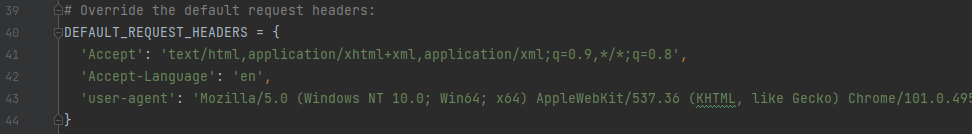

# 一、爬虫基础概念

## 1. 爬虫的分类

- **通用网络爬虫**

  抓取系统重要组成部分。抓取的是一整张页面数据。

- **聚焦网络爬虫（又称主题网络爬虫）**

  是建立在通用爬虫的基础之上。抓取的是页面中特定的局部内容。

- **增量式网络爬虫**

  检测网站中数据更新的情况。只会抓取网站中更新出来的数据。

- **深层网络爬虫**

  大部分内容不能通过静态的URL获取、隐藏在搜索表单后的、只有用户提交一些关键词才能获取的网络页面

  

## 2.爬虫中的矛与盾
- 反爬机制
门户网站，可以通过指定相应的策略或者技术手段，防止爬虫程序进行网站数据的爬取。
- 反反爬策略
爬虫程序可以通过制定相关的策略或者技术手段，破解门户网站中具备的反爬机制，从而可以获取门户网站中相关的数据。
- robots.txt协议：
  君子协议，明确规定了网站中哪些数据可以被爬虫爬取，哪些数据不可以被爬取。(没有强制性的技术手段阻止爬虫爬取，所以叫君子协议)
   如何查看某个网站的robots协议？
   在网站后面加入/robots.txt，例如`www.taobao.com/robots.txt`


## 3. URL与URI

- **URL：**网址，是 **Uriform Resource Locator** 的简写，统一资源定位符

  一个 **URL** 由以下几部分组成 `https://www.baidu.com/s?ie=utf-8&f=8&rsv_bp=1&tn=baidu&wd=python&oq=python&rsv_pq=d42ea7430000e54c&rsv_t=eb71ffNSSutRKy4qkSVMfi6X3UQo4Gs5tojP1JT8RZBIQ7wuGxWQL6WbOWY&rqlang=cn&rsv_enter=0&rsv_dl=tb&rsv_btype=t`

  - 协议的类型
  - 主机名称/域名
  - 端口号
  - 查找路径
  - 查询参数
  - 锚点，前端用来作面定位的，现在一些前后端分离项目，也用锚点来做导航

- **URI：**统一资源标识符 **Uniform Resource Identifier**，是一个用于标识某一互联网资源名称的字符串

`https://www.baidu.com/s?ie=UTF-8&wd=python`

- **URL**    `https://www.baidu.com/s`  
- **URI**     `/s`
- **请求参数**  `?`之后的`ie=UTF-8&wd=python`


## 4.Web请求过程

- 常用请求方式

  - **get请求：**一般情况下，只从服务器获取数据下来，并不会对服务器的资源产生任何影响的时候会使用 **get请求**

  - **post请求：**向服务器发送数据(登录)、上传文件等，会对服务器的资源产生影响的时候使用 **post请求**，请求参数在 **form data** 中

    

- 渲染方式
  **服务器渲染：** 在服务器那边直接把数据和html整合在一起，统一返回给浏览器。
  特点：在页面源代码中能看到数据

  **客户端渲染：** 客户端会发送两个请求，第一个请求：服务器会给客户端返回一个html骨架，第二个请求：服务器会给客户端返回需求的数据，客户端再将骨架和数据整合在一起。
  特点：在页面源代码中不能看到数据，需要浏览器抓包工具

  

## 5.经验之谈

- 登录账户的 **post请求** 中，账户的账号密码一般位于 **login.asp** 请求中的 **form data** 中


## 6.http协议&https协议

- http协议
  概念：服务器和客户端进行数据交互的一种形式，服务端口号是80端口
  **常用请求头信息**
   User-Agent：请求载体的身份标识
   Referer：防盗链（这次请求是从哪个页面来的？反爬会用到）
   cookie：本地字符串数据信息（用户登录信息，反爬的token）
   Connection：请求完毕后，是断开连接还是保持连接
  **常用响应头信息**
  Content-Type：服务器响应回客户端的数据类型
  cookie：本地字符串数据信息（用户登录信息，反爬的token）
  各种神奇的莫名其妙的字符串（这个需要经验，一般都是token字样，防止各种攻击和反爬）

  >请求：
  >1 请求行 -> 请求方式 请求url地址 协议
  >2 请求头 -> 放一些服务器要使用的附加信息
  >3 
  >4 请求体 -> 一般放一些请求参数

  >响应：
  >1 状态行 -> 协议 状态码
  >2 响应头 -> 放一些客户端要使用的一些附加信息
  >3 
  >4 响应体 -> 服务器返回的真正客户端要用的内容（HTML,json）等

- https协议
  表示安全的http协议，安全的超文本传输协议，服务端口号是443端口

  **加密方式**
  **-对称密钥加密：**
  方式：客户端将数据加密，客户端将加密数据和密钥一同发送给服务器端。
  缺点：容易被拦截，第三方获得密钥对密文进行破解。

  **-非对称密钥加密：**
  方式：服务器端制定加密规则，并将公钥发送给客户端；客户端依据公钥进行数据加密，并将密文(仅密文)发送至服务器端；服务器端使用私钥进行解密。
  缺点：1.第三方机构可能会拦截公钥，并将公钥进行篡改，从而使第三方机构具有解开密文的能力
   &emsp;&emsp;&emsp;2.效率比较低，处理起来更为复杂。

  **-证书秘钥加密：**
  方式：在非对称密钥的基础上进行，服务器端将公钥先提交给证书认证机构，机构会对公钥进行数字签名，而后再发送给客户端，从而保证公钥的可靠性，安全性。

  

## 7. 常见响应状态码

- **200：**请求正常，服务器正常的返回数据
- **301：** 永久重定向
- **404：**请求的URL在服务器上找不到
- **418：**发送请求遇到服务器端反爬虫，服务器拒绝响应数据
- **500：**服务器内部错误，可能是服务器出现了bug

## 8. Session 与 Cookie

- **Session**
  - Session代表服务器与浏览器的一次会话过程
  - Session是一种服务器端的机制，Session对象用来存储特定用户会话所需的信息
  - Session由服务器端生成，保存在服务器的内存、缓存、硬盘或数据库中

- **Cookie**
  - Cookie是由服务端生成后发送给客户端(通常是浏览器)，Cookie总是保存在客户端
  - Cookie的基本原理：创建Cookie、设置存储Cookie、发送Cookie、读取Cookie

## 9. Json

- **JavaScript ObjectNotation, JS对象标记**，是一种轻量级的数据交互格式，采用完全独立于编程语言的文本格式来存储和表示数据
- 简洁和清晰的层次结构使得JSON成为理想的数据交换语言，易于阅读和编写，同时也易于机器解析和生产，并有效地提升网络传输效率
- **JSON的数据格式**
  - 对象表示为键值对
  - 数据由逗号分隔
  - 花括号保存对象
  - 方括号保存数组
  - 在数据结构上，JSON和Python里的字典非常相似

## 10. Ajax

- Ajax在浏览器与Web服务器之间使用异步数据传输，这样就可以使页面从服务器请求少量信息，而不是整个页面

- Ajax技术独立于浏览器和平台

- Ajax一般返回的是JSON，直接对Ajax地址进行Post或get，就返回JSON数据了

  

# 二、urllib库

- **urllib.request.urlopen(url,data=None,[timeout,]*,cafile=None,capath=None，cadefault=False,context=None)**
  - url：请求网址
  - data：请求参数，可选字段，默认为get，如果选择post方式，其传递参数需要转化为bytes，需要用urllib.parse.urlencode转换
  - timeout：设置网站的访问超时时间
  - cafile和capth两个参数：是制定CA证书和它的路径，在HTTPS链接时会有用
  - cadefault：弃用，默认为False
  - context 参数：它必须是ssl.SSLContext类型，用来指定SSL设置

## 1.最基础的get访问请求

```python
import urllib.request

url='https://www.taobao.com/'

#发送请求
resp=urllib.request.urlopen(url)
html=resp.read().decode('utf-8')   #decode将bytes类型转成str类型
print(html)
resp.close()
```

## 2.最基础的post访问请求

```python
import  urllib.request
import  urllib.parse
url='https://www.xslou.com/login.php'

data={'username':'18600605736','password':'57365736','action':'login'}


#发送请求
resp=urllib.request.urlopen(url,data=bytes(urllib.parse.urlencode(data),encoding='utf-8'))

html=resp.read().decode('gbk')  #解码是gbk
print(html)
resp.close()
```

## 3.opener的使用

```python
import urllib.request

url = 'https://www.baidu.com'
headers = {
"User-Agent": "Mozilla/5.0 (Windows NT 10.0; Win64; x64) AppleWebKit/537.36 (KHTML, like Gecko) Chrome/100.0.4896.127 Safari/537.36"
}

# 构建请求对象
req = urllib.request.Request(url, headers=headers)
# 获取opener对象
opener = urllib.request.build_opener()
resp = opener.open(req)
print(resp.read().decode('utf-8'))
resp.close()
```

## 4.ip代理

```python
from urllib.request import build_opener
from urllib.request import ProxyHandler

headers = {
"User-Agent": "Mozilla/5.0 (Windows NT 10.0; Win64; x64) AppleWebKit/537.36 (KHTML, like Gecko) Chrome/100.0.4896.127 Safari/537.36"
}

proxy = ProxyHandler({'http': '223.82.60.202:8060'})
opener = build_opener(proxy)
url = 'https://www.baidu.com'
resp = opener.open(url)
print(resp.read().decode('utf-8'))

resp.close()
```

## 5.使用Coockie

- 为什么需要使用Cookie
  - 解决http的无状态性

- 使用步骤
  - 实例化MozillaCookieJar(保存Cookie)
  - 创建 handler 对象 （Cookie的处理器）
  - 创建opener对象
  - 打开网页（发送请求获取响应）
  - 保存cookie文件

- 案例：获取百度贴吧的Cookie并保存到文件中

```python
import urllib.request
from http import cookiejar
filename = 'cookie.txt'

# 获取cookie
def get_cookie():
    # 实例化MozillaCookieJar(保存Cookie)
    cookie = cookiejar.MozillaCookieJar(filename)
    # 创建 handler 对象 （Cookie的处理器）
    handler = urllib.request.HTTPCookieProcessor(cookie)
    # 创建opener对象
    opener = urllib.request.build_opener(handler)

    # 请求网址
    url = 'https://tieba.baidu.com/index.html?traceid=#'
    resp = opener.open(url)

    # 保存cookie信息
    cookie.save()


# 读取cookie
def use_cookie():
    # 实例化MozillaCookieJar
    cookie = cookiejar.MozillaCookieJar()
    # 加载cookie文件
    cookie.load(filename)
    print(cookie)


if __name__ == '__main__':
    get_cookie()
    use_cookie()
```

## 6.异常处理

- **urllib.error.URLError：**用于捕获由urllib.request产生的一场，使用reason属性返回错误原因
- 主要用于从客户端向服务器端发送请求时的异常捕获

```python
import urllib.request
import urllib.error

url = 'http://www.google.com'
try:
    resp = urllib.request.urlopen(url)
except urllib.error.URLError as e:
    print(e.reason)
resp.close()

#result
#[WinError 10060] 由于连接方在一段时间后没有正确答复或连接的主机没有反应，连接尝试失败。
```

- **urllib.error.HTTPError：**用于处理HTTP于HTTPS请求的错误，它有三个属性
  - code：请求返回的状态码
  - reason：返回错误的原因
  - headers：请求返回的响应头信息

- 主要用于获取服务器端向客户端返回的非正常数据

```python
import urllib.request
import urllib.error

url = 'https://movie.douban.com/'
try:
    resp = urllib.request.urlopen(url)
except urllib.error.HTTPError as e:
    print('原因：', e.reason)
    print('响应状态码：', str(e.code))
    print('响应头数据：', e.headers)
resp.close()

#result
'''
原因： 
响应状态码： 418
响应头数据： Date: Thu, 21 Apr 2022 04:48:14 GMT
Content-Length: 0
Connection: close
Server: dae
Strict-Transport-Security: max-age=15552000
X-Content-Type-Options: nosniff
'''
```


# 三、requests库

## 1.requests库常用方法

| 序号 | 方法                      | 说明                           |
| ---- | ------------------------- | ------------------------------ |
| 1    | **requests.request(url)** | 构造一个请求，支持以下各种方法 |
| 2    | **requests.get()**        | 发送get请求                    |
| 3    | **requests.post()**       | 发送post请求                   |
| 4    | **requests.head()**       | 获取HTML头部信息               |
| 5    | **requests.put()**        | 发送put请求                    |
| 6    | **requests.patch()**      | 提交局部修改的请求             |
| 7    | **requests.delete()**     | 提交删除请求                   |

- 最常用的方法
- **requests.get(url, params=None, headers=None, proxies=None)**
- **requests.post(url, data=None, json=None)**

## 2.response对象常用属性或方法

| 序号 | 属性或方法               | 说明                                           |
| ---- | ------------------------ | ---------------------------------------------- |
| 1    | **response.status_code** | 响应状态码                                     |
| 2    | **response.content**     | 把response对象转换为二进制数据                 |
| 3    | **response.text**        | 把response对象转换为字符串数据                 |
| 4    | **response.encoding**    | 定义response对象的编码                         |
| 5    | **response.cookies**     | 获取请求后的cookie                             |
| 6    | **response.url**         | 获取请求网址                                   |
| 7    | **response.json()**      | 内置的JSON解码器                               |
| 8    | **response.headers**     | 以字典对象存储服务器响应头，字典键不区分大小写 |

## 3.发送不带参数的get请求

```python
import requests
url = 'https://www.baidu.com'
resp = requests.get(url)

resp.encoding = 'utf-8'            # 设置响应的编码格式
cookie = resp.cookies              # 获取请求后的cookie信息
headers = resp.headers             # 获取响应头信息
status_code = resp.status_code     # 获取响应状态码
resp_url = resp.url                # 获取请求的网址
text = resp.text                   # 获取字符串类型的爬取信息
print('请求后的cookie信息: ', cookie)
print('响应头: ', headers)
print('状态码: ', status_code)
print('请求的网址: ', resp_url)
print('响应内容: ', text)
resp.close()

#result
'''
请求后的cookie信息:  <RequestsCookieJar[<Cookie BDORZ=27315 for .baidu.com/>]>
响应头:  {'Cache-Control': 'private, no-cache, no-store, proxy-revalidate, no-transform', 'Connection': 'keep-alive', 'Content-Encoding': 'gzip', 'Content-Type': 'text/html', 'Date': 'Thu, 21 Apr 2022 05:38:24 GMT', 'Last-Modified': 'Mon, 23 Jan 2017 13:24:33 GMT', 'Pragma': 'no-cache', 'Server': 'bfe/1.0.8.18', 'Set-Cookie': 'BDORZ=27315; max-age=86400; domain=.baidu.com; path=/', 'Transfer-Encoding': 'chunked'}
状态码:  200
请求的网址:  https://www.baidu.com/
响应内容:  <!DOCTYPE html>
<!--STATUS OK--><html> <head><meta http-equiv=content-type content=text/html;charset=utf-8><meta http-equiv=X-UA-Compatible content=IE=Edge><meta content=always name=referrer><link rel=stylesheet type=text/css href=https://ss1.bdstatic.com/5eN1bjq8AAUYm2zgoY3K/r/www/cache/bdorz/baidu.min.css><title>百度一下，你就知道</title></head> <body link=#0000cc> <div id=wrapper> <div id=head> <div class=head_wrapper> <div class=s_form> <div class=s_form_wrapper> <div id=lg>  </div> <form id=form name=f action=//www.baidu.com/s class=fm> <input type=hidden name=bdorz_come value=1> <input type=hidden name=ie value=utf-8> <input type=hidden name=f value=8> <input type=hidden name=rsv_bp value=1> <input type=hidden name=rsv_idx value=1> <input type=hidden name=tn value=baidu><span class="bg s_ipt_wr"><input id=kw name=wd class=s_ipt value maxlength=255 autocomplete=off autofocus=autofocus></span><span class="bg s_btn_wr"><input type=submit id=su value=百度一下 class="bg s_btn" autofocus></span> </form> </div> </div> <div id=u1> <a href=http://news.baidu.com name=tj_trnews class=mnav>新闻</a> <a href=https://www.hao123.com name=tj_trhao123 class=mnav>hao123</a> <a href=http://map.baidu.com name=tj_trmap class=mnav>地图</a> <a href=http://v.baidu.com name=tj_trvideo class=mnav>视频</a> <a href=http://tieba.baidu.com name=tj_trtieba class=mnav>贴吧</a> <noscript> <a href=http://www.baidu.com/bdorz/login.gif?login&amp;tpl=mn&amp;u=http%3A%2F%2Fwww.baidu.com%2f%3fbdorz_come%3d1 name=tj_login class=lb>登录</a> </noscript> <script>document.write('<a href="http://www.baidu.com/bdorz/login.gif?login&tpl=mn&u='+ encodeURIComponent(window.location.href+ (window.location.search === "" ? "?" : "&")+ "bdorz_come=1")+ '" name="tj_login" class="lb">登录</a>');
                </script> <a href=//www.baidu.com/more/ name=tj_briicon class=bri style="display: block;">更多产品</a> </div> </div> </div> <div id=ftCon> <div id=ftConw> <p id=lh> <a href=http://home.baidu.com>关于百度</a> <a href=http://ir.baidu.com>About Baidu</a> </p> <p id=cp>&copy;2017&nbsp;Baidu&nbsp;<a href=http://www.baidu.com/duty/>使用百度前必读</a>&nbsp; <a href=http://jianyi.baidu.com/ class=cp-feedback>意见反馈</a>&nbsp;京ICP证030173号&nbsp;  </p> </div> </div> </div> </body> </html>
'''
```

## 4.发送带参数的get请求

```python
import requests

headers = {
"User-Agent": "Mozilla/5.0 (Windows NT 10.0; Win64; x64) AppleWebKit/537.36 (KHTML, like Gecko) Chrome/100.0.4896.127 Safari/537.36"
}
url = 'https://www.baidu.com/s'
search_lis = ['python', 'java', '什么是奥特曼', '周杰伦']
for key in search_lis:
    params = {'wd': key}
    resp = requests.get(url, params=params, headers=headers)
    resp.encoding = 'utf-8'
    print(resp.text)
resp.close()
```

## 5.获取json类型的数据

```python
import requests
headers = {
"User-Agent": "Mozilla/5.0 (Windows NT 10.0; Win64; x64) AppleWebKit/537.36 (KHTML, like Gecko) Chrome/100.0.4896.127 Safari/537.36"
}
url = 'https://image.baidu.com/search/acjson?tn=resultjson_com&logid=7643482031408784176&ipn=rj&ct=201326592&is=&fp=result&fr=&word=%E6%B1%BD%E8%BD%A6&queryWord=%E6%B1%BD%E8%BD%A6&cl=2&lm=-1&ie=utf-8&oe=utf-8&adpicid=&st=-1&z=&ic=0&hd=&latest=&copyright=&s=&se=&tab=&width=&height=&face=0&istype=2&qc=&nc=1&expermode=&nojc=&isAsync=&pn=60&rn=30&gsm=3c&1650521706301='
resp = requests.get(url, headers=headers)
json_data = resp.json()
print(json_data)

resp.close()
```

## 6.获取二进制数据(可用于图片的存储)

```python
import requests
headers = {
"User-Agent": "Mozilla/5.0 (Windows NT 10.0; Win64; x64) AppleWebKit/537.36 (KHTML, like Gecko) Chrome/100.0.4896.127 Safari/537.36"
}
url = 'https://www.baidu.com/img/flexible/logo/pc/result@2.png'
resp = requests.get(url, headers=headers)

# 存储 ('wb': 'w'代表写入、'b'代表二进制)
with open('logo.png', 'wb') as file:
    file.write(resp.content)
resp.close()
```

## 7.利用post请求登录账户、百度翻译

```python
import requests

url = 'https://www.xslou.com/login.php'
data = {'username': '18600605736', 'password': '57365736', 'action': 'login'}
resp = requests.post(url, data=data)
resp.encoding = 'gb2312'
print(resp.status_code)
print(resp.text)
resp.close()
```

```python
import requests

url = "https://fanyi.baidu.com/sug"
s = input("输入你要查的单词：")
dat = {
    "kw":s
}

#发送post请求，发送的数据必须放在字典中，通过data参数进行传递
resp = requests.post(url, data=dat)
print(resp.json()) #将服务器返回的内容直接处理成json()  => 字典dict
resp.close()  #关掉resp
```

## 8.用session保持访问状态

```python
import  requests
url='https://www.xslou.com/login.php'
data={'username':'18600605736','password':'57365736','action':'login'}

#使用session发送请求
session=requests.session()
resp=session.post(url,data=data)
resp.encoding='gb2312'

#print(resp.text)
#推荐小说
hot_url='https://www.xslou.com/modules/article/uservote.php?id=71960'
resp2=session.get(hot_url)
resp2.encoding='gb2312'
print(resp2.text)

resp.close()
resp2.close()
```


# 四、数据解析

## 1.正则表达式解析数据

测试网址推荐：https://tool.oschina.net/regex、https://c.runoob.com/front-end/854/

- 正则处理函数

| 正则处理函数                                        | 说明                                                         |
| --------------------------------------------------- | ------------------------------------------------------------ |
| **re.match(pattern, string, flages=0)**             | 尝试从字符串的开始位置匹配一个模式，如果匹配成功，就返回一个匹配成功的对象，否则返回None |
| **re.search(pattern, string, flages=0)**            | 扫描整个字符串并返回第一次成功匹配的对象，如果匹配失败，就返回None |
| **re.findall(pattern, string, flages=0)**           | 获取字符串中所有匹配的字符串，并以列表的形式返回             |
| **re.sub(pattern, repl, string, count=0, flags=0)** | 用于替换字符串中的匹配项，如果没有匹配的项，则返回没有匹配的字符串 |
| **re.compile(pattern,[flag])**                      | 用于编译正则表达式，生成一个正则表达式(Pattern)对象，供match()和search()函数使用 |


- 常用元字符（用于选择要匹配的内容）

| 元字符 | 说明                                                      |
| ------ | --------------------------------------------------------- |
| **.**  | 匹配**除**换行符以外的任意字符                            |
| \w     | 匹配**字母**或**数字**或**下划线**                        |
| \s     | 匹配任意的**空白符**（例如：空格、换行、回车）            |
| \d     | 匹配**数字**                                              |
| \n     | 匹配一个**换行符**                                        |
| \t     | 匹配一个**制表符**                                        |
| ^      | 匹配字符串的开始(常用于校验)                              |
| $      | 匹配字符串的结束（常用于校验）                            |
| \W     | 匹配 **非** **字母**或**数字**或**下划线**                |
| \S     | 匹配 **非** **空白符**                                    |
| \D     | 匹配 **非** **数字**                                      |
| a \| b | 匹配 字符a **或** 字符b                                   |
| ()     | 匹配括号内的表达式，也表示一个组                          |
| [...]  | 匹配字符组中的字符（例如匹配所有字母和数字：[a-zA-Z0-9]） |
| [^...] | 匹配除了字符组中字符的所有字符                            |


- 量词：用于控制前面的元字符出现的次数

| 量词  | 说明             |
| ----- | ---------------- |
| \*    | 重复零次或更多次 |
| \+    | 重复一次或更多次 |
| ?     | 重复零次或一次   |
| {n}   | 重复n次          |
| {n,}  | 重复n次或更多次  |
| {n,m} | 重复n到m次       |

- 贪婪匹配和惰性匹配

| 特殊匹配 | 说明     |
| -------- | -------- |
| .*       | 贪婪匹配 |
| .*?      | 惰性匹配 |

- re模块使用实例
```python
import re

#findall: 匹配字符串所有的符合正则的内容
lst = re.findall(r"\d+","我的电话号码是: 10086, 他的电话号码是: 10010")
print(lst)

#finditer: 匹配字符串中所有的内容[返回的是迭代器],从迭代器中拿到内容需要.group()
it = re.finditer(r"\d+","我的电话号码是: 10086, 他的电话号码是: 10010")
for i in it:
    print(i.group())

#search返回的结构是match对象，拿取数据需要.group(),search的特点是只匹配第一个找的的结果
s = re.search(r"\d+","我的电话号码是: 10086, 他的电话号码是: 10010")
print(s.group())

#match返回的特点是，从开头进行匹配
m = re.match(r"\d+","10086, 他的电话号码是: 10010")
print(m.group())

#预加载正则表达式
obj = re.compile(r"\d+")
ret = obj.finditer("我的电话号码是: 10086, 他的电话号码是: 10010")
ret2 = obj.findall("我有100000个朋友")
for i in ret:
    print(i.group())
print(ret2)

s = """
    <div class='jay'><span id='1'>郭麒麟</span></div>
    <div class='jjj'><span id='2'>宋轶</span></div>
    <div class='jolin'><span id='3'>大聪明</span></div>
    <div class='sylar'><span id='4'>范思哲</span></div>
    <div class='tory'><span id='5'>胡说八道</span></div>
"""
#正则表达式中的(?P<name>.*?)结构，是将.*?匹配到的内容，存储在name对象中--------(?P<分组名字>正则表达式)  注意此处的P是大写的P
#re.S:让.能匹配换行符
obj = re.compile(r"<div class='(?P<nike_name>.*?)'><span id='(?P<id>\d+)'>(?P<name>.*?)</span></div>",re.S)
result = obj.finditer(s)
for it in result:
    print(it.group("nike_name"),end = ' ')
    print(it.group("id"),end = ' ')
    print(it.group("name"))
```
### 实战案例1：豆瓣排行top250

```python
import requests
import re
import csv
#获取网页源代码(服务器渲染)
f = open("data.scv", mode='w',encoding='utf-8',newline='')
for i in range(0,10):
    url = "https://movie.douban.com/top250?start="+ str(i*25) +"&filter="
    headers = {
        "User-Agent" : "Mozilla/5.0 (Windows NT 10.0; Win64; x64) AppleWebKit/537.36 (KHTML, like Gecko) Chrome/100.0.4896.75 Safari/537.36"
    }
    resp = requests.get(url,headers=headers)
    page_content = resp.text

    #解析数据
    #正则表达式
    obj = re.compile(r'<li>.*?<div class="item">.*? <span class="title">(?P<name>.*?)</span>'
    r'.*?<p class="">.*?<br>(?P<year>.*?)&nbsp.*?<span class="rating_num"'
    r' property="v:average">(?P<score>.*?)</span>'
    r'.*?<span>(?P<comment>.*?)</span>',re.S)

    #正则匹配
    result = obj.finditer(page_content)
    #数据存入

    csvwriter = csv.writer(f)
    rank = 1
    for it in result:
        dic = it.groupdict()
        dic['year'] = dic['year'].strip()
        csvwriter.writerow(dic.values())
f.close()
resp.close()
```
### 实战案例2：电影天堂下载链接爬取

```python
import requests
import re
import csv
import json

domain = 'https://dytt89.com/'
#verify=False 去掉安全验证
resp = requests.get(domain,verify=False)
resp.encoding = 'gb2312'  #指定字符集(charset)

obj1 = re.compile(r"2022必看热片.*?<ul>(?P<ul>.*?)</ul>",re.S)
obj2 = re.compile(r"<a href='(?P<href>.*?)'",re.S)
obj3 = re.compile(r'◎片　　名(?P<movie>.*?)<br />.*?'
    r'<td style="WORD-WRAP: break-word" bgcolor="#fdfddf"><a href="(?P<download>.*?)">magnet',re.S)
result1 = obj1.finditer(resp.text)
child_herf_list = []
f = open("download.csv",mode='w',encoding='utf-8',newline='')
for it in result1:
    #提取主页面
    ul = it.group('ul')
    #二次提取，提取子页面的herf
    result2 = obj2.finditer(ul)
    for it2 in result2:
        #拼接子页面
        child_herf = domain + it2.group('href').strip('/')
        #把子页面连接保存在列表中
        child_herf_list.append(child_herf)
cvwriter = csv.writer(f)
#提取子页面内容
for href in child_herf_list:
    child_resp = requests.get(href,verify=False)
    child_resp.encoding = 'gb2312'
    result3 = obj3.search(child_resp.text)
    #写入数据
    dic = result3.groupdict()
    cvwriter.writerow(dic.values())
    
resp.close()
```
## 2.bs4模块

>find(标签，属性=值)      ->  找到第一个符合的 
>find_all(标签，属性=值)  ->  找到所有符合的
>get("href")   -> 获取href属性的值
### 实战案例3：撸菜价

```python
import requests
from bs4 import BeautifulSoup
#步骤一：拿到页面源代码
url = 'http://zhongdapeng.com/shucaijiage/934.html'
headers = {
    "User-Agent" : "Mozilla/5.0 (Windows NT 10.0; Win64; x64) AppleWebKit/537.36 (KHTML, like Gecko) Chrome/100.0.4896.75 Safari/537.36"
}
resp = requests.get(url,headers=headers)
resp.encoding = 'utf-8'
#步骤二：使用bs4进行解析，拿到数据
#1.把页面源代码交给BeautifulSoup进行处理，生成bs对象
page = BeautifulSoup(resp.text,"html.parser")  #指定html解析器
#2.从bs对象中查找数据
#find(标签，属性=值)      ->  找到第一个符合的 
#find_all(标签，属性=值)  ->  找到所有符合的
#class属性是python的关键字，为了防止报错，需要加下划线class_
#table = page.find_all("div",cellpadding="0")  
table = page.find_all("table",attrs = {"cellpadding":"0"})  #与上一行的代码是一个意思

# print("type(page) = " + str(type(page)))
# print("type(table) = " + str(type(table)))

for it in table:
    trs = it.find_all('tr')
    for itt in trs:
        tds = itt.find_all('td')
        for it3 in tds:
            for it4 in it3:
                print(it4,end = ' ')
        print('')

resp.close()
```
### 实战案例4：抓取优美图库

```python
# 1.拿到主页面的源代码，然后提取到子页的链接地址href
# 2.通过href拿到子页面的内容，从子页面中找到图片的下载地址 img -> src
# 3.下载图片

import requests
from bs4 import BeautifulSoup
import time
url = 'https://www.umeitu.com/bizhitupian/weimeibizhi/'
resp = requests.get(url)
resp.encoding = 'utf-8'
# 把源代码交给bs
main_page = BeautifulSoup(resp.text,"html.parser")
main_href = main_page.find("ul",attrs = {"class":"pic-list after"}).find_all("a")
for a in main_href:
    #获取子页面的地址
    href = "https://www.umeitu.com/" + a.get('href')   #直接通过get就可以拿到属性的值
    #拿到子页面的信息
    child_page_href = requests.get(href)
    child_page_href.encoding = 'utf-8'
    child_page_text = child_page_href.text
    #从子页面中拿到图片的下载路径
    child_page = BeautifulSoup(child_page_text,"html.parser")
    pic = child_page.find("section",attrs = {"class":"img-content"}).find("img")
    src = pic.get('src')
    img_resp = requests.get(src)
    img_name = src.split('/')[-1]
    with open("img/" + img_name,mode='wb') as f:
        f.write(img_resp.content)    #这里的content是拿到的字节
    print("over!!!",img_name)
    time.sleep(1)
print("all over!")

resp.close()
```
## 3.Xpath解析
>Xpath是一门在XML和HTML文档中查找信息的语言，可用来在XML和HTML文档中对元素和属性进行遍历。简单来说，我们的数据是超文本数据，想要获取超文本数据里面的内容，就要按照一定规则来进行数据的获取，这种规则就叫做Xpath语法

| 序号 | 表达式   | 描述                               |
| ---- | -------- | ---------------------------------- |
| 1    | nodename | 选取此节点的所有子节点             |
| 2    | //       | 从全局节点中选择节点，任意位置均可 |
| 3    | /        | 选取某个节点下的节点               |
| 4    | /@xxx    | 选取某个带属性的节点               |
| 5    | **.**    | 当前节点下                         |
| 6    | **..**   | 选取当前节点的父节点               |
| 7    | /text()  | 获取当前路径下的文本内容           |
| 8    | \|可选符 | 可选取若干个路径//p\|//div         |
| 序号 | 表达式                            | 描述                               |
| ---- | --------------------------------- | ---------------------------------- |
| 1    | xpath('/body/div[1]')             | 选取body下的第一个div节点          |
| 2    | xpath('/body/div[last()]')        | 选取body下最后一个div节点          |
| 3    | xpath('/body/div[last()-1]')      | 选取body下前两个div节点            |
| 4    | xpath('/body/div[position()<3]')  | 选取body下前两个div节点            |
| 5    | xpath('/body/div[@class]')        | 选取body下带有class属性的div节点   |
| 6    | xpath('/body/div[@class="main"]') | 选取body下class属性为main的div节点 |
| 7    | xpath('/body/div[price>35.00]')   | 选取body下price元素大于35的div节点 |

### 实战案例5：爬取猪八戒信息网

```python
# 拿到页面源代码
# 提取和解析数据
import requests
from lxml import etree
url = "https://beijing.zbj.com/search/f/?type=new&kw=saas"
resp = requests.get(url)
html = etree.HTML(resp.text)
#拿到每一个服务商的div
divs = html.xpath("/html/body/div[6]/div/div/div[2]/div[5]/div[1]/div")
for div in divs:
    price = div.xpath("./div/div/a[2]/div[2]/div[1]/span[1]/text()")[0].strip("¥")
    title = "saas".join(div.xpath("./div/div/a[2]/div[2]/div[2]/p/text()"))
    company = div.xpath("./div/div/a[1]/div[1]/p/text()")[1].strip('\n')
    location = div.xpath("./div/div/a[1]/div[1]/div/span/text()")[0]
    print(price,end=' ')
    print(title,end=' ')
    print(company,end=' ')
    print(location)
resp.close()
```

### 实战案例6：爬取起点小说网的月票榜

```python
# 书名：//div[@class='book-mid-info']/h2/a/text()
# 作者：//p[@class='author']/a[@class='name']/text()

import requests
from lxml import etree
headers = {
    'User-Agent': 'Mozilla/5.0 (Windows NT 10.0; WOW64) AppleWebKit/537.36 (KHTML, like Gecko) Chrome/72.0.3626.81 Safari/537.36 SE 2.X MetaSr 1.0'
}
url = 'https://www.qidian.com/rank/yuepiao/'

# 发送请求
resp = requests.get(url, headers=headers)
# 将响应数据转换成etree类型，使得xpath能够正常运用
# <class 'lxml.etree._Element'>
e = etree.HTML(resp.text)
authors = e.xpath("//p[@class='author']/a[@class='name']/text()")
books = e.xpath("//div[@class='book-mid-info']/h2/a/text()")
for i in range(len(books)):
    print(f'本月第{i+1}名\t作者: ' + authors[i], '\t书名: '+books[i])

resp.close()
```

## 4.pyquery解析


# 五、数据存储

## 1.JSON文件存储

- Json
  - JSON（JavaScript Object Notation）是一种轻量级的数据交换格式，它是基于ECMAScript的一个子集
  - JSON采用完全独立于语言的文本格式
  - JSON在Python中分别由 **list** 和 **dict** 组成

- Json模块提供的4个功能

| 序号 | 函数         | 描述                                                         |
| ---- | ------------ | ------------------------------------------------------------ |
| 1    | json.dumps() | 实现Python类型转化为json字符串，返回一个str对象，把一个Python对象编码转换成Json字符串 |
| 2    | json.loads() | 把Json格式字符串解码转换成Python对象，从json到python的类型转化 |
| 3    | json.dump()  | 将Python内置类型序列转化为json对象后写入文件                 |
| 4    | json.load()  | 读取文件中json形式的字符串转化为Python类型                   |

- json函数功能展示

```python
import json

# 生成一个内容为 字典 的 字符串
s = '{"name":"张三", "age":"18"}'

# 将字符串类型转化成字典类型
# Json数据格式  ---->  Python数据格式
obj = json.loads(s)
print(type(obj))
print(obj)

print('-'*50)

# 将字典类型转化成字符串类型
#  Python数据格式  ----> Json数据格式
ss = json.dumps(obj, ensure_ascii=False)
print(type(ss))
print(ss)

# 把对象(dict)保存在文件中
json.dump(obj, open('Person.txt', 'w', encoding='utf-8'), ensure_ascii=False)

print('-'*50)

# 把文件中的内容读取到Python程序中
obj2 = json.load(open('Person.txt', encoding='utf-8'))
print(type(obj2))
print(obj2)
```

### 实战案例5：爬取京东粽子评论，用Json保存在本地txt中

```python
import requests
import json

url = 'https://club.jd.com/comment/productPageComments.action?callback=fetchJSON_comment98&productId=1335822&score=0&sortType=5&page=0&pageSize=10&isShadowSku=0&fold=1'
headers = {"user-agent": "Mozilla/5.0 (Windows NT 10.0; Win64; x64) AppleWebKit/537.36 (KHTML, like Gecko) Chrome/100.0.4896.127 Safari/537.36"}
resp = requests.get(url, headers=headers)
content = resp.text
s = content.replace('fetchJSON_comment98(', '').replace(');', '')
json_data = json.loads(s)

# 存储数据
json.dump(json_data, open('京东粽子评论数据.txt', 'w', encoding='utf-8'), ensure_ascii=False)
```

## 2.CSV数据的写入和读取

- csv函数功能展示

```python
import csv

# 'a+'是追加模式,原来的数据还在，不会覆盖，而是在后面追加
# newline=''是为了防止行与行之间出现空行
with open('student.csv', 'a+', newline='') as file:
    # 创建一个writer对象
    writer = csv.writer(file)
    # 一次写一行数据
    writer.writerow(['张三', 23, 90])
    # 一次写多行数据
    lst = [
        ['李四', 18, 60],
        ['王五', 19, 80],
        ['赵六', 22, 97]
    ]
    writer.writerows(lst)

    
# 读取csv的数据
with open('student.csv', 'r', newline='') as file:
    content = csv.reader(file)
    for row in content:
        print(row)
```


## 3.Excel数据的写入和读取

- **Excel的写入操作**

| 操作                | 说明                  |
| ------------------- | --------------------- |
| openpyxl.Workbook() | 创建工作簿对象        |
| wb.active           | 获取活动工作表对象    |
| sheet[单元格名称]   | 获取单元格            |
| cell.value = 值     | 向单元格中写入数据    |
| sheet.append(列表)  | 向Excel中写入一行数据 |
| wb.save(文件)       | 保存Excel文件         |

```python
import openpyxl

# 创建工作簿对象(对应一个excel文件)
wb = openpyxl.Workbook()
# 获取工作表对象sheet
sheet = wb.active
# 获取指定的单元格
cell = sheet['A1']
# 向单元格中写数据
cell.value = 'hello world'

# 一次写入一行数据
lst = ['姓名', '年龄', '成绩']
sheet.append(lst)
# 一次写入多行数据
lst2 = [
    ['李四', 18, 60],
    ['王五', 19, 80],
    ['赵六', 22, 97]
]
for row in lst2:
    sheet.append(row)

# 保存
wb.save('我的Excel.xlsx')
```

- **Excel的读取操作**

| 操作                                 | 说明                 |
| ------------------------------------ | -------------------- |
| openpyxl.load_workbook(文件名)       | 加载工作簿对象       |
| wb.active                            | 获取活动工作表对象   |
| sheet[单元格名称]                    | 获取单元格           |
| cell.value                           | 获取单元格的值       |
| sheet['A'], sheet['3'], sheet['A:C'] | 获取一系列格子       |
| sheet.rows                           | 获取整个表格的所有行 |

```python
import openpyxl

# 加载excel文件(创建一个Python中的工作薄对象)
wb = openpyxl.load_workbook('我的Excel.xlsx')
# 获取工作表对象
# sheet = wb.active
sheet = wb['Sheet']
# 获取指定单元格
cell = sheet['A1']
# 获取指定单元格中的内容
value = cell.value
print(value)

# 获取一系列的格子
# 获取第A列的数据
columns = sheet['A']
for cell in columns:
    print(cell.value)

# 获取第3行的数据
row = sheet[3]
for cell in row:
    print(cell.value)

# 获取两列的数据
cols = sheet['B':'C']
for col in cols:  # 获取每一列的数据
    for cell in col: # 获取每一个单元格的值
        print(cell.value)

```

## 4.MySQL数据库的常用操作

### 4.1 数据库的基本操作

| 操作                                 | 说明            |
| ------------------------------------ | --------------- |
| net start mysql80                    | 启动MySQL服务   |
| mysql -h127.0.0.1 -uroot-proot-p3306 | 登录MySQL服务器 |
| mysql -u root -p                     | 登录MySQL服务器 |
| net stop mysql80                     | 关闭MySQL服务   |


## 5.Python与MySQL的交互操作

## 6.MongDB数据库的常用操作

## 7.Python和MongDB的交互操作


# 六、selenium库

```python
from selenium import webdriver

# 构造浏览器
chrome = webdriver.Chrome()

# 请求的url
chrome.get('http://www.baidu.com')

# 截图操作
chrome.save_screenshot('baidu.jpg')

# 获取网页源代码
html = chrome.page_source
print(html)
chrome.quit()

```

## 6.1 定位元素

```python
from selenium import webdriver
from selenium.webdriver.common.by import By
import time
# 构造浏览器、请求url
driver = webdriver.Chrome()
driver.get('https://cn.bing.com/')

# 定位元素
# (1)通过ID定位元素
input_tag = driver.find_element(By.ID, 'sb_form_q')
input_tag.send_keys('python')
time.sleep(2)

# (2)通过name定位元素
input_tag1 = driver.find_element(By.NAME, 'q')
input_tag1.send_keys('python1')
time.sleep(2)

# (3)通过类样式的名称定位元素
input_tag2 = driver.find_element(By.CLASS_NAME, 'sb_form_q')
input_tag2.send_keys('python2')
time.sleep(2)

# (4)根据标签名称定位元素
input_tag3 = driver.find_element(By.TAG_NAME, 'input')
input_tag3.send_keys('python3')
time.sleep(2)

# (5)根据链接文本定位元素
# a_tag = driver.find_element(By.LINK_TEXT, '图片')
# a_tag.click()

# (6)根据CSS定位元素
input_tag4 = driver.find_element(By.CSS_SELECTOR, '#sb_form_q')
input_tag4.send_keys('python4')
time.sleep(2)

# (7)利用xpath定位
input_tag5 = driver.find_element(By.XPATH, "//input[@class='sb_form_q']")
input_tag5.send_keys('python5')
```

## 6.2 操作表单元素：输入框

```python
from selenium import webdriver
from selenium.webdriver.common.by import By
import time

# 构造浏览器、请求url
driver = webdriver.Chrome()
driver.get('https://www.baidu.com/')

# (1)操作表单元素：输入框
input_tag = driver.find_element(By.ID, 'kw')
input_tag.send_keys('Python')
```


## 6.3 操作表单元素：复选框

```python
from selenium import webdriver
from lxml import etree
from selenium.webdriver.common.by import By
import time

# 构造浏览器、请求url
driver = webdriver.Chrome()
driver.get('https://mail.163.com/')

# 获取iframe的id信息
html = driver.page_source
tree = etree.HTML(html)
id_ = tree.xpath('//*[@id="loginDiv"]/iframe/@id')[0]
iframe = driver.find_element(By.ID, id_)

# 转到iframe表单中
driver.switch_to.frame(iframe)

# 操作表单元素：复选框
# 送帐号信息
email_tag = driver.find_element(By.NAME, 'email')
email_tag.send_keys('nudt201509')
# 送密码信息
password_tag = driver.find_element(By.NAME, 'password')
password_tag.send_keys('456951abcd')
# 勾选30天免登陆复选框
checkbox_tag = driver.find_element(By.ID, 'un-login')
checkbox_tag.click()


time.sleep(5)
driver.close()
```

## 6.4 操作表单元素：下拉选单

```python
from selenium import webdriver
from selenium.webdriver.common.by import By
from selenium.webdriver.support.ui import Select
import time

# 构造浏览器、请求url
driver = webdriver.Chrome()
driver.get('https://kyfw.12306.cn/otn/regist/init')

# 获取元素
select = Select(driver.find_element(By.ID, 'cardType'))
# 获取下拉列表框中的项
# (1)根据索引获取
select.select_by_index(1)
# (2)根据value属性获取
select.select_by_value('B')
# (3)根据可变文本获取
select.select_by_visible_text('台湾居民来往大陆通行证')
time.sleep(5)
driver.close()

```

## 6.5 selenium行为链

```python
from selenium import webdriver
from selenium.webdriver.common.by import By
from selenium.webdriver.common.action_chains import ActionChains
import time

# 构造浏览器、请求url
driver = webdriver.Chrome()
driver.get('https://cn.bing.com/')
# 获取文本框
input_tag = driver.find_element(By.ID, 'sb_form_q')
# 获取提交按钮
button = driver.find_element(By.ID, 'search_icon')

# 创建行为链，更好的去模拟人类的行为
actions = ActionChains(driver)
# 移动到文本框上
actions.move_to_element(input_tag)
# 输入要搜索的关键字Python
actions.send_keys_to_element(input_tag, 'Python')
# 移动到提交按钮上
actions.move_to_element(button)
# 点击提交按钮
actions.click(button)

# 开始执行行为链
actions.perform()
```

## 6.6 操作cookie

```python
from selenium import webdriver

# 构造浏览器、请求url
driver = webdriver.Chrome()
driver.get('http://www.baidu.com/')

# (1)获取所有的cookie信息
cookies = driver.get_cookies()
for cookie in cookies:
    print(cookie)
print('-'*60)

# (2)获取指定的cookie信息
cookie = driver.get_cookie('BAIDUID')
print(cookie)
print('-'*60)

# (3)添加cookie信息
driver.add_cookie({'name': 'zhangsan', 'value': '8888'})
print(driver.get_cookie('zhangsan'))
print('-'*60)

# (4)删除cookie
driver.delete_cookie('zhangsan')
print(driver.get_cookie('zhangsan'))
print('-'*60)

# (5)删除浏览器端的所有cookie
driver.delete_all_cookies()
print(driver.get_cookies())
```

## 6.7 页面等待

- 隐式等待

```python
from selenium import webdriver
from selenium.webdriver.common.by import By

# 构造浏览器、请求url
driver = webdriver.Chrome()
driver.get('http://www.baidu.com/')

# 隐式等待
driver.implicitly_wait(5)
driver.find_element(By.ID, 'abc')
```

- 显示等待

```python
from selenium import webdriver
from selenium.webdriver.common.by import By
from selenium.webdriver.support.ui import WebDriverWait
from selenium.webdriver.support import expected_conditions as ec

# 构造浏览器、请求url
driver = webdriver.Chrome()
driver.get('https://kyfw.12306.cn/otn/leftTicket/init?linktypeid=dc')

WebDriverWait(driver, 100).until(
    ec.text_to_be_present_in_element_value((By.ID, 'fromStationText'), '长春')
)
WebDriverWait(driver, 100).until(
    ec.text_to_be_present_in_element_value((By.ID, 'toStationText'), '北京')
)
btn = driver.find_element(By.ID, 'query_ticket')
btn.click()
```


## 6.8 selenium库防坑总结

### 6.8.1 By.XPATH获取标签的属性的坑

**以获取a标签的href属性为例**

- 先上html文档

```html
<html>
  <body>
    <a href="http://www.example.com">Example</a> 
    <a href="http://www.stackoverflow.com">SO</a> 
  </body>
</html>
```

- 正常的xpath想要获取a标签的href属性的时候

  xpath路径只需要写 `/html/body/a/@href` 即可

- 但selenium这样写会报错，注意这个坑，应该要先定位a标签，再获取a标签的href的值

  ```python
  a = /html/body/a  # 这里获取到a标签就好了
  for i in a:
      # 这样就可以获取到href的链接了
      print(a.get_attribute('href'))
  ```

  


# 七、Scrapy框架

## 7.1 Scrapy简介


- Scrapy Engine（引擎）：Scrapy框架的核心部分，负责在Spider和Item Pipeline、Downloader、Scheduler中间通信、传递数据等
- Spider（爬虫）：发送需要爬取的链接给引擎，最后引擎把其他模块请求回来的数据再发送给爬虫，爬虫就去解析想要的数据
- Scheduler（调度器）：负责接收引擎传过来的下载请求，并按照一定的方式进行排列和整理，负责调度请求的顺序等
- Downloader(下载器)：负责接收引擎传过来的下载请求，然后去网络上下载对应的数据，再交给引擎
- Item Pipeline（管道）：负责将爬虫传递过来的数据进行保存
- Downloader Middlewares(下载中间件)：可以扩展下载器和引擎之间通信功能的中间件
- Spider Middlewares（Spider中间件）：可以扩展引擎和爬虫之间通信功能的中间件


## 7.2 scrapy提取数据的方法

| 序号 | 方法/函数       | 描述                                                         |
| ---- | --------------- | ------------------------------------------------------------ |
| 1    | xpath()         | 返回选择器列表，他代表由指定的Xpath表达式参数选择的节点      |
| 2    | css()           | 返回选择器列表，他代表由指定CSS表达式作为参数所选择的节点    |
| 3    | re()            | 返回Unicode字符串列表，当正则表达式被赋予作为参数时提取      |
| 4    | extract()       | 返回一个Unicode字符串以及所选择数据，类似getall()，空时报错  |
| 5    | extract_first() | 返回第一个Unicode字符串以及所选数据，类似get()，空时报错     |
| 6    | get()           | 返回第一个Unicode字符串以及所选数据，类似extract_first()，空时为None |
| 7    | getall()        | 返回一个Unicode字符串以及所选择数据，类似extract()，空时为None |


## 7.3 yield推送数据的三种方式

- yield{ } 字典————推送给pipeline
- yield item 对象————推送给pipeline
- yield scrapy.Request()  Request对象——推送给调度器


## 7.4 实战练习：爬取豆瓣Top250

### 7.4.1 创建项目（通过命令创建项目）

- 语法：`scrapy startproject 项目名称`

  

- 项目结构

  


### 7.4.2 在spiders目录下，创建top250books.py文件

- spiders主要完成两个操作
  - 发送请求
  - 解析数据


```python
import scrapy
from bs4 import BeautifulSoup

class DoubanSpider(scrapy.Spider):
    # 定义爬虫的名称，启动爬虫程序时使用
    name = 'douban'
    # 定义允许爬虫爬取的域名
    allowed_domains = ['book.douban.com/top250']
    # 定义起始的网址，告诉爬虫从哪个网址开始爬取
    start_urls = ['https://book.douban.com/top250']

    # parse是Scrapy里默认的处理response(响应)的一个方法
    def parse(self, response, **kwargs):
        bs = BeautifulSoup(response.text, 'html.parser')
        tr_tag = bs.find_all('tr', class_='item')
        for tr in tr_tag:
            title = tr.find_all('a')[1]['title']  # 提取书名
            publish = tr.find('p', class_='pl').text  # 提取出版信息
            score = tr.find('span', class_='rating_nums').text  # 提取评分
            print([title, publish, score])
```


### 7.4.3 在items.py文件里面创建接收数据的item类


```python
# Define here the models for your scraped items
#
# See documentation in:
# https://docs.scrapy.org/en/latest/topics/items.html

import scrapy


class DoubanItem(scrapy.Item):
    # define the fields for your item here like:
    # name = scrapy.Field()
    title = scrapy.Field()
    publish = scrapy.Field()
    score = scrapy.Field()


```


### 7.4.4 修改top250books.py，将数据封装到Item类中，并提交给引擎

```python
import scrapy
from bs4 import BeautifulSoup
from ..items import DoubanItem

class DoubanSpider(scrapy.Spider):
    # 定义爬虫的名称，启动爬虫程序时使用
    name = 'douban'
    # 定义允许爬虫爬取的域名
    allowed_domains = ['book.douban.com/top250']
    # 定义起始的网址，告诉爬虫从哪个网址开始爬取
    start_urls = ['https://book.douban.com/top250']

    # parse是Scrapy里默认的处理response(响应)的一个方法
    def parse(self, response, **kwargs):
        bs = BeautifulSoup(response.text, 'html.parser')
        tr_tag = bs.find_all('tr', class_='item')
        for tr in tr_tag:
            item = DoubanItem()  # 创建DoubanItem这个类的对象
            title = tr.find_all('a')[1]['title']  # 提取书名
            publish = tr.find('p', class_='pl').text  # 提取出版信息
            score = tr.find('span', class_='rating_nums').text  # 提取评分
            item['title'] = title
            item['publish'] = publish
            item['score'] = score

            # 数据封装完毕之后，需要提交给引擎
            yield item
```


### 7.4.5 配置pipelines.py，对数据进行存储

```python
# Define your item pipelines here
#
# Don't forget to add your pipeline to the ITEM_PIPELINES setting
# See: https://docs.scrapy.org/en/latest/topics/item-pipeline.html


# useful for handling different item types with a single interface
from itemadapter import ItemAdapter
import openpyxl

class DoubanPipeline:
    def __init__(self):
        self.wb = openpyxl.Workbook()
        # 获取活动表
        self.ws = self.wb.active
        # 添加表头
        self.ws.append(['名称', '出版信息', '评分'])


    def process_item(self, item, spider):
        # 存储操作
        line = [item['title'], item['publish'], item['score']]
        self.ws.append(line)

        return item

    # 定义一个关闭的方法
    def close_spider(self, spider):
        self.wb.save('book.xlsx')
        self.wb.close()
```


### 7.4.6 修改配置文件settings

- 不遵守robots协议：ROBOTSTXT_OBEY = False

  

- 添加请求头：'Accept'、'Accept-Language'、'User-Agent'

  

- 激活PIPELINES

  - 整数越大，优先级越低；整数越小，优先级越高

  


### 7.4.7 启动爬虫程序

- CMD中运行

  `scrapy crawl 爬虫名称 ` 

  

- 在Pycharm中运行

  - 在项目名文件夹下创建start.py（和scrapy.cfg同文件夹下）

    

    ```python
    from scrapy import cmdline
    cmdline.execute('scrapy crawl douban'.split(' '))
    ```


## 7.5 实战练习：爬取笔趣阁小说

### 7.5.1 创建项目

- 语法：`scrapy startproject 项目名称`
- 创建：`scrapy startproject story`


### 7.5.2 创建爬虫文件

- 语法：`scrapy genspider 文件名 网站的域名`
- 创建：`scrapy genspider qustory qbiqu.com`

- 创建好后，修改 `start_urls = [https://www.qbiqu.com/59_59413/28989198.html]`


```python
import scrapy


class QustorySpider(scrapy.Spider):
    name = 'qustory'
    allowed_domains = ['qbiqu.com']
    start_urls = ['https://www.qbiqu.com/59_59413/28989198.html']

    def parse(self, response):
        pass

```


### 7.5.3 编写爬虫文件

```python
import scrapy

class QustorySpider(scrapy.Spider):
    name = 'qustory'
    allowed_domains = ['qbiqu.com']
    start_urls = ['https://www.qbiqu.com/59_59413/28989198.html']

    def parse(self, response):
        # 解析提取数据
        title = response.xpath("string(//div[@id='content']/text())").extract()
        content = response.xpath("string(//div[@id='content'])").extract_first().strip()
        next_url = 'https://www.qbiqu.com/' + response.xpath("//div[@class='bottem1']//a[5]/@href").extract_first()
        # print(next_url)
        yield {
            'title': title,
            'content': content
        }
        yield scrapy.Request(next_url, callback=self.parse)
        # print(title, content)
```


### 7.5.4 存储数据

```python
# Define your item pipelines here
#
# Don't forget to add your pipeline to the ITEM_PIPELINES setting
# See: https://docs.scrapy.org/en/latest/topics/item-pipeline.html


# useful for handling different item types with a single interface
from itemadapter import ItemAdapter


class StoryPipeline:
    def open_spider(self, spider):
        self.file = open('story.txt', 'w', encoding='utf-8')

    def process_item(self, item, spider):
        info = item['title'][0].replace(' ', '') + '\n' + item['content'].replace(' ', '').replace('\n', '').replace('\r', '') + '\n\n'
        self.file.write(info)
        return item

    def close_spider(self, spider):
        self.file.close()
```


### 7.5.5 测试中间数据

- 在项目的根目录下创建start.py

  ```python
  from scrapy import cmdline
  cmdline.execute(['scrapy', 'crawl', 'qustory'])
  ```

- 修改settings文件

  - 不遵守robots协议：ROBOTSTXT_OBEY = False

    

  - 添加请求头：'Accept'、'Accept-Language'、'User-Agent'

    

  - 激活PIPELINES

    - 整数越大，优先级越低；整数越小，优先级越高

    

  - 不显示日志信息
  
    - 这个是没有的，需要自己手动添加
  
      
  
  - 设置并发量
  
    - 默认是16，最大是32
  
      
  
  - 设置下载延迟
  
    - 默认是3
  
      


## 7.6 CrawlSpider爬虫

- **CrawlSpider爬虫**

  CrawlSpider继承自Spider，在之前的Spider的基础上增加了新的功能，可以定义爬取的url的规则，以后Scrapy碰到满足条件的url都进行爬去，而不用手动的yield Request

  

- **创建CrawlSpider爬虫的语法**

  `scrapy genspider -t crawl 爬虫名字 网站域名`

  

- **LinkExtractors链接提取器**

  使用LinkExtractors可以不用程序员自己提取想要的url，然后发送请求，这些工作都可以交给LinkExtractors，他会在所有爬的页面中找到满足规则的url，实现自动爬取

  

  - allow：允许的url，所有满足这个正则表达式的url都会被提取
  - deny：禁止的url，所有满足这个正则表达式的url都不会被提取
  - allow_domains：允许的域名，只有在这个里面指定的域名的url才会被提取
  - deny_domains：禁止的域名，所有在这个里面指定的域名的url都不会被提取
  - restrict_xpaths：严格的xpath，和allow共同过滤链接


- **Rule规则**

  定义爬虫的规则类

  

  - link_extractor：一个LinkExtractor对象，用于定义爬虫规则
  - callback：满足这个规则的url，应该要执行哪个回调函数
  - follow：指定根据该规则从response中提取的链接是否需要跟进
  - process_links：从link_extractor中获取到的链接会传递给这个函数，用来过滤不需要爬取的链接

  


## 7.7 实战练习：CrawlSpider爬取猎云网

### 7.7.1 创建项目

- 语法：`scrapy startproject 项目名称`
- 创建：`scrapy startproject lieyun`


### 7.7.2 创建爬虫文件(crawl模板)

- 语法：`scrapy genspider -t 模板名 爬虫名字 网站的域名`
- 创建：`scrapy genspider -t crawl lyw lieyunwang.com`


### 7.7.3 设置爬虫链接规则

- 主要修改  `start_urls 和 rules`


### 7.7.4 解析和推送数据

- 在parse_item里面解析数据

  ```python
  import scrapy
  from scrapy.linkextractors import LinkExtractor
  from scrapy.spiders import CrawlSpider, Rule
  from ..items import LieyunItem
  
  
  class LywSpider(CrawlSpider):
      name = 'lyw'
      allowed_domains = ['lieyunwang.com']
      start_urls = ['https://www.lieyunwang.com/latest/p1.html']
  
      rules = (
          Rule(LinkExtractor(allow=r'/latest/p\d+.html'), follow=True),
          Rule(LinkExtractor(allow=r'/archives/\d+.html'), callback='parse_item', follow=True),
      )
  
      def parse_item(self, response):
          title_lst = response.xpath('//*[@id="fixed_container"]/div[1]/div[2]/div[1]/h1/text()').getall()
          title = ''.join(title_lst).strip()
          pubulis_time = response.xpath('//*[@id="fixed_container"]/div[1]/div[2]/div[1]/h1/span/text()').get()
          author = response.xpath('//*[@id="open_reporter_box"]/div/div/div/a[1]/text()').get()
          text = response.xpath('//*[@id="main-text-id"]/p/text()').getall()
          content = ''.join(text).strip()
          article_url = response.url
  
          # 创建item对象
          item = LieyunItem()
          item['title'] = title
          item['pubulis_time'] = pubulis_time
          item['author'] = author
          item['content'] = content
          item['article_url'] = article_url
  
          yield item
  ```

  

- 在item.py里面创建数据类

  ```python
  # Define here the models for your scraped items
  #
  # See documentation in:
  # https://docs.scrapy.org/en/latest/topics/items.html
  
  import scrapy
  
  
  class LieyunItem(scrapy.Item):
      title = scrapy.Field()
      pubulis_time = scrapy.Field()
      author = scrapy.Field()
      content = scrapy.Field()
      article_url = scrapy.Field()
  ```

  


# 八、反爬机制

## 8.1 模拟浏览器

