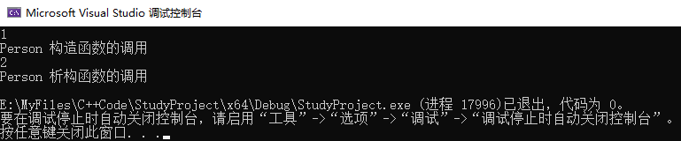
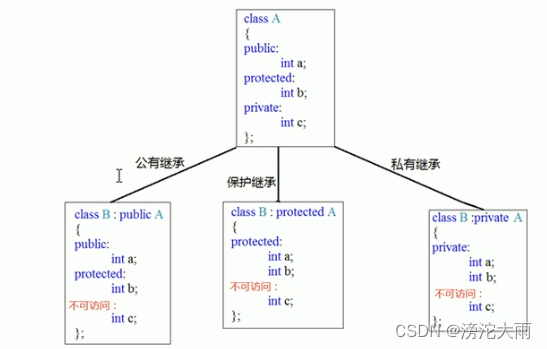

@[TOC](C++自学)

# 一、数据变量
## 1. 字符
## 2.字符串
# 二、数组相关
## 1.数组的定义方式
一维数组定义
方式1：<kbd>数据类型 数组名[ 数组长度 ];</kbd>
方式2：<kbd>数据类型 数组名[ 数组长度 ] = {值1, 值2 ... };</kbd>
方式3：<kbd>数据类型 数组名[  ] = {值1, 值2 ... };</kbd>

二维数组定义
方式1：<kbd>数据类型 数组名[ 行数 ] [ 列数 ]; </kbd>
方式2：<kbd>数据类型 数组名[ 行数 ] [ 列数 ] = { { 数据1,数据2 },{ 数据3,数据4 } }; </kbd>
方式3：<kbd>数据类型 数组名[ 行数 ] [ 列数 ] = { 数据1,数据2,数据3,数据4 }; </kbd>
方式4：<kbd>数据类型 数组名[ ] [ 列数 ] =  { 数据1,数据2,数据3,数据4 }; </kbd>

## 2.数组的查询
获取数组的总空间大小：`cout<< sizeof(arr) <<endl;`
获取某数数组元素的空间大小：`cout << sizeof(arr[3]) <<endl;`
获取数组的首地址： `cout<< arr <<endl;`  或  `cout<< (int)arr <<endl;`
获取某个数组元素的地址：`cout << &arr[3] <<endl;`  或  `cout << (int)&arr[3] <<endl;`

# 三、函数相关
## 1.函数的定义

```cpp
返回值类型 函数名 (参数列表)
{
	函数体语句;
	return 表达式;
}
```
## 2.值传递
函数调用时，实参将数值传入给形参
值传递时，如果形参发生改变，不会影响实参
## 3.函数的声明
声明过的函数，其定义的实体代码可以放在main()之后
声明可以写多次，但函数定义只能写一次
```cpp
返回值类型 函数名 (参数列表);


int max(int a,int b);      //这里是函数声明
int main()
{
	int a = 10,b = 20;
	cout<<max(a,b)<<endl;
}
int max(int a,int b)       //这里是函数实体
{
	return a > b ? a : b;
}
```
## 4.函数的份文件编写
1.创建后缀名为.h的头文件
2.创建后缀名为.cpp的源文件
3.在头文件中写函数的声明
4.在源文件中写函数的定义

# 四、指针相关
## 1.定义指针
**语法：**<kbd>数据类型 * 指针变量名</kbd>

```cpp
int a = 10;
int *p;
p = &a;     //让指针p存放a的地址

或者是
int a = 10;
int *p = &a;
```
## 2.使用指针
可以通过解引用的方式来找到指针指向的内存
指针前加 * 代表解引用，找到指针指向的内存中的数据

```cpp
*p = 520;     //p代表变量的地址，*p代表 该地址 所指代的存储空间 存储的实际值
cout << "a = "<< a <<endl;
cout << "*p = "<< *p <<endl;

>>>
a = 520
*p = 520
```
## 3.指针所占内存空间
32位操作系统(x86)：占用4字节
64位操作系统(x64)：占用8字节

```cpp
int a = 10;
int *p = &a;
cout << "sizeof(int *) = " << sizeof(p) << endl;
cout << "sizeof(int *) = " << sizeof(int *)<<endl;
cout << "sizeof(int *) = " << sizeof(float *)<<endl;
cout << "sizeof(int *) = " << sizeof(double *)<<endl;
cout << "sizeof(int *) = " << sizeof(char *)<<endl;
```
## 4.const修饰指针
const修饰指针三种情况
1.const修饰指针   --- 常量指针
2.const修饰常量   --- 指针常量
3.const即修饰指针，又修饰常量

<kbd>const修饰指针：`const int * p = &a`</kbd>特点：指针的指向可以修改，但指针指向的值不可以修改
<kbd>const修饰常量：`int * const p = &a`</kbd>特点：指针的指向不可以修改，但指针指向的值可以修改
<kbd>const即修饰指针，又修饰常量：`const int * const p = &a`</kbd>特点：指针的指向和指向的值都不可修改
## 5.指针和数组
**作用：** 利用指针来访问数组中的元素

```cpp
int arr[10] = {1,2,3,4,5,6,7,8,9,10};
int *p = arr;    //arr就是数组的首地址
cout<< "利用指针访问第一个元素："<< *p <<endl;
cout<< "利用指针访问第二个元素："<< *(p++) <<endl;
```
## 6.指针和函数
**作用：** 利用指针作函数参数，可以修改实参的值
```cpp
void swap(int *p1,int *p2)
{
	int temp = *p1;
	*p1 = *p2;
	*p2 = temp;
}

int main()
{
	int a=10,b=20;
	swap(&a,&b);
}
```
# 五、结构体
## 1.结构体定义和使用
**语法：**<kbd>struct 结构体名 { 结构体成员列表 };

```cpp
//结构体定义
struct student
{
	string name;
	int age;
	int score;
};

//通过学生类型创建具体学生
方法一：
struct Student s1;
s1.name = "张三";
s1.age = 18;
s1.score = 100;

方法二：
struct Student s2 = {"李四",15,90};

方法三：定义结构体时，顺便创建结构体变量
struct Student
{
	string name;
	int age;
	int score;
}s3;
```
## 2.结构体数组

```cpp
//定义学生的结构体
struct Student
{
	string name;
	int age;
	int score;
};

int main()
{
	//创建学生的结构体变量
	struct Student stuArray[3] = 
	{
		{"张三", 18 , 100},
		{"李四", 28 , 99},
		{"王五", 38 , 66}
	};
	
	//将王五的信息改为赵六的信息
	stuArray[2].name = "赵六";
	stuArray[2].age = 80;
	stuArray[2].score = 60;
	
	//遍历结构体数组
	for(int i=0, i<3, i++)
	{
		cout << stuArray[i].name <<endl;
		cout << stuArray[i].age <<endl;
		cout << stuArray[i].score <<endl;
	}
}
```
## 3.结构体指针
**作用：** 通过指针访问结构体中的成员

```cpp
//定义学生的结构体
struct Student
{
	string name;
	int age;
	int score;
};

int main()
{
	//创建学生的结构体变量
	Student s = {"张三", 18, 100};
    //通过指针指向结构体变量
    student * p = &s;
    //通过指针访问结构体变量中的数据
    cout << p->name <<endl;
    cout << p->age <<endl;
    cout << p->score <<endl;
```
## 4.结构体嵌套结构体
**作用：** 结构体中的成员可以是另一个结构体
```cpp
struct student
{
	string name;
	int age;
	int score;
};
struct teacher
{
	int id;
	string name;
	int age;
	struct student stu;
};

int main()
{
	//创建老师
	teacher t;
	t.id = 10000;
	t.name = "老王";
	t.age = 50;
	t.stu.name = "小王";
	t.stu.age = 20;
	t.stu.score = 60;
}
```
## 5.结构体做函数参数
**作用：** 将结构体作为参数向函数中传递
传递方式有两种
· 值传递
· 地址传递

```cpp
//定义学生的结构体
struct student
{
	string name;
	int age;
	int score;
};
//打印学生信息函数
//1.值传递
void printStudent1(struct student s)
{
	cout << s.name << endl;
	cout << s.age <<endl;
	cout << s.score <<endl;
}
//2.地址传递 
void printStudent2(struct student *p)
{
	cout << s->name << endl;
	cout << s->age <<endl;
	cout << s->score <<endl;
}

int main()
{
	struct student s = {"张三",20,85};
	void printStudent1(s);
	void printStudent2(&s);
}
```
## 6.结构体中const使用场景
**作用：** 用const来防止误操作

```cpp
//定义学生的结构体
struct student
{
	string name;
	int age;
	int score;
};

void printStudent(const student *stu) //加const防止函数体中的误操作
{
	cout << stu->name << endl;
	cout << stu->age <<endl;
	cout << stu->score <<endl;
}

int main()
{
	struct student s = {"张三",20,85};
	printStudent(&stu);
}
```
# 六、程序的内存模型
C++程序在执行时，将内存大方向划分为4个区域
 · 代码区：存放函数体的二进制代码，由操作系统进行管理
  		         &nbsp;&nbsp;&nbsp;&nbsp;&nbsp;&nbsp;&nbsp;&nbsp;&nbsp;&nbsp;&nbsp;&nbsp;&nbsp;&nbsp;&nbsp;&nbsp;&nbsp;存放CPU执行的机器指令
				&nbsp;&nbsp;&nbsp;&nbsp;&nbsp;&nbsp;&nbsp;&nbsp;&nbsp;&nbsp;&nbsp;&nbsp;&nbsp;&nbsp;&nbsp;&nbsp;&nbsp;代码区是**共享的**，共享的目的是对于频繁被执行的程序，只需要在内存中有一份代码即可
				 &nbsp;&nbsp;&nbsp;&nbsp;&nbsp;&nbsp;&nbsp;&nbsp;&nbsp;&nbsp;&nbsp;&nbsp;&nbsp;&nbsp;&nbsp;&nbsp;&nbsp;代码区是**只读的**，只读的目的是防止程序意外地修改了它的指令
· 全局区：存放全局变量和静态变量以及常量
				 &nbsp;&nbsp;&nbsp;&nbsp;&nbsp;&nbsp;&nbsp;&nbsp;&nbsp;&nbsp;&nbsp;&nbsp;&nbsp;&nbsp;&nbsp;&nbsp;&nbsp;全局区包含了：全局变量、静态变量、常量区；常量区中存放const修饰的全局常量和字符串常量
				 &nbsp;&nbsp;&nbsp;&nbsp;&nbsp;&nbsp;&nbsp;&nbsp;&nbsp;&nbsp;&nbsp;&nbsp;&nbsp;&nbsp;&nbsp;&nbsp;&nbsp;该区域的数据在程序结束后由操作系统释放
| 在全局区中的数据                                             | 不在全局区中的数据            |
| ------------------------------------------------------------ | ----------------------------- |
| 全局变量                                                     | 局部变量                      |
| 静态变量(static)                                             | const修饰的局部变量(局部常量) |
| 字符串常量                                                   |                               |
| const修饰的全局变量(全局常量)                                |                               |
| · 栈区：由编译器自动分配释放，存放函数的参数值，局部变量等   |                               |
| &nbsp;&nbsp;&nbsp;&nbsp;&nbsp;&nbsp;&nbsp;&nbsp;&nbsp;&nbsp;&nbsp;&nbsp;&nbsp;注意事项：不要返回局部变量的地址，栈区开辟的数据由编译器自动释放 |                               |
| · 堆区：由程序员分配和释放，若程序员不释放，程序结束时由操作系统回收 |                               |
| &nbsp;&nbsp;&nbsp;&nbsp;&nbsp;&nbsp;&nbsp;&nbsp;&nbsp;&nbsp;&nbsp;&nbsp;&nbsp;C++主要使用new在堆区开辟内存，利用delete释放内存 |                               |
| `new开辟数据： new 数据类型`                                 |                               |
```cpp
int* func()
{
	int* a = new int(10); //10代表开辟的空间中，存放的是整数10
	delete p;  //释放整数10
	return 0;
}
```
`new 开辟数组`

```cpp
void test()
{
	int* arr = new int[10]; //10代表数组空间大小是10
	delete[] arr;  //释放数组
}
```
# 七、引用
## 1.引用的定义和语法
**作用：** 给变量起别名（两个不同的变量名，指向同一块内存空间）
**语法：** <kbd>数据类型 &别名 = 原名</kbd>
```cpp
int a = 10;
int &b = a;
```
## 2.引用做函数参数
**作用：** 函数传参时，可以利用引用的技术让形参修饰实参
**优点：** 可以简化指针修改实参
```cpp
//1.值传递
void mySwap01(int a, int b)
{
	int temp = a;
	a = b;
	b = temp;
}
//2.地址传递
void mySwap02(int *a, int *b)
{
	int *temp = *a;
	*a = *b;
	*b = *temp; 
}
//3.引用传递
void mySwap03(int &a, int &b)
{
	int temp = a;
	a = b;
	b = temp;
}

int main(){
	int a = 10;
	int b = 20;
	mySwap01(a,b);  //值传递不改变实参的值
	cout << "a = " << a << endl;
	cout << "b = " << b << endl;
	
	mySwap02(&a,&b); //地址传递可以改变实参的值
	cout << "a = " << a << endl;
	cout << "b = " << b << endl;

	mySwap03(a,b); //引用传递可以改变实参的值
	cout << "a = " << a << endl;
	cout << "b = " << b << endl;	
}
```
## 3.引用做函数返回值
注意事项：
· 不要返回局部变量的引用
```cpp
int& test01()
{
	int a = 10;    //局部变量存放在栈区
	return a;
}
int& test02()
{
	static int a = 10; //静态变量存放在全局区
	return a;
}
```
· 函数的调用可以作为左值
```cpp
int main(){
	test02() = 1000;
}
```
## 4.引用的本质
**本质：** 在C++内部实现是一个指针常量
编译器将 `int& ref = a` 自动转换为 `int* const ref = &a`
编译器将 `ref = 10` 自动转换为 `*ref = 10`
指针常量是指针指向不可改，也说明了为什么引用不可更改

## 5.常量引用
**作用：** 常量引用主要用来修饰形参，防止误操作
在函数形参列表中，可以加const修饰形参，防止形参改变实参

```cpp
int a = 10;
int &ref = 10; //会报错，必须引用合法的地址空间

int a = 10;
const int &ref = 10; //不会报错
//加上const之后，编译器将代码修改为 int temp = 10; const int & ref = temp;
ref = 20; //会报错，加入const之后，变为只读，不可以修改 
```

# 八、函数高级
## 1.函数默认参数
在C++中，函数的形参列表中的形参是可以有默认值的
**语法：**<kbd>返回值类型    函数名  ( 参数 = 默认值 ) {}</kbd>
如果传入了具体数据，就使用传入的数据，如果没有，则用默认值
如果某个位置已经有了默认参数，那么这个位置往后，都必须有默认值
如果函数声明有默认参数，函数实现就不能有默认参数了（声明和实现只能有一个设置默认值）
```cpp
int add(int a,int b = 20,int c = 30)
{
	return a + b + c ;
}

int main()
{
	cout << add(10) << endl;
	cout << add(10,50) <<endl;
	cout << add(10,50,90) <<endl;
}

int add2(int a = 10, int b = 20);
int add2(int a = 10, int b = 20) //会报错，因为函数声明中已经设置过默认值
{
	return a + b;
}
```
## 2.函数占位参数
C++中函数的形参列表里可以有占位参数，用来做占位，调用函数时必须填补该位置
**语法：** <kbd>返回值类型 函数名 (数据类型) {}</kbd>
占位参数也可以有默认值
```cpp
void func(int a,int )
{
	cout << a << endl;
}
void func2(int a,int = 10)
{
	cout << a << endl;
}

int main(){
	func(10);   //报错，有一个占位参数没有传入值
	func(10,10);
	
	func2(10);  //不会报错，因为占位参数有默认值
}
```
## 3.函数重载
**作用：** 函数名可以相同，提高复用性
**函数重载满足条件：**
&nbsp;&nbsp;&nbsp;&nbsp;&nbsp;&nbsp;&nbsp;&nbsp;&nbsp;&nbsp;&nbsp;&nbsp;· 同一个作用域下
&nbsp;&nbsp;&nbsp;&nbsp;&nbsp;&nbsp;&nbsp;&nbsp;&nbsp;&nbsp;&nbsp;&nbsp;· 函数名称相同
&nbsp;&nbsp;&nbsp;&nbsp;&nbsp;&nbsp;&nbsp;&nbsp;&nbsp;&nbsp;&nbsp;&nbsp;· 函数参数 **类型不同** 或者 **个数不同** 或者 **顺序不同**
**注意：** 函数的返回值不可以作为函数重载的条件
&nbsp;&nbsp;&nbsp;&nbsp;&nbsp;&nbsp;&nbsp;&nbsp;&nbsp;&nbsp;&nbsp;&nbsp;`int func()`和`void func()`不能重载

```cpp
void func()
void func(int a)
void func(int a,double b)
void func(double a,int b)
int main(){
	func();        //调用第一个func
	func(1);       //调用第二个func
	func(1, 3.14)  //调用第三个func
	func(3.14, 1)  //调用第三个func
}
```
## 4.重载注意事项
1.引用作为重载的条件
```cpp
void func(int &a)
void func(const int &a)

int main(){
	int a = 10;
	func(a);   //调用第一个func，因为 int &a = 10 不合法
	func(10);  //调用第二个func，const int &a = 10 合法(编译器优化代码)
}
```
2.函数重载碰到默认参数

```cpp
void func2(int a,int b = 10)
void func2(int a)

int main(){
	func(2); //报错，因为func(2)出现二义性，尽量避免这种情况
	func(2,10); //调用第二个func
}
```
# 九、类和对象
C++面向对象的三大特性为：封装、继承、多态

## 1.封装
**封装的意义：**
· 将属性和行为作为一个整体，表现生活中的事物
· 将属性和行为加以权限控制
### （一）封装的意义一
在设计类的时候，属性和行为写在一起，表现事物
**语法：**<kbd>class 类名{ 访问权限: 属性 / 行为 } ;</kdb>

```cpp
#include<iostream>
using namespace std;
const double PI = 3.14;

class Circle
{
	//访问权限
	//公共权限
public:
	//属性
	double m_r;   //半径

	//行为
	double calculateZC()    //获取圆的周长
	{
		return 2 * PI * m_r;
	}
};

int main() {
	//通过圆类 创建具体的圆（对象）
	//实例化 （通过一个类 创建一个对象的过程）
	Circle c1;
	//给圆对象 的属性进行赋值
	c1.m_r = 10;
	cout << "圆的周长为：" << c1.calculateZC() << endl;
}
```
案例二

```cpp
#include<iostream>
#include<string>
using namespace std;

class student 
{
public:
	//属性
	string m_Name;
	int N_number;
	//行为
	void setName(string name)
	{
		m_Name = name;
	}

	void setNumber(int number)
	{
		N_number = number;
	}

	void showname() 
	{
		cout << m_Name << endl;
	}
	void shownumber()
	{
		cout << N_number << endl;
	}
};

int main()
{
	student s1;
	s1.m_Name = "Kite";   //第一种赋值方法，直接赋值
	s1.N_number = 101;
	s1.showname();
	s1.shownumber();

	student s2;
	s2.setName("Peter");  //第二种赋值方法，调用类中定义的方法进行赋值
	s2.setNumber(102);
	s2.showname();
	s2.shownumber();
	return 0;
}
```

> 类中的属性和行为 我们统一称为“成员”
> 属性：成员属性、成员变量
> 行为：成员函数、成员方法

### （二）封装意义二
类在设计时，可以把属性和行为放在不同的权限下，加以控制
访问权限有三种：
| 权限     | 名称      | 可访问性                                 |
| -------- | --------- | ---------------------------------------- |
| 公共权限 | public    | 类内可以访问，类外可以访问，可被继承     |
| 保护权限 | protected | 类内可以访问，类外不可以访问，可被继承   |
| 私有权限 | private   | 类内可以访问，类外不可以访问，不可被继承 |

### （三）struct和class区别
在C++中struct和class唯一的区别就在于，**默认的访问权限不同** 
区别：
`struct 默认权限为公共`
`class 默认权限为私有`

```cpp
class C1
{
	int m_A; //默认是私有权限
};

struct C2
{
	int m_A; //默认是公共权限
};
```
### （四）成员属性设置为私有
优点1：可以使用提供的函数来修改私有属性，防止不想被修改的属性被修改，实现可控化操作。
优点2：可以对数据的有效性进行控制

```cpp
#include<iostream>
#include<string>
using namespace std;

class Person
{
public:
	//设置姓名
	void setName(string name)
	{
		m_Name = name;
	}
	//获取姓名
	string getName()
	{
		return m_Name;
	}
	//设置年龄
	void setLover(int age)
	{
		if (age <0 || age >150)
		{
			m_Age = -1;
			cout << "输入年龄有误" << endl;
			return;
		}
		m_Age = age;
    }
	//获取年龄
	int getAge()
	{
		return m_Age;
	}
	//设置情人
	void setLover(string lover)
	{
		m_lover = lover;
	}
	
private:
	//姓名 可读可写
	string m_Name;
	//年龄 可读可写
	int m_Age;
	//情人 只写
	int m_lover;
};

int main() {
	Person P;
	P.setName("张三");
	cout << "姓名为：" << P.getName() << endl;
	cout << "年龄为：" << P.getAge() << "岁" << endl;
	return 0;
}
```
### （五）对象的初始化和清理
**构造函数：** 主要作用在于创建对象时，为对象的成员属性赋值，构造函数由编译器自动调用，无须手动调用
**析构函数：** 主要作用在于对象销毁前，系统自动调用，执行一些清理工作

**构造函数语法：**`类名() {}`
1.构造函数，没有返回值也不写void
2.函数名称与类名相同
3.构造函数可以有参数，因此可以发生重载
4.程序在调用对象时候会自动调用构造函数，无需手动调用，而且只会调用一次

**析构函数语法：**`~类名() {}`
1.析构函数，没有返回值也不写void
2.函数名称与类名相同，在名称前面加上符号 ~
3.析构函数不可以有参数，因此不可以发生重载
4.程序在对象销毁前，会自动调用析构，无需手动调用，而且只会调用一次

#### 构造函数、析构函数示例
```cpp
#include<iostream>
#include<string>
using namespace std;

//对象的初始化和清理
//1.构造函数：进行初始化操作
//2.析构函数：进行清理的操作

class Person
{
public:
	//构造函数
	Person()
	{
		cout << "Person 构造函数的调用" << endl;
	}
	~Person()
	{
		cout << "Person 析构函数的调用" << endl;
	}
};

int main()
{
	cout << 1 << endl;
	Person p;
	cout << 2 << endl;
	return 0;
}
```
输出结果为：


&nbsp;&nbsp;&nbsp;&nbsp;可以看出，在创建`Person p;`的时候，系统会自动调用**构造函数**`Person()`，且只会调用一次。若程序员没有写**构造函数**`Person()`，则系统会自动调用一个空的构造函数`Person() {  }`.
&nbsp;&nbsp;&nbsp;&nbsp;易见**析构函数**的调用在`cout << 2 << endl;`之后，这是因为main()函数中的局部变量是存放在栈中的，函数结束运行的时候会销毁栈的数据，也就是说，在main()函数结束的时候会自动调用**析构函数**，且只会调用一次。若程序员没有写**析构函数**`~Person()`,则系统会自动调用一个空的析构函数`~Person() {}`


### （六）构造函数的分类及调用
两种分类方式：
&nbsp;&nbsp;&nbsp;&nbsp;按参数分为：有参构造和无参构造
&nbsp;&nbsp;&nbsp;&nbsp;按类型微分：普通构造和拷贝构造

三种调用方式：
&nbsp;&nbsp;&nbsp;&nbsp;括号法
&nbsp;&nbsp;&nbsp;&nbsp;显示法
&nbsp;&nbsp;&nbsp;&nbsp;隐式转换法

```cpp
#include<iostream>
#include<string>
using namespace std;

class Person
{
public:
	//构造函数
	
	//无参构造（默认构造）
	Person()   
	{
		cout << "Person 无参构造函数的调用" << endl;
	}
	
	//有参构造
	Person(int a)  
	{
		M_age = a;
		cout << "Person 有参构造函数的调用" << endl;
	}

	//拷贝构造函数
	Person( const Person &p )
	{
		//将传入的人身上的所有属性，拷贝到新的人身上
		M_ID = p.M_ID;
		M_age = p.M_age;
		cout << "Person 拷贝构造函数的调用" << endl;
	}
private:
	string M_name;
	int M_ID;
	int M_age;
};


void test01() //括号法调用函数
{
	Person P;          //默认构造函数调用
	Person P2(10);     //有参构造函数调用
	Person P3(P2);     //拷贝构造函数调用
}

void test02() //显示法
{
	Person P;                  //默认构造函数调用
	Person P2 = Person(10);    //有参构造函数调用
	Person P3 = Person(P2);    //拷贝构造函数调用
	Person(10);  //匿名对象  特点：此语句执行结束后，系统会立即回收掉匿名对象
}

void test03() //隐式转换法
{
	Person P4 = 10; //相当于写了 Person P4 = Person(10);有参构造函数的调用
	Person P5 = P4; //相当于写了 Person P5 = Person(P4);拷贝构造函数的调用 
}
```
注意事项1：
默认构造函数的调用，不能加()
即`Person P;`而不能是`Person P();`
因为`Person P();`会被编译器理解为一个函数声明，而不是创建对象，类似于`void func();`

注意事项2
不要利用拷贝构造函数 初始化匿名对象
`Person(P3);`
编译器会认为这是在定义一个数据类型是Person的 新变量 P3
即`Person(P3); 等价于 Person P3;`

#### **拷贝构造函数调用时机**
C++中拷贝构造函数调用时机通常有三种情况
&nbsp;&nbsp;&nbsp;&nbsp;&nbsp;&nbsp;&nbsp;&nbsp;· 使用一个已经创建完毕的对象来初始化一个新对象
&nbsp;&nbsp;&nbsp;&nbsp;&nbsp;&nbsp;&nbsp;&nbsp;· 值传递的方式给函数参数传值
&nbsp;&nbsp;&nbsp;&nbsp;&nbsp;&nbsp;&nbsp;&nbsp;· 以值方式返回局部对象

```cpp
#include<iostream>
#include<string>
using namespace std;

class Person
{
public:
	Person()
	{
		cout << "Person默认构造函数调用" << endl;
	}
	
	Person(int age) 
	{
		m_Age = age;
		cout << "Person有参构造函数调用" << endl;
	}
	
	Person(const Person& p)
	{
		m_Age = p.m_Age;
		cout << "Person拷贝构造函数调用" << endl;
	}
	
	~Person()
	{
		cout << "Person析构函数调用" << endl;
	}
	
	int m_Age;
};

//1.使用一个已经创建完毕的对象来初始化一个新对象
void test01()
{
	Person p1(20);
	Person p2(p1); 
}

//2.值传递的方式给函数参数传值
void doWork(Person p)
{

}

void test02()
{
	Person p;
	doWork(p);
}

//3.值方式返回局部对象
Person doWork2()
{
	Person p1;
	return p1;
}
void test03()
{
	Person p = doWork2();
}

int main()
{
	cout << "test01" << endl;
	test01();
	cout << "test02" << endl;
	test02();
	cout << "test03" << endl;
	test03();
}
```
#### 构造函数调用规则
默认情况下，C++编译器至少给一个类添加3个函数
1.默认构造函数（无参，函数体为空）
2.默认析构函数（无参，函数体为空）
3.默认拷贝构造函数，对属性进行值拷贝

构造函数调用规则如下
&nbsp;&nbsp;&nbsp;&nbsp;&nbsp;&nbsp;&nbsp;&nbsp;· 如果用户定义有构造参数，C++不再提供默认无参构造，但会提供默认拷贝构造
&nbsp;&nbsp;&nbsp;&nbsp;&nbsp;&nbsp;&nbsp;&nbsp;· 如果用户定义拷贝构造函数，C++不会再提供其他构造函数
### （七）深拷贝与浅拷贝
浅拷贝：简单的赋值拷贝操作
深拷贝：在堆区重新申请空间，进行拷贝操作
浅拷贝带来的问题就是堆区的内存重复释放

```cpp
#include<iostream>
using namespace std;
class Person
{
public:
	Person()
	{
		cout << "Person的默认构造函数调用" << endl;
	}
	Person(int age , int height)
	{
		m_Height = new int(height);
		m_Age = age;
		cout << "Person的有参构造函数调用" << endl;
	}
	//自己实现拷贝构造函数，解决浅拷贝带来的问题
	Person(const Person &p)
	{
		cout << "Person的拷贝构造函数调用" << endl;
		m_Age = p.m_Age;
		//m_Height = p.m_Height; 编译器默认实现就是这行代码
		//深拷贝操作
		m_Height = new int(*p.m_Height);
	}
	~Person()
	{
		//析构代码，将堆区开辟数据做释放操作
		if(m_Height != NULL)
		{
			delete m_Height;
			m_Height = NULL;
		}
		cout << "Person的析构函数调用" << endl;
	}
	int m_Age;
	int *m_Height;
};
void test01()
{
	Person p1(18,160);
	Person p2(p1);
}
```
### （八）初始化列表
**作用：** C++提供了初始化列表语法，用来初始化属性
**语法：**<kbd>构造函数(): 属性1(值1) 属性2(值2) ... {}</kbd>

**传统的初始化** 
```cpp
#include<iostream>
using namespace std;
class Person
{
public:
	//传统初始化操作
	Person(int a,int b,int c)
	{
		m_A = a;
		m_B = b;
		m_C = c;
	}
	int m_A;
	int m_B;
	int m_C;
};

void test01()
{
	Person p(10,20,30);
	cout << p.m_A << endl;
	cout << p.m_B << endl;
	cout << p.m_C << endl;
}
```
**初始化列表方式赋值**

```cpp
#include<iostream>
using namespace std;
class Person
{
public:
	Person():m_A(10),m_B(20),m_C(30)
	//Person(int a,int b,int c):m_A(a),m_B(b),m_C(c);
	{}
	int m_A;
	int m_B;
	int m_C;
};

void test01()
{
	Person p;
	//Person p(30,20,10);
	cout << p.m_A << endl;
	cout << p.m_B << endl;
	cout << p.m_C << endl;
}
```
### （九）类对象作为类成员
C++类中的成员可以是另一个类的对象，我们称该成员为 **对象成员**
当其他类对象作为本类成员，构造时先构造类对象，再构造自身，析构时先析构自身，再析构类对象
```cpp
#include<iostream>
#include<string>
using namespace std;

class Phone
{
public:
	Phone(string pName)
	{
		m_PName = pName;
	}
	string m_PName;
};

class Person
{
public:
	//隐式转换法：Phone m_Phone = pName;
	//等价于：Phone m_Phone = Phone(pName);
	Person(string name, string pName):m_Name(name),m_Phone(pName)
	{}
	string m_Name;
	Phone m_Phone;
};

void test01()
{
	Person p("张三","苹果MAX");
}
```
### （十）静态成员
静态成员就是在成员变量和成员函数前加上关键字static，称为静态成员
静态成员分为：
| 静态成员变量         | 静态成员函数                 |
| -------------------- | ---------------------------- |
| 所有对象共享一份数据 | 所有对象共享同一个函数       |
| 在编译阶段分配内存   | 静态成员只能访问静态成员变量 |
| 类内声明，类外初始化 |                              |

```cpp
#include<iostream>
using namespace std;

class Person
{
public:
	//静态成员函数
	static void func()
	{
		m_A = 100; //静态成员函数可以访问 静态成员变量
		m_B = 200; //报错，静态成员函数不可以访问 非静态成员变量
		cout << "static void func调用" << endl;
	}
	static int m_A; //静态成员变量
	int m_B; //非静态成员变量
};

void test01()
{
	//1.通过对象访问
	Person P;
	P.func();
	//2.通过类名访问
	Perosn :: func();
}

```
### （十一）C++对象模型和this指针
**成员变量和成员函数分开存储**
在C++中，类内的成员变量和成员函数分开存储
只有非静态成员变量才属于类的对象上，其余都不属于类的对象上

### （十二）this指针
C++中成员变量和成员函数是分开存储的
每一个非静态成员只会诞生一份函数实例，也就是说多个同类型的对象会共用一块代码
这一块代码是如何区分哪个对象调用自己的呢？

C++通过提供特殊的对象指针，this指针，解决上述问题
**this指针指向被调用的函数成员函数所属的对象**
this指针是隐含在每一个非静态成员函数内的一种指针

```cpp
#include<iostream>
using namespace std;
class Person
{
public:
	Person(int age)
	{
		//age = age;
		//this指针指向的是被调用的成员函数所属的对象
		this -> age = age;
	}
	Person& PersonAddAge(Person &p)
	{
		this -> age += p.age;
		//this指向p2的指针，而*this指向的就是p2这个对象本体
		return *this;
	}
	int age;
};
//1.解决名称冲突
void test01()
{
	Person p1(18);
}
//2.返回对象本身用 *this
void test02()
{
	Person p1(10);
	Person p2(10);
	//链式编程思想 
	p2.PersonAddAge(p1).PersonAddAge(p1).PersonAddAge(p1);
}

```
### （十三）空指针访问成员函数
C++中空指针也是可以调用成员函数的，但是也要注意有没有用到this指针
如果用到this指针，需要加以判断保证代码的健壮性

```cpp
#include<iostream>
using namespace std;
class Person
{
public:
	void showClassName()
	{
		cout << "this is Person class" << endl;
	}
	void showPersonAge()
	{
		cout << "age = " << m_Age << endl;
	}
	int m_Age;
};

void test01()
{
	Person * p = NULL;
	p -> showClassName();//不报错
	p -> showPersonAge();//报错，因为*p是空指针，没有m_Age的数据
}
//可加一个判断语句，加强代码的健壮性
	void showPersonAge()
		{
			if (this == NULL)
			{
				return ;
			}
			cout << "age = " << m_Age << endl;
		}
```
### （十四）const修饰成员函数
**常函数**
· 成员函数后加const后我们成这个函数为**常函数**
· 常函数内不可以修改成员属性
· 成员属性声明时加关键字mutable后，在常函数中依然可以修改

**常对象**
· 声明对象前加const称该对象为常对象
· 常对象只能调用常函数

```cpp
#include<iostream>
using namespace std;
class Person
{
public:
	//this 指针本质是 指针常量，指针的指向是不可以修改的
	//const Person * const this ;
	//在成员函数后面加const，修饰的是this指向，让指针指向的值也不可以修改
	void showPerson()const  //常对象
	{
		 this -> m_A = 100; //不报错，加mutable后的属性可以在常函数内修改
		 this -> m_B = 100; //报错，常函数内不可以修改成员属性
		 this = NULL; //this指针不可以修改指针的指向
	}
	void func()
	{}
	mutable int m_A;
	int m_B;
};

void test01()
{
	Person P;
	P.showPerson();
}

//常对象
void test02()
{
	const Person p; //在对象前加cosnt，变为常对象
	p.m_A = 100; //不报错，加了mutable后的常对象属性可以被修改
	p.m_B = 100; //报错，const常对象不可被修改  
	p.showPerson();
	p.func();   //报错，常对象只能调用常函数，不可以调用普通成员函数
}
```
### （十五）友元
友元的目的是让一个函数或者类，访问另一个类中的**私有成员**
友元的关键字为 **friend**
友元的三种实现方式
· 全局函数做友元
· 类做友元
· 成员函数做友元
#### 全局函数做友元
```cpp
#include<iostream>
#include<string>
using namespace std;

class Building
{
	//goodGay全局函数 是Building的好朋友，可以访问Building中私有成员
	friend void goodGay(Building *building);
public:
	Building()
	{
		m_SittingRoom = "客厅";
		m_BedRoom = "卧室";
	}
public:
	string m_SittingRoom;
private:
	string m_BedRoom; 
};

//全局函数
void goodGay(Building *building)
{
	cout << "好基友全局函数 正在访问：" << building -> m_SittingRoom << endl;
	//因为class Building中声明了friend void goodGay(Building *building);所以可以访问private的成员
	cout << "好基友全局函数 正在访问：" << building -> m_BedRoom << endl;
}
void test01()
{
	Building building;
	goodGay(&building);
}

```
#### 类做友元

```cpp
#include<iostream>
#include<string>
using namespace std;

class Building;
class GoodGay
{
public:
	GoodGay();
	void visit(); //参观函数，访问Building中的属性
	Building * building;
};

class Building
{
	//GoodGay类是本类的好朋友，可以访问本类中私有成员
	friend class GoodGay;
public:
	Building();
public:
	string m_SittingRoom;
private:
	string m_BedRoom; 
}

//类外写成员函数
Building :: Building()
{
	m_SittingRoom = "客厅";
	m_BedRoom = "卧室";
}
GoodGay::GoodGay()
{
	building = new Building;
}
void GoodGay::visit()
{
	cout << "好基友类 正在访问：" << building -> m_SittingRoom << endl;
	cout << "好基友类 正在访问：" << building -> m_BedRoom << endl;
}
```
#### 成员函数做友元

```cpp
#include<iostream>
#include<string>
using namespace std;

class Building;
class GoodGay
{
public:
	GoodGay();
	void visit(); //让visit函数可以访问Building中私有成员
	void visit2();//让visit2函数不可以访问Building中私有成员
	Building * building;
};
class Building
{
public:
	Building();
public:
	string m_SittingRoom;
private:
	string m_BedRoom;
};

//类外写成员函数
Building::Building()
{
	//告诉编译器，GoodGay类下的visit成员函数是本类的好朋友
	friend void GoodeGay::visit();
	m_SittingRoom = "客厅";
	m_BedRoom = "卧室";
}
GoodGay::GoodGay()
{
	building = new Building;
}
void GoodGay::visit()
{
	cout << "visit函数正在访问" << building->m_SittingRoom << endl;
	cout << "visit函数正在访问" << building->m_BedRoom << endl;
}
void GoodGay::visit2()
{
	cout << "visit2函数正在访问" << building->m_SittingRoom << endl;
	cout << "visit2函数正在访问" << building->m_BedRoom << endl; //报错
}
```
### （十六）运算符重载
运算符重载概念：对已有的运算符重新进行定义，赋予其另一种功能，以适应不同的数据类型
#### 加号运算符重载
**作用：** 实现两个自定义数据类型的相加运算
**使用成员函数重载+**
```cpp
#include<iostream>
#include<string>
using namespace std;

class Person
{
public:
	//1.成员函数重载+号
	Person operator+(Person& p)
	{
		Person temp;
		temp.m_A = this->m_A + p.m_A;
		temp.m_B = this->m_B + p.m_B;
		return temp;
	}
	int m_A;
	int m_B;
};
void test01()
{
	Person p1;
	p1.m_A = 10;
	p1.m_B = 10;
	Person p2;
	p2.m_A = 10;
	p2.m_B = 10;
	Person p3 = p1 + p2; //本质是：Person p3 = p1.operator+(p2);
	cout << "p3.m_A = " << p3.m_A << endl;
	cout << "p3.m_B = " << p3.m_B << endl;
}

int main()
{
	test01();
	return 0;
}

```
**使用全局函数重载+**

```cpp
#include<iostream>
#include<string>
using namespace std;

class Person
{
public:
	int m_A;
	int m_B;
};

//2.使用全局函数重载+号
Person operator+(Person& p1, Person& p2)
{
	Person temp;
	temp.m_A = p1.m_A + p2.m_A;
	temp.m_B = p1.m_B + p2.m_B;
	return temp;
}

void test01()
{
	Person p1;
	p1.m_A = 10;
	p1.m_B = 10;
	Person p2;
	p2.m_A = 10;
	p2.m_B = 10;
	Person p3 = p1 + p2; //本质是：Person p3 = operator+(p1,p2);
	cout << "p3.m_A = " << p3.m_A << endl;
	cout << "p3.m_B = " << p3.m_B << endl;
}

int main()
{
	test01();
	return 0;
}
```
#### 左移运算符重载

```cpp
#include<iostream>
#include<string>
using namespace std;

class Person
{
public:
	//利用成员函数重载 左移运算符 p.perator<<(cout),简化版本 p << cout ;
	//一般不会利用成员函数重载<<运算符，因为无法实现cout在左侧
	//void operator<<(cout)
	//{
	//	
	//}

	int m_A;
	int m_B;
};

//只能利用全局函数重载左移运算符
ostream & operator<<(ostream& cout, Person& p)//本质 operator<<(cout,p)简化 cout << p
{
	cout << "m_A = " << p.m_A << " m_B = " << p.m_B;
	return cout;
}

void test01()
{
	Person p;
	p.m_A = 10;
	p.m_B = 10;
	cout << p << endl;
}

int main()
{
	test01();
	return 0;
}
```
#### 递增运算符重载

```cpp
#include<iostream>
#include<string>
using namespace std;

class MyInteger
{
	friend ostream& operator<<(ostream& cout, MyInteger myint);
public:
	MyInteger()
	{
		m_Num = 0;
	}
	//重载前置++运算符
	//返回引用是为了一直对一个数据进行操作
	MyInteger& operator++()
	{
		m_Num++;
		return *this;
	}

	//重载后置++运算符
	//int 代表占位参数，可以用于区分前置和后置递增
	//后置递增返回的是值，而不是引用，是因为temp是局部变量，返回引用会出错
	MyInteger operator++(int)
	{
		//先记录目前结果
		MyInteger temp = *this;
		//后递增
		m_Num++;
		//最后返回记录结果
		return temp;
	}
private:
	int m_Num;
};

//重载<<运算符
ostream& operator<<(ostream& cout, MyInteger myint)
{
	cout << myint.m_Num;
	return cout;
}


void test01()
{
	MyInteger myint;
	cout << ++myint << endl;
	cout << myint << endl;
	cout << myint++<< endl;
	cout << myint << endl;
}

int main()
{
	test01();
	return 0;
}

```
## 2.继承
### （一）基本语法
定义这些类时，下级别的成员除了拥有上一级的共性，还有自己的特性
这个时候就可以考虑利用继承的技术，减少重复代码

```cpp
#include<iostream>
#include<string>
using namespace std;

class Father
{
public:
	void f1()
	{
		cout << "f1" << endl;
	}

};

class Son1 : public Father
{
public:
	void s1()
	{
		cout << "s1" << endl;
	}
};

int main()
{
	Son1* son = new Son1;
	son->f1();
	son->s1();
}
```
总结：
继承的好处：可以减少重复的代码
<kbd>class A : public B;</kbd>
A类称为子类 或 派生类
B类称为父类 或 基类

派生类中的成员，包含两大部分
一类是从基类继承过来的，一类是自己增加的成员
从基类继承过来的表现其共性，新增的成员体现了其个性

### （二）继承方式
继承的语法：<kbd>class 子类 : 继承方式 父类;</kbd>
继承方式一共有三种：
&nbsp;&nbsp;&nbsp;&nbsp;&nbsp;&nbsp;&nbsp;&nbsp; · 公共继承
&nbsp;&nbsp;&nbsp;&nbsp;&nbsp;&nbsp;&nbsp;&nbsp; · 保护继承
&nbsp;&nbsp;&nbsp;&nbsp;&nbsp;&nbsp;&nbsp;&nbsp; · 私有继承


### （三）继承中的对象模型
**问题：** 从父类继承过来的成员，哪些属于子类对象中？

```cpp
#include<iostream>
#include<string>
using namespace std;

class Father
{
public:
	int m_A;
protected:
	int m_B;
private:
	int m_C;
};

class Son : public Father
{
public:
	int m_D;
};

int main()
{
	Son son;
	cout << sizeof(son) << endl;
	return 0;
}
```
输出结果为 16
可以得知，父类中所有非静态成员属性都会被子类继承下去
父类中私有成员属性是被编译器给隐藏了，因此是访问不到，但确实是继承了

### （四）